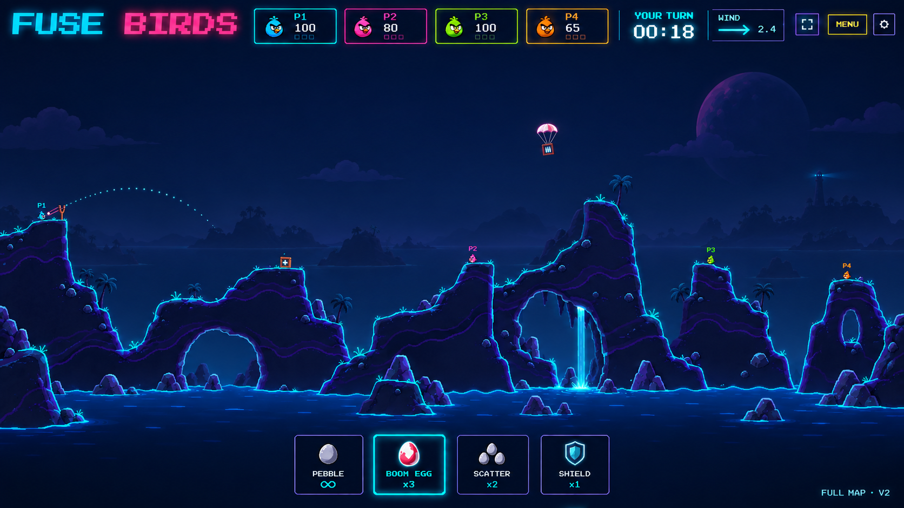
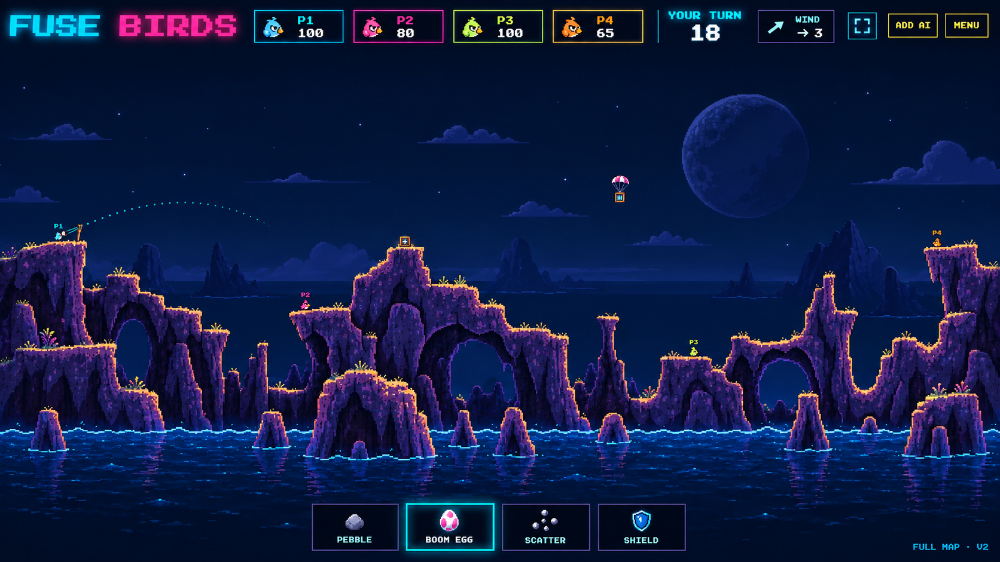
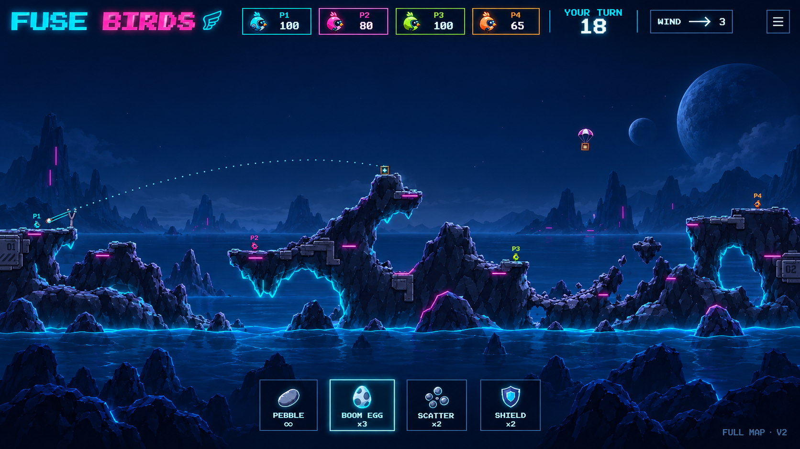
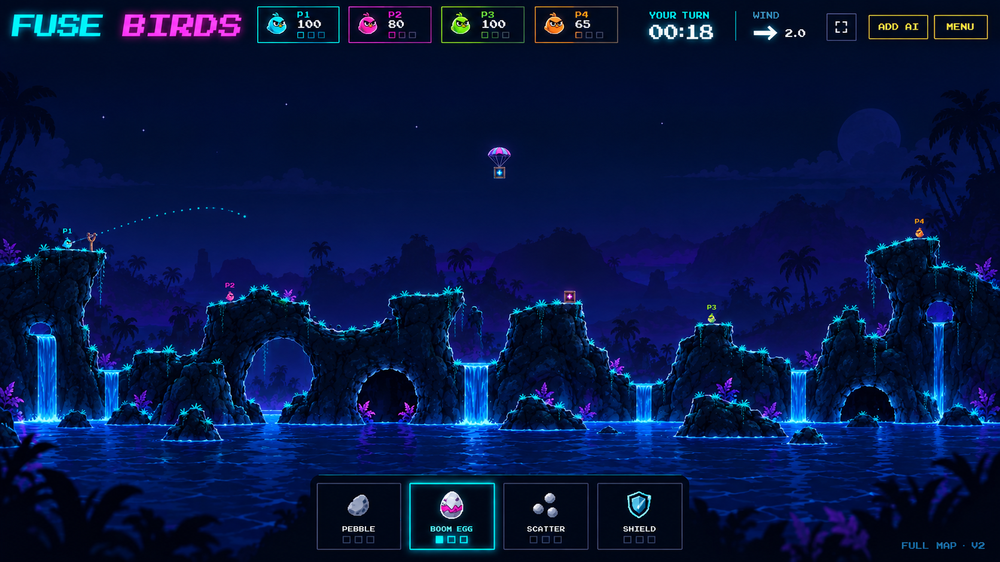
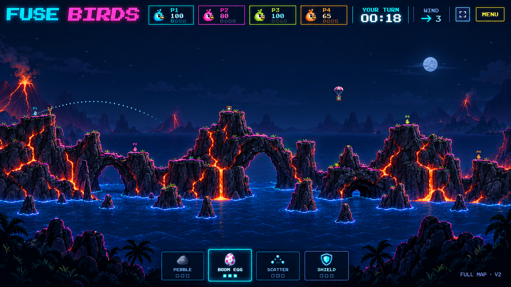

# Fuse Birds — revised visual directions (V2)

Five new generated mock screenshots inspired by the existing Riders graphics, with much smaller world birds and no background grid. Each is marked FULL MAP · V2. These illustrate art direction, not implemented gameplay. See the [spec](../fuse-birds.md), [V2 edit prompt](prompts-v2.md) and [original prompts](prompts.md). Generated with the built-in image generation tool by editing each original concept.

These depict the full-map shared-TV view. Birds are intentionally tiny; phones will support independent pinch zoom and pan for close-up aiming. HUD portraits and weapon buttons remain readable at normal UI size. The original images and prompts are retained as V1 provenance; the gallery below shows V2.

Background: no grid. Retain the neon Riders palette and interface with a quiet sky or subtle distant scenery instead.

Phase 1 scope revision: these images remain the accepted visual target, but their four-slot HUD and medical/shield crate symbols are superseded by [ADR-052](../../adr/052-fuse-birds-phase-one.md). The playable tray contains only `Pebble ∞` and `Scatter Bomb ×N`; Phase 1 crates refill Scatter Bombs. Deliver Neon burrow fully polished first; the other four images define later skins of the same game. No revised screenshot has been generated for the two-slot layout yet.

## 1. Neon burrow

The closest translation: tiny smooth birds, cyan terrain contours and a quiet navy sky.

## 2. Pixel badlands

Stepped pixel cliffs, violet strata and amber edges; the most retro artillery character.

## 3. Reactor islands

Metal-clad rock and mechanical birds, with strong cyan and magenta highlights.

## 4. Neon jungle

Organic arches and restrained luminous foliage within the same dark neon family.

## 5. Volcanic circuit

Charcoal cliffs and orange fissures against the cyan interface and dark blue water.

Generated details are illustrative: the spec governs mechanics, terrain collision and controls. In particular, the exact amount of trajectory preview, decorative floating fragments and any extra HUD buttons in the images remain design choices, not implemented features.
