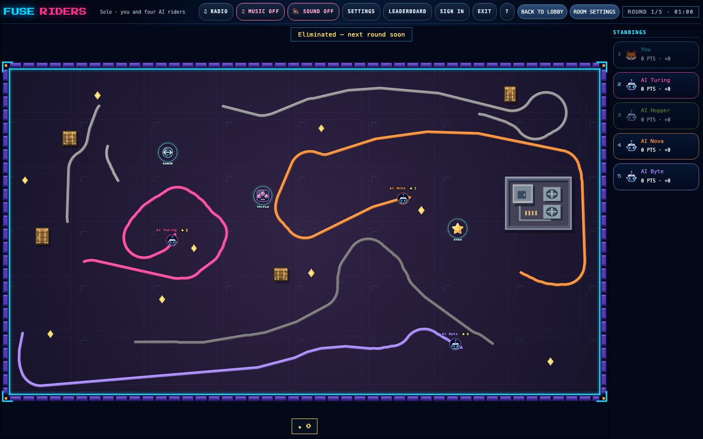

# Append-only trail history (issue #254)

A rider's trail is immutable once established: a tick appends one segment at the tail, and expiry drops
segments off the head. Presentation used to ignore that and re-derive everything on every frame — every
path of every rider, and every triangle of every ribbon, sixty times a second for a simulation that moves
twenty times a second. `games/fuse-riders/src/render/phaser/trail-history.ts` keeps what it built last
frame instead and builds only what arrived since.

Nothing here changes what is drawn. `scripts/render-parity.ts` is the proof.

## The rule

| What                                                                          | What happens                                                                        | Why                                                                                                                                     |
| ----------------------------------------------------------------------------- | ----------------------------------------------------------------------------------- | --------------------------------------------------------------------------------------------------------------------------------------- |
| An alive trail's established segments                                         | Kept; new segments are appended to the trailing path or start a new one             | They cannot change                                                                                                                      |
| Segments expired off the head                                                 | Dropped; only the group they straddle is rebuilt                                    | Expiry removes whole segments from the front                                                                                            |
| The final segment of every trail                                              | Never established; folded in per frame with the fractional tip                      | The local rider's speculative tip is rewritten every frame (`presentWorld`), and a remote rider's newest segment can still be corrected |
| The frame a trail detaches                                                    | Repainted in full, once                                                             | Every segment gains a `detached` marker, so nothing retained matches                                                                    |
| A detached piece while it fades                                               | Colour recomputed every tick over retained geometry; rebuilt on the ticks it erodes | `trailColor` greys it over three seconds and `erodeTrailPiece` shortens it at both ends                                                 |
| A rollback, a gun cut, a clipped or corrected segment                         | Full rebuild for that rider                                                         | The retained window no longer matches the trail, segment for segment                                                                    |
| A new round, match, scope or theme; a rider leaving, changing colour or dying | Full rebuild                                                                        | Identity and scope are part of what makes history reusable                                                                              |

Two invariants make this safe rather than clever:

- **Holes survive.** A path splits on exactly the rule `trailPaths` applies — a break in the detachment id,
  a missing tick, or endpoints that do not touch. A missing tick is a real hole even where a trail crosses
  itself, and appending applies the rule one segment at a time, so an append splits where a rebuild splits.
- **A mismatch is never patched over.** `expiredCount` compares the retained window against the new trail
  segment for segment, on everything that is drawn. Anything that does not line up falls back to a full
  rebuild of that rider, so the cache can be wrong about what to reuse but never about what to draw.

`games/fuse-riders/src/render/phaser/trails.ts` stays pure and holds the definitions the cache reproduces:
`trailPaths`, `completeTrailStrokes` and `establishedTrailStrokes`. The frame-by-frame differential test in
`games/fuse-riders/tests/trail-history.test.ts` replays the pinned recording and compares the two.

## Triangles

`TrailRibbonBuilder` in `render/phaser/trail-ribbon.ts` does the same thing one level down. A path grows at
its end, so every cross section behind the last one is still exactly right; only that section — whose miter
changes when a point is added beyond it — and the end cap are recomputed. It is the same arithmetic in the
same order over the same points, so the vertices are identical to a full rebuild, which is what the seeded
differential test in `trail-ribbon.test.ts` pins. Builders are keyed by where a path starts, and a builder
handed the wrong path simply finds a short common prefix and rebuilds.

## The Canvas backend does not append

The WebGL backend (`BeveledTrails`) draws one ribbon per piece, so retained geometry is simply reused.
The Canvas backend strokes into a retained `Phaser.Graphics` in three passes — two of them translucent —
with a cap at each end of every path. Stroking only the new segments into it would add caps mid-trail and
blend the new passes after the old ones wherever a trail crosses itself, so the picture would change. That
backend therefore still repaints on a change; what it saves is deriving the paths, which is now incremental
for both. Trails are not appended into a `Graphics`, and that is deliberate.

## Cost

`pnpm exec tsx scripts/trail-cost.ts` (3000 ticks of the pinned recording, three frames per tick, one
rider led ahead), on `505609f9`:

| Per frame             | Full rebuild | Retained |
| --------------------- | ------------ | -------- |
| Path points derived   | 347.6        | 41.9     |
| Ribbon vertices drawn | 2565.6       | 2565.6   |
| Trail pipeline        | 0.583 ms     | 0.170 ms |

`scripts/phaser-benchmark.ts` shows no change (WebGL `cpu` p50 6.0 ms → 5.8 ms, Canvas 1.2 ms → 1.2 ms),
and cannot: its fixture rebuilds every rider's whole trail from the tick number, so no established segment
is ever the same twice and there is nothing to retain. That is a limitation of the fixture, not a result.

## What it looks like

Solo against four AI riders on `http://localhost:8801/?mute&solo=1`: alive trails as continuous ribbons,
a detached piece greying out after a death, and a burnt hole that stays a hole.

