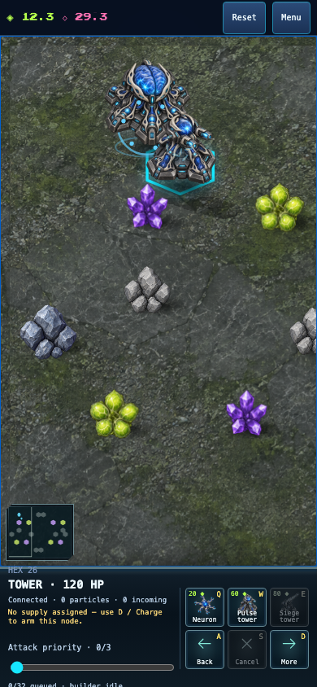
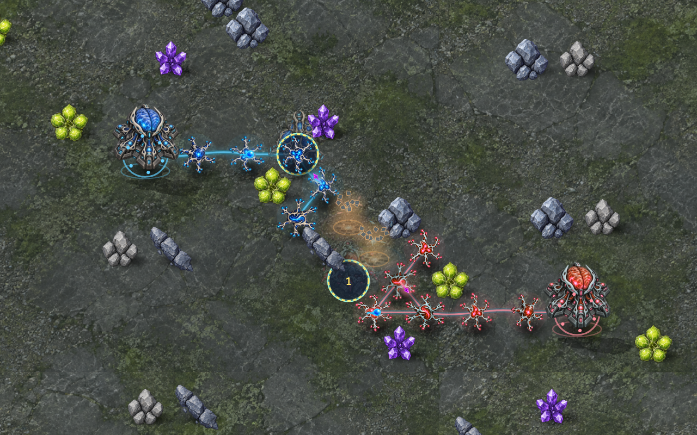

# Angled battlefield and AI investment

The ground now uses a shared oblique projection with upright buildings and rocks. Board selection polygons, placement, camera focus and minimap navigation use the same coordinates. Simulation cells, connectivity, range and timing do not change. Building silhouettes cast directional shadows on the ground below all bodies. Rocks and deposits can rise above their ground hex; their raised hit regions select their actual tile outside placement mode. Placement continues to use ground footprints.

The geometry is centralized in `src/render/projection.ts`. This is illustrated 2.5D, not a 3D renderer or proof of AAA quality. More environmental and animation work remains.

The AI now queues its intended specialist when only biomass is missing. Previously it bought cheap neurons while trying to save, preventing timely specialist construction. It still needs unlocked research, an available worker, a valid site and connected support. The ordinary queue waits for income; no extra resources or privileged construction are introduced. Online compatibility is `neural-defence-6-skirmish-3`; authoritative rules remain 6.

## Evidence

- The saving regression queues an unaffordable Bastion, observes it waiting unpaid, advances ordinary income and verifies it completes without buying cheap alternatives. Checkpoints remain valid.
- Shared projection tests map every minimap tile back to itself. Renderer tests retain fixed authoritative tile restrictions and unclipped upright objects.
- Chromium and WebKit passed the normal timed neuron-to-tower flow at desktop and 390×844 phone sizes: valid upgrade ghost, visible construction clock, retained neuron and one completed tower. These are emulated phones, not physical devices.
- Both browsers rendered the real rules-6 combat replay at 80, 240 and 650 ms and reproduced `c412ba31`. Combat images are diagnostic renderer captures; the phone upgrade below is an ordinary UI flow.
- The full 210-match saving-policy matrix is now complete: 100 matches finish, 110 time out. Five default-arena openings have counter relationships, but Defensive loses all non-mirrors and wide-map stalemates persist. See [exact-source report and raw data](SAVINGS_BALANCE.md). This is historical rules-6 evidence, not balance evidence for the subsequent rules-7 protection candidate.

An earlier, rejected Bastion range-two experiment on source `0a598485` did not stop Pressure beating Defensive (141 seconds, both seats). Its exact patch and 20-match results are preserved alongside these captures. The range change is **not** in the game. Examination of the battle showed fragile supply connections destroyed before Bastions could contribute, motivating the AI saving correction before adding shield mechanics.

