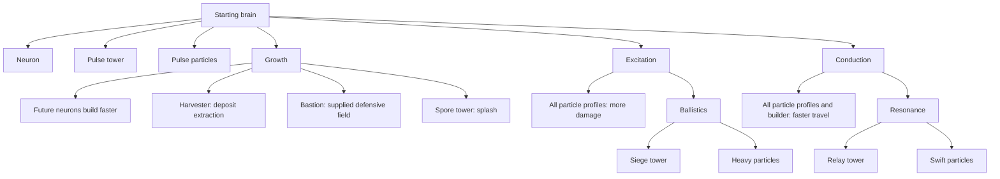

# Fuse Craft tech tree

Current implemented rules, updated **2026-10-01**, written against engine **rules version 13**. This is the current game reference, not a list of planned features. Update this document in the same change as any tech-tree rule change.

**The numbers live in source.** This document describes what each building, research and particle profile is for, how they unlock each other and how they interact. It deliberately does not copy costs, HP, damage, ranges, cooldowns or durations, because those change with the rules version. Read them from the linked definitions below.

Buildings may be placed on open ground or used to specialize an owned neuron in place. Specialization uses the normal full building price, prerequisites, builder and duration. The neuron remains connected and vulnerable during work; completion preserves its identity and health fraction. Canceling retains the neuron without refunding paid work. Destroying the neuron cancels its upgrade. Brains and existing buildings cannot be replaced. See [specialization behavior](NEURON_UPGRADES.md).

## Where the definitions live

| What                                                                                                                      | Where                                                                                                                |
| ------------------------------------------------------------------------------------------------------------------------- | -------------------------------------------------------------------------------------------------------------------- |
| Build cost, build time, prerequisites, upgrade source, deposit adjacency                                                  | `CONSTRUCTIONS` in [catalog.ts](../../games/fuse-craft/src/engine/catalog.ts)                                        |
| HP, range, minimum range, firing interval, volley cap, splash, protection, mining bonus                                   | `STRUCTURES` in [catalog.ts](../../games/fuse-craft/src/engine/catalog.ts)                                           |
| Research cost, duration, prerequisites                                                                                    | `RESEARCH` in [catalog.ts](../../games/fuse-craft/src/engine/catalog.ts)                                             |
| Particle damage, travel speed, recovery, prerequisites; Excitation and Conduction adjustments                             | `PARTICLES` and `particleProfile` in [catalog.ts](../../games/fuse-craft/src/engine/catalog.ts)                      |
| Shared constants: starting pool, costs and durations of Neuron and Pulse tower, research defaults, queue limit, tick rate | `RULES` in [types.ts](../../games/fuse-craft/src/engine/types.ts)                                                    |
| Sprout slots                                                                                                              | `SPROUT` and `sproutSlots` in [catalog.ts](../../games/fuse-craft/src/engine/catalog.ts)                             |
| Deposit mining share per structure                                                                                        | `MINERS_PER_DEPOSIT` and `depositContribution` in [catalog.ts](../../games/fuse-craft/src/engine/catalog.ts)         |
| Territory income and dominance                                                                                            | `TERRITORY`, `dominanceShare` and `DOMINANCE_LEAD` in [territory.ts](../../games/fuse-craft/src/engine/territory.ts) |
| Starting resources, passive income, builder travel, targeting, splash and protection resolution                           | The simulation in [index.ts](../../games/fuse-craft/src/engine/index.ts) (`createWorld`, `economy`, `combat`)        |
| Display names and player-facing descriptions                                                                              | [command-card.ts](../../games/fuse-craft/src/app/command-card.ts)                                                    |

Structure ids used in the catalog are `brain`, `neuron`, `tower` (Pulse tower), `siege`, `relay`, `harvester`, `bastion` and `spore`. Research ids are `growth`, `excitation`, `conduction`, `ballistics` and `resonance`. Particle profile ids are `pulse`, `heavy` and `swift`.

## Unlock tree

Arrows mean **requires completed research**, not merely queued research. The three starting research branches are independent; Growth is not required for either specialist branch.

The branches have a shape. **Growth** is the economy and utility branch: faster expansion plus the three specialists that are not generic gun platforms (Harvester, Bastion, Spore). **Excitation, then Ballistics** is the damage branch: harder-hitting particles, then long-range artillery and Heavy particles. **Conduction, then Resonance** is the speed branch: faster particles and builder, then rapid-fire Relay towers and Swift particles.

## Resources and timing

Biomass pays for construction; Insight pays for research. Prices are in the catalog and `RULES`; they are stored in engine units where 1,000 engine units are one displayed unit. The simulation runs at a fixed tick rate (`RULES.ticksPerSecond`), and all durations in the catalog are in ticks. Times assume normal settings, not debug instant construction/research.

- A player starts with some Biomass, no Insight, one brain, one builder and a fixed pool of reusable attack particles (see `createWorld` in the simulation and `RULES.particleCount`).
- Every player earns a small passive Biomass and Insight income (see `economy`).
- Each completed, brain-connected structure adjacent to a deposit adds an income share according to the deposit type (Biomass or Insight). Only a small fixed number of a player's structures (`MINERS_PER_DEPOSIT`) count on the same deposit; more crowd it without more income, so an economy grows by holding more deposits. Build beside deposits, not on them.
- **Territory** pays Biomass per claimed cell, so a larger network earns more. See [Territory and dominance](#territory-and-dominance).
- A connected **Harvester** adds one extra share per adjacent deposit (its `miningBonus`). A deposit gets only one specialist bonus per player, even with several adjacent Harvesters. Its ordinary adjacency share still counts. Losing its brain connection stops both contributions.

## Research

Each research costs Insight and takes time to complete; the second-tier technologies cost more than the first-tier ones. See `RESEARCH` in the catalog for exact values.

- **Growth** (no prerequisite): future neuron construction becomes faster. Unlocks Harvester, Bastion and Spore.
- **Excitation** (no prerequisite): every particle profile deals more damage. Unlocks Ballistics research.
- **Conduction** (no prerequisite): particles travel faster along each link and the builder travels faster. Unlocks Resonance research.
- **Ballistics** (requires Excitation): unlocks Siege towers and Heavy particles.
- **Resonance** (requires Conduction): unlocks Relay towers and Swift particles.

One research job can run per player, alongside construction. Starting research requires sufficient Insight and pays immediately; research does not queue while waiting for funds. Cancelling research does not refund its cost. Each technology is researched once.

Growth determines a construction job's duration when the builder is dispatched; it does not shorten an already dispatched job. Particle upgrades take effect when particles refresh their profile at the brain, on return or departure. Existing frontline and in-flight particles retain their current profile until then.

## Structures

Costs, build times, HP, range, volley caps and firing intervals are in `CONSTRUCTIONS` and `STRUCTURES` (see [Where the definitions live](#where-the-definitions-live)). Roles and relationships:

- **Brain** (`brain`): the starting structure; it cannot be built. It is the hub that supplies the network, claims territory and is itself armed at short range. It has the most HP of any structure (matched only by Bastion), and losing it eliminates the player.
- **Neuron** (`neuron`): no prerequisite. The cheap, fragile connective tissue. It carries no weapon; it claims territory, mines, conducts supply and is the base every tower is built on. Growth makes new neurons build faster.
- **Pulse tower** (`tower`): no prerequisite. The generalist: a sturdy, medium-range, all-round gun that is available from the start. It fires a large volley once per interval.
- **Siege tower** (`siege`, requires Ballistics): artillery. It has the longest reach of any weapon and fires slowly, but it is fragile and cannot hit nearby targets (its minimum range equals its maximum range, so it hits only at exactly that reach). Protect it with close-range structures.
- **Relay tower** (`relay`, requires Resonance): the economical rapid-fire option. It is cheaper and quicker to build than a Pulse tower, fires far more often with smaller volleys, and has the same range as a Pulse tower, but with less HP and a smaller volley.
- **Harvester** (`harvester`, requires Growth and an adjacent deposit): an economic specialist. It cannot attack and has no range; it exists to boost a deposit's income. It is a network conduit like a neuron. Specialist bonuses do not stack on the same deposit.
- **Bastion** (`bastion`, requires Growth): the defensive specialist. It has the same high HP as the brain, a short attack range with a large volley cap, and a protection field over nearby friendly structures and paid sites. See Bastion protection below.
- **Spore tower** (`spore`, requires Growth): the splash specialist and the counter to dense neuron spreads. It has Pulse-like range and cadence, a smaller volley than a Pulse tower, and low HP, but a hit also damages the enemy structures beside the target. See Spore splash below.

Neurons carry no weapon: they claim territory, mine and conduct supply, and every tower is built on one. Build times exclude builder travel and waiting. Range is measured in hex steps; attacks beyond adjacent tiles need a route through open intermediate tiles. The volley cap is the maximum number of supplied particles fired, **not fixed damage**. Actual damage is the sum of the fired particles' attack values. Armed structures (brains and towers) need stationed particles to fire. Harvesters cannot fire or receive attack-priority orders. Disconnected structures cannot mine or fire.

Siege cannot hit targets closer than its minimum range, measured in traversable steps. Protect artillery with Pulse, Relay or Bastion structures against a close assault. Both minimum and maximum range use terrain-aware reach: an obstacle can make a geometrically nearby target farther away in traversable steps. Other weapons and Bastion protection retain their filled-radius reach.

**Spore splash:** a Spore salvo also deals a fixed share of its damage (`splashPercent`) to every enemy structure beside the target, so it out-damages a Pulse tower against a dense network but is weaker against a lone target. Spores aim at the target with the most enemy structures beside it; other weapons finish the weakest target first.

Weapons prioritize an enemy brain in range, then completed weapons able to hit them, then other completed structures, then paid construction. Within a priority, Spores prefer dense clusters and other weapons prefer the lowest HP, rotating equivalent targets deterministically. A new scaffold cannot indefinitely distract a weapon from a completed threat.

**Bastion protection:** a connected Bastion can absorb up to a set percentage of incoming damage (`protection.absorbPercent`) to itself and friendly structures or paid sites within its protection range (`protection.range`) through open intermediate tiles. Protection spends stationed particles assigned to the Bastion: each absorbs up to a multiple of its attack value (`protection.capacityPerAttack`) and enters normal recovery. Unused absorption capacity on that particle is lost. Empty or disconnected Bastions provide none. Overlapping fields share the cost but do not stack the percentage cap. Firing reserves ammunition first, so the same particle cannot fire and protect in one tick. Shared protection prioritizes attacks on brains, then strongest salvos, with home-relative cell ties. Damage statistics count damage after protection. A neuron being specialized is protected once as the source, not again as a scaffold.

Map terrain is authoritative: rocks occupy blocked cells; resource deposits occupy deposit cells. Neither accepts construction or conducts the network. The floor texture depicts traversable ground only; obstacle artwork and the minimap derive from these cell categories. Cosmetic variants cannot change a tile's gameplay category.

### Planning versus building

Choose **Build → structure → tile**. A plan requires completed prerequisite research, an open tile without a structure or paid construction site, no duplicate in your own queue, and space in the construction queue (`RULES.queueLimit`).

**Disconnected plans are allowed.** They remain unpaid ghosts until construction can start. Every buildable structure requires at least **one adjacent completed friendly structure connected back to the brain** before dispatch, plus sufficient Biomass. A queued ghost is not a connection.

**Neurons sprout; the builder upgrades.** A paid neuron grows by itself while it touches the connected network, like creep. Each player grows one sprout at a time, plus one more per block of claimed territory, up to a cap (`SPROUT`). Towers and other specialists are upgrades of a neuron: they need an idle builder, which physically travels through the network, and one builder means one active upgrade per player. The queue dispatches the first currently eligible job of each kind, so a distant plan does not block a later connecting plan. Biomass is charged at dispatch. A paid neuron cut off from every connected neighbour is refunded and waits again, so it never holds a sprout slot; a waiting plan on a hex someone builds on is dropped.

Paid construction has the catalog HP of its building and can be attacked immediately. Damage persists through completion; construction does not heal it. Unpaid plans cannot be attacked. This makes building durability meaningful during construction as well as afterward. Cancelling paid work gives no refund.

The brain's **Auto expand** toggle requires no research. It proposes neurons when resources, a free sprout slot and a valid connected tile are available. It stays enabled while waiting, respects manual plans that can still connect, and does not automatically research or choose specialist towers. Turning it off does not cancel the active construction.

## Territory and dominance

Every connected structure claims its own cell and the six around it (blocked rock excluded). A cell claimed by two players is **contested** and counts for nobody. A player's territory is the number of cells they alone claim; it pays income (above), grows the sprout slots, and decides **dominance**: holding a large enough share of the map's claimable cells, and a clear lead over any rival's territory, for a sustained period wins outright. The required share is highest in a duel and falls a little as more players join, so free-for-alls can still end (`dominanceShare`). The lead multiple is `DOMINANCE_LEAD`, the hold time is `TERRITORY.dominanceTicks`, and the income per cell is `TERRITORY.incomePerCell`, all in [territory.ts](../../games/fuse-craft/src/engine/territory.ts). If several players have held a dominant share for the full period on the same tick, the longest hold wins, then the larger territory; an exact tie plays on. Losing the share resets the clock. Eliminating every rival brain still wins at any time.

## Particle profiles

Press **Q / Particles** from the main commands; no brain selection is required. Choosing an unlocked profile has no resource cost and does not create extra particles; it changes how the existing reusable pool is equipped at the brain. Damage, travel speed, recovery and prerequisites are in `PARTICLES` in the catalog; Excitation and Conduction adjustments are applied by `particleProfile`.

- **Pulse** (no prerequisite): the baseline profile.
- **Heavy** (requires Ballistics): hits harder than Pulse, but travels slower and takes longer to recover after firing or loss. It suits sieges and slow, committed pushes.
- **Swift** (requires Resonance): the weakest hit, but the fastest travel and the shortest recovery. It suits rapid fire and reinforcing a front quickly, and pairs naturally with Relay towers.

Heavy necessarily has Excitation researched because Ballistics requires it, so newly equipped Heavy particles always include the Excitation bonus. Swift necessarily has Conduction, so newly equipped Swift particles always include the Conduction speed-up. Base values and the bonuses are separate fields in the source so the profile can be told apart from its prerequisite upgrades.

Recovery returns particles to the brain; travel back to the frontline takes additional time. Network capacity, supply allocation and travel can reduce actual firing rates. Tower type and particle profile are independent: for example, a Relay tower can fire Heavy particles once both research branches are unlocked.

## Keeping this reference current

When changing the tech tree, update the relevant catalog entry and simulation effect, then update this document's diagram and role descriptions together. Do not paste numbers here; change the source and, if the qualitative comparisons (longer range, faster fire, sturdier) stop being true, fix the prose. Check:

- Prerequisites and unlocks in `CONSTRUCTIONS`, `RESEARCH` and `PARTICLES`.
- Costs, durations, capacities and tick conversion in `RULES`.
- HP, range, cadence and volley caps in `STRUCTURES`.
- Upgrade application, income and queue/dispatch behavior in the simulation.
- Player-facing names and explanations in the command card.

The runtime remains authoritative. This document describes implemented behavior only. Put proposed additions in a separate design document until they exist in the catalog and simulation.
