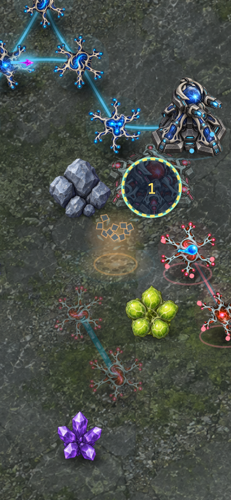
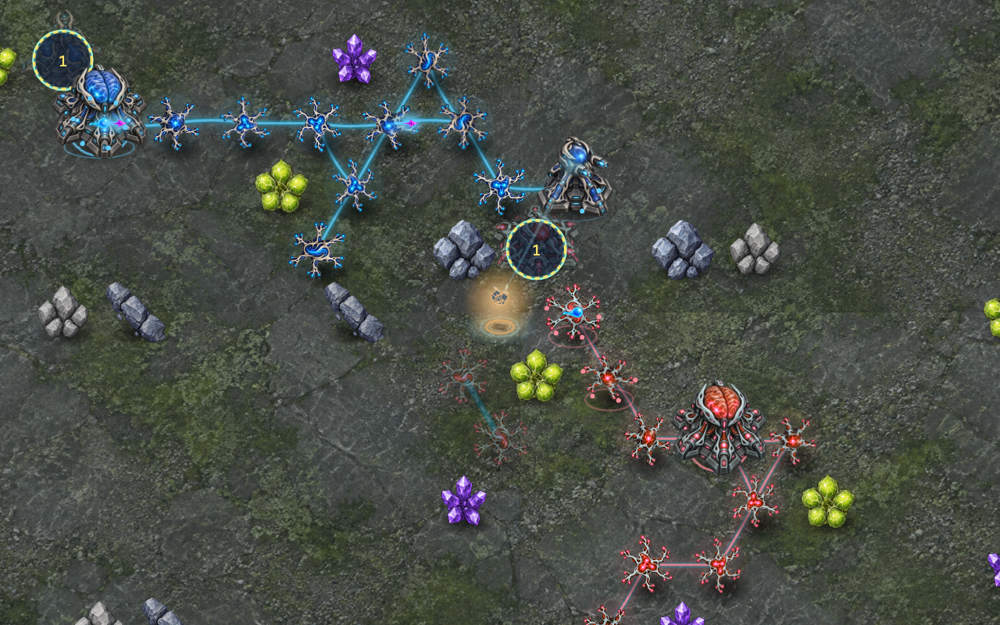

# Battlefield depth and combat presentation

For the newer weapon-specific trajectories and synchronized impacts, see
[distinct weapon motion](WEAPON_EFFECTS.md).

The continuing goal is a deeper, balanced strategy game with substantially better animation and dimensional presentation. The rules-5 tournament is a baseline, not completion: the defensive opening and long-map stalemates remain unresolved.

This presentation milestone places terrain objects and buildings in the same ground-depth order and replaces flat combat flashes with raised muzzle light, tapered tracers, projected ballistic sparks, debris, smoke and light on the ground. Building recoil moves artwork only. Selection, hit targets, gameplay geometry and authoritative timing remain fixed.

Effects consume authoritative outcomes and use the existing injected animation clock. Cosmetic trajectories are pure functions of event identity and age; no gameplay random state changes. Transient groups have a strict shared budget and expire. Rollback, match changes and reduced-motion settings clear them. Small gradients replace per-particle blur filters to control phone rendering cost.

Verification must cover event deduplication, expiry, rollback, depth sorting, immutability, reduced motion and actual Chromium/WebKit desktop/phone rendering. Screenshots of one frame do not prove animation quality; inspect several moments from a real command replay and preserve the source and timing. This milestone does not establish AAA quality or finish the broader game goal by itself.

## Verified milestone — 2026-09-27

- Full repository suite: 1,701 tests passed. Build/typecheck and lint passed. Independent presentation review found no actionable findings.
- Chromium and WebKit rendered a real destruction/damage tick from the recorded rules-5 match at 80, 240 and 650 ms of effect age, in 1280×800 and 390×844 viewports. The entire recording first reproduced its authoritative hash `650617de`; the images below are diagnostic renderer captures, not ordinary UI gameplay.
- Both browsers also passed the normal setup/map/locked-help/phone-bounds flow on the live source preview. Map tile counts remain authoritative after moving decorative art into the depth layer.
- Both browsers passed raised-body selection, placement on the ground behind a building, rejection on visible rocks and minimap navigation after the depth-layer change.
- Automated regressions verify the shared 48-event limit, moving fragments, fixed ground hit regions, depth ordering, terrain fallback images, state immutability, repeated-tick deduplication, expiry, rollback and reduced-motion cleanup.

Reproduce current effects with `pnpm exec tsx scripts/fuse-craft-effects-smoke.ts` while the source preview is running on port 5174 (or `FUSE_CRAFT_URL` names another). The default is the [rules-12 combat recording](verification/rules12-replays-2026-10-01/README.md). Historical: the captures below used the rules-5 recording under `verification/expansion-2026-09-27/close-quarters.replay.json`, which the current engine rejects; they reproduce only on that older source revision.

