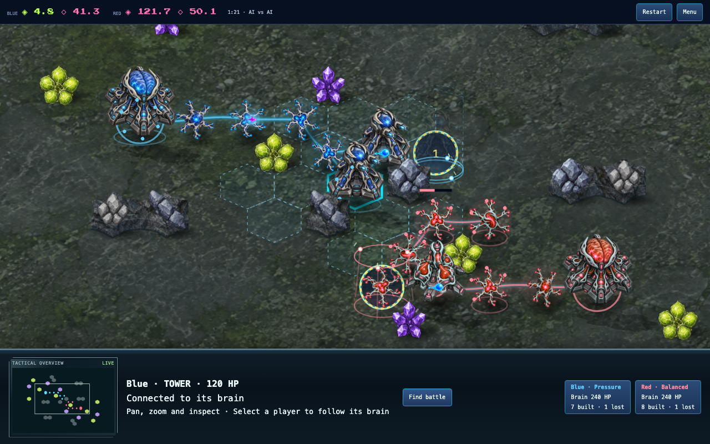
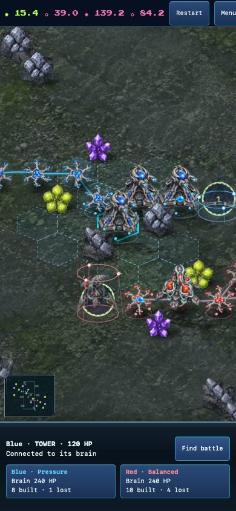

# Finding and watching a developed battle

Watch mode now has a **Find battle** camera action. It selects the strongest
current hit, or the nearest pair of connected opposing structures between
volleys. It moves only when clicked, preserves manual pan/zoom, and sends no
gameplay commands. Selecting either player still focuses that player's brain.

Ground art now spans the arena once at its projected proportions, with lower
contrast so buildings and effects remain the focus. Mirrored continuation starts
outside the arena. An earlier repeating version put a conspicuous reflection
through the middle of the phone view; the live capture exposed it and the final
version moves that boundary off the playing field. Terrain and collision data
are unchanged.

## Verification

- All 1,782 repository tests, typecheck, focused ESLint and build pass.
- Focused tests verify deterministic camera selection, no mutation/reordering of
  world state, disconnected-network exclusion, equal-hit ties and read-only UI.
- Chromium and WebKit pass actual camera movement and the desktop/portrait/
  landscape watch flow. Independent review found no actionable issue.
- `scripts/fuse-craft-live-watch.ts` starts Pressure/Balanced from the ordinary
  menu, waits for combat under the ordinary clock, clicks Find battle, then
  records 60 samples approximately 500 ms apart. No world, commands or clock are
  injected. Both browsers capture moving supply and shots without page errors.
- Chromium samples observe two simultaneous wreck silhouettes. WebKit's coarse
  samples observe no wreck; this is not evidence that WebKit rendered a collapse
  in that interval. Its destruction effect is separately covered by the verified
  real-command replay in `../wreck-collapse-2026-09-27/`.
- The screenshots were visually inspected. The videos are the last 30 seconds of
  those live runs, trimmed and encoded without changing playback speed.

These are headless desktop/browser-emulation observations, not physical-device
frame-rate measurements or human visual acceptance.

Reproduce the live run with:

```sh
pnpm exec tsx scripts/fuse-craft-live-watch.ts /tmp/fuse-live-watch
```

[Live desktop battle](live-desktop.mp4) · [Live phone battle](live-phone.mp4)



