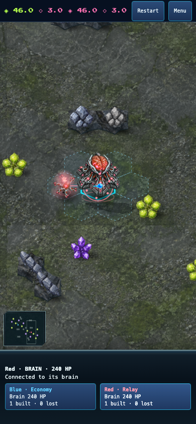
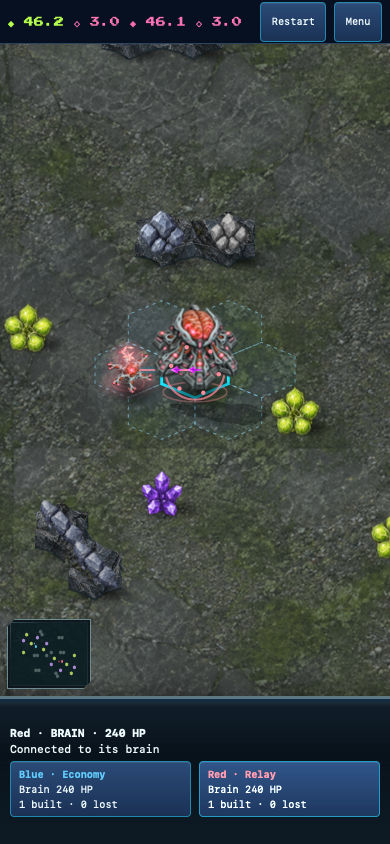
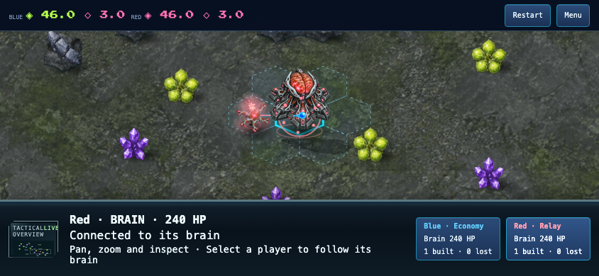

# Live AI vs AI watch mode

The normal New game menu now offers Watch AI vs AI, with independent opening
selectors. Both AIs choose commands from the same pre-step world and share the
existing RoomRuntime clock. The spectator can inspect, pan, zoom, focus either
brain, restart the matchup and return to the menu. Gameplay commands are blocked
at both the session and room-fold boundaries. Results and audio do not treat the
spectator as a winning or losing player.

The validated strategy pair travels with room settings and checkpoints. Adapter
compatibility is `neural-defence-9-watch-1`; world rules remain 9 and the production
AI remains policy 2. This change does not integrate an experimental balance policy.

## Verification

- `pnpm test`: 1,754 tests passed, no failures or skips.
- `pnpm typecheck`, focused ESLint and `pnpm build` passed.
- Network regressions cover invalid settings, simultaneous ordinary AI commands,
  injected human commands being ignored, checkpoint continuation, deterministic
  restart and clock disposal. UI and audio regressions cover read-only controls
  and neutral results.
- `pnpm exec tsx scripts/fuse-craft-watch-smoke.ts`: Chromium and WebKit passed
  the actual menu flow, independent Economy/Relay choices, both players building,
  enemy inspection, restart retaining openings and return to menu without page
  errors, at 1280×800, 390×844 and 844×390.
- The smoke checks that inspector and player cards fit the visible dock. The
  initial phone layout clipped its inspector; the corrected layout stacks the
  selection summary above the two cards. Captures below were visually inspected.
- Independent diff review found no actionable findings.

These are browser-emulation checks, not physical-phone or human visual acceptance.
Start the existing local preview and choose **New game → Watch AI vs AI** to try it.

