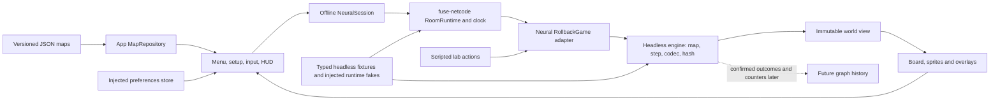

# Neural Defence architecture

Status: Phase 0 engine, adapter, shared Fuse UI and sprite integration are implemented locally. Focused browser flows and automated tests are verified in [HANDOFF.md](HANDOFF.md); visual acceptance remains with the user. [Phase 0](PHASE_0.md) describes the rules; [core contracts](CORE_TYPES.md) points to exact types. The diagram describes current modules, not public online play.

Arrows represent data/control. [`src/engine/`](../../games/neural-defence/src/engine/index.ts) imports no app, renderer or netcode. It owns validated maps, ownership/connectivity, economy, construction, research, worker and particle travel, combat, outcomes, state encoding/decoding and hashing. `step(world, commands)` advances one tick and returns a new world. The renderer does not run physics or advance ticks.

[`src/online/game.ts`](../../games/neural-defence/src/online/game.ts) translates admitted log entries into typed engine commands, folds room management, scopes matches, and supplies a checkpoint codec to `RollbackGame`. It supports a one-seat solo setting and up to four owner seats in the shared contract. [`src/online/session.ts`](../../games/neural-defence/src/online/session.ts) composes the existing `RoomRuntime` offline without a transport. [`combat-lab.ts`](../../games/neural-defence/src/online/combat-lab.ts) authors an initial two-network scenario and issues normal actions afterward; it is not AI. No public room flow has been qualified.

[`src/app/`](../../games/neural-defence/src/app/app.ts) owns menu/setup, map loading, preferences, session lifecycle and player controls. `MapRepository`, `SessionFactory`, `PreferencesStore` and `RuntimeDependencies` provide narrow injection seams for deterministic tests. [`src/render/`](../../games/neural-defence/src/render/board.ts) reads the current world and presents hexes, ownership, construction, builder travel, attack supply and sprites. `?debug` affects presentation and exposes two engine settings; neither flag is silently enabled.

The simulation has one 20 Hz clock through `RoomRuntime`: admitted commands, income/research, simultaneous combat, builder dispatch/work, connectivity and attack routing occur inside the engine step. The lab, solo sandbox and four-owner headless tests use that same function. Checkpoints hold per-owner jobs, worker/particle timing, research, priorities and outcomes; paths are derived from validated map and structures. [`REVIEW-2026-09-25.md`](REVIEW-2026-09-25.md) and [`HANDOFF.md`](HANDOFF.md) identify unresolved replay, browser and visual acceptance risks.
