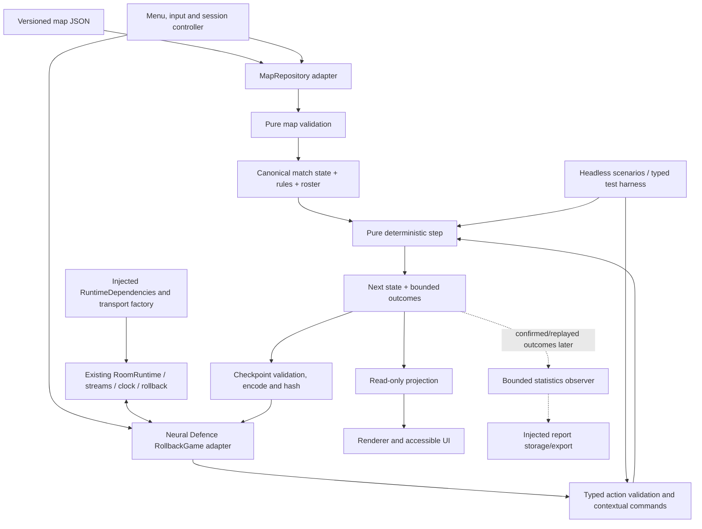
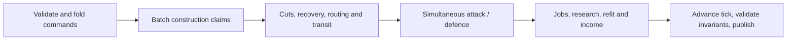

# Phase 0 inventory and architecture

Status: design for review, not implementation. [PHASE_0.md](PHASE_0.md) owns the initial rules and acceptance criteria; [CORE_TYPES.md](CORE_TYPES.md) defines the proposed data contracts. Builder delivery is a proposal below, not an approved change to the construction rule.

## What exists in the first playable slice

| System               | Phase 0 behavior                                                                                          | Later                                                           |
| -------------------- | --------------------------------------------------------------------------------------------------------- | --------------------------------------------------------------- |
| Menu/session         | Choose map/spawn, one-player no-AI sandbox, separate scripted combat lab, reset/back, loading/error/retry | Human online rooms, shared TV/controller qualification          |
| Map                  | Versioned 12 × 12 JSON hex map, static terrain/deposits/spawns, strict loader, four spawn slots           | Editor, procedural maps, fairness-qualified map catalogue       |
| Player/world         | Explicit roster/ownership, four independent economies and particle pools in headless tests                | Teams or additional player capacity                             |
| Economy              | Biomass and Insight; brain baseline plus adjacent connected deposit mining                                | Additional economic specializations if needed                   |
| Construction         | Explicit neuron queue, affordability, paid active site, progress, cancellation, vulnerable site           | Tower construction; optional builder delivery only after review |
| Research             | Growth Efficiency and mutually exclusive Excitation/Insulation; jobs, cost, progress, activation rules    | Speed, throughput, other bounded branches                       |
| Particle composition | Simultaneous assault A and guard B; finite shared pool; brain refit with delay                            | Additional types with a distinct role                           |
| Transport            | Per-type priorities, real hop latency, shared capacity, reservations, backpressure, rerouting             | Measured algorithm improvements preserving the rule contract    |
| Combat               | Adjacent attacks, type-dependent protection, HP, simultaneous damage, cuts, elimination/draw              | Towers/range, abilities and wider competitive scenarios         |
| Runtime              | Existing offline `RoomRuntime` through `RollbackGame`, typed actions, replay/checkpoints                  | Real network delivery/recovery qualification                    |
| Observation          | Read-only board/UI view and typed actual outcomes                                                         | Recorded histories, end-of-match graphs and career integration  |
| Debug                | Instant construction/research durations, normal costs and particle travel                                 | Additional explicit diagnostics if useful                       |

Construction and research are **two job families**, not the entire game. Mining is continuous economy, routing is movement/allocation, combat consumes available particles, refitting is another timed job, and recovery is a scheduled lifecycle transition. These systems share IDs, ticks, validation and resource accounting; they do not need one generic “job that does anything” abstraction.

## Dependency architecture

Arrows show data/control, not permission for reverse imports. `engine/` imports no app, renderer, network, filesystem, browser API or another game. The renderer cannot advance ticks, decide collisions or mutate state. The statistics observer cannot affect play. Production and test adapters implement the same small interfaces at the composition root; do not introduce a dependency-injection container.

## Module responsibilities

| Proposed location under `games/neural-defence/` | Owns                                                                                 |
| ----------------------------------------------- | ------------------------------------------------------------------------------------ |
| `maps/`                                         | Hand-authored JSON assets; catalog belongs to app-facing data                        |
| `src/engine/map.ts`, `hex.ts`                   | Schema guard, canonical map, indexing/neighbors                                      |
| `src/engine/state.ts`, `rules.ts`               | Serializable authority, IDs, bounded immutable rules                                 |
| `src/engine/actions.ts`                         | Typed action bodies, semantic validation and rejection reasons                       |
| `src/engine/construction.ts`, `research.ts`     | Explicit job lifecycles and costs                                                    |
| `src/engine/economy.ts`                         | Income, spending, caps and fractional remainders                                     |
| `src/engine/particles.ts`, `routing.ts`         | Typed cohorts, profiles, quotas, transit/reservations/refit/recovery                 |
| `src/engine/combat.ts`, `connectivity.ts`       | Attack/defence, simultaneous destruction and owner-specific reachability             |
| `src/engine/step.ts`                            | One ordered rule pipeline; no separate subsystem clocks                              |
| `src/engine/view.ts`, `checkpoint.ts`           | Public projections; canonical serialization, validation and hashing                  |
| `src/online/`                                   | Existing netcode contract, log entry codec, management fold and typed command facade |
| `src/app/`, `src/render/`                       | Session composition, map repository, menu/input and presentation                     |
| `tests/`, `scripts/`                            | Typed boundary fakes, deterministic scenarios, batch measurement                     |

Split modules by actual responsibility; these names are a map of ownership, not a requirement to create empty files. Existing package APIs remain authoritative. Engine actions are independent of wire tuples; the adapter translates them losslessly and attaches trusted stream context. Map schema, rules and checkpoint versions are separate.

## One simulation clock

The exact availability and ordering rules are in Phase 0. Render frames may interpolate recorded departure/arrival times, but never run a second simulation. Four-player fixtures, the scripted lab and eventual network play use the same step. Checkpoints contain all decision state, including cursors and active particle profiles; topology/path caches are derived and safely rebuilt.

## Builder particles: a decision to make before implementation

**Recommendation to evaluate:** make construction require a builder to reach a connected neuron beside the target. It then grows the adjacent tile. This gives network distance and cuts a direct economic effect, while avoiding a worker crossing arbitrary unowned terrain. It also makes “planned route,” “builder travelling,” and “construction progressing” distinct visible states.

For an initial experiment, use a small, separately bounded worker pool, rather than silently adding builder C to the already-defined 128 assault/guard pool. One builder per active construction job matches the existing one-job-per-player rule. A common military/worker pool is a meaningful alternative, but changes combat composition, refitting and economic balance and must be explicitly chosen. Neither variant is accepted yet.

| Proposed stage     | Rule question and recommended starting behavior                                                                              |
| ------------------ | ---------------------------------------------------------------------------------------------------------------------------- |
| Queued             | No cost, tile reservation or worker commitment yet; user may cancel freely                                                   |
| Accepted/dispatch  | Validate target and friendly anchor; reserve worker/site and pay once; record destination/entity identity                    |
| Travelling         | Builder uses actual friendly links, latency and shared transport capacity; build timer has not started                       |
| Building           | Builder reaches the anchor; target is a vulnerable nonconducting site; only now advance construction time                    |
| Complete           | Neuron activates next tick; builder travels back to brain before another job can use it                                      |
| Cancel             | Unstarted work is free; accepted work keeps the current no-refund policy; return builder through valid links                 |
| Cut or destruction | Pause/replan if possible; otherwise use a specified bounded recovery path with delay, never instantaneous worker replacement |

This deliberately exposes open choices: whether an accepted but unreached site can be attacked, builder vulnerability, return versus onward dispatch, recovery delay and whether debug construction still waits for delivery. Recommended debug behavior is to remove the build duration while retaining travel, because transport is the mechanic under test. Tower jobs can later use the same delivery lifecycle with their own prerequisites, cost and duration.

Research remains a brain-based timed job in this proposal. Its effects reach existing frontline particles through their defined return/redispatch profile rules; a research worker travelling to every neuron is unnecessary. Construction and research share lifecycle vocabulary and typed outcome reporting, while retaining distinct state machines and rules.
