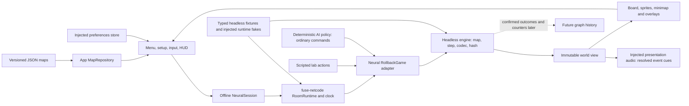

# Neural Defence architecture

Status: the current game provides local player-versus-AI skirmishes, sandbox and combat lab through the shared runtime, with the illustrated responsive RTS interface. [The tech tree](TECH_TREE.md) is the current rules reference; [core contracts](CORE_TYPES.md) points to exact types. [First-version evidence](FIRST_VERSION.md) and [current presentation verification](verification/PREMIUM_TERRAIN.md) distinguish headless, browser and visual evidence. Earlier Phase 0 handoffs are historical. The diagram describes current modules, not public online play.

Arrows represent data/control. [`src/engine/`](../../games/neural-defence/src/engine/index.ts) imports no app, renderer or netcode. It owns validated maps, ownership/connectivity, economy, construction, research, worker and particle travel, combat, outcomes, state encoding/decoding and hashing. `step(world, commands)` advances one tick and returns a new world. The renderer does not run physics or advance ticks.

[`src/online/game.ts`](../../games/neural-defence/src/online/game.ts) translates admitted log entries into typed engine commands, folds room management, scopes matches, and supplies a checkpoint codec to `RollbackGame`. It supports a one-seat solo setting and up to four owner seats in the shared contract. [`src/online/session.ts`](../../games/neural-defence/src/online/session.ts) composes the existing `RoomRuntime` offline without a transport. [`combat-lab.ts`](../../games/neural-defence/src/online/combat-lab.ts) authors an initial two-network scenario and issues normal actions afterward; it is not AI. No public room flow has been qualified.

[`src/app/`](../../games/neural-defence/src/app/app.ts) owns menu/setup, map loading, preferences, session lifecycle and player controls. `MapRepository`, `SessionFactory`, `PreferencesStore` and `RuntimeDependencies` provide narrow injection seams for deterministic tests. [`src/render/`](../../games/neural-defence/src/render/board.ts) reads the current world and presents hexes, ownership, construction, builder travel, attack supply and sprites. `?debug` affects presentation and exposes two engine settings; neither flag is silently enabled.

The engine catalog owns costs, prerequisites, upgrades and unit profiles. Command pages derive eligibility and missing requirements from it. Placement is local presentation state until a confirmed command enters the runtime. Queued plans wait for actual connected support, resources and a free builder; their ghosts do not conduct.

The terrain art catalog restricts artwork to the map cell's category. Flat ground is decorative; visible rocks and deposits, their clipped footprints and the minimap come from authoritative map cells. A shared cell-based art resolver keeps neuron anatomy identical in the world, placement ghost and portrait. Raised building hit regions affect selection only and are disabled during placement. Camera/minimap navigation, animation and audio do not mutate simulation state. The audio adapter consumes resolved outcomes, suppresses duplicate/rewound ticks, respects forced mute, and cancels active voices on mute or disposal.

The simulation has one 20 Hz clock through `RoomRuntime`: admitted commands, income/research, simultaneous combat, builder dispatch/work, connectivity and attack routing occur inside the engine step. Skirmish AI uses ordinary validated commands with equal resources and no private simulation clock. The lab, solo sandbox and four-owner headless tests use that same step. Checkpoints hold per-owner jobs, worker/particle timing, research, priorities and outcomes; paths are derived from validated map and structures. Current verification and its limits are linked above; browser emulation does not establish physical-device or public online qualification.
