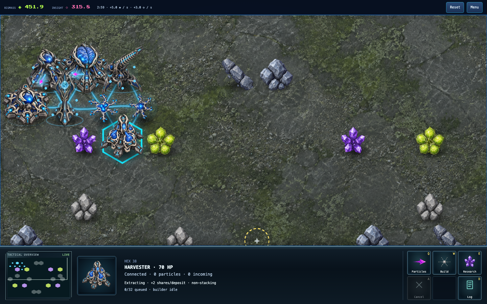
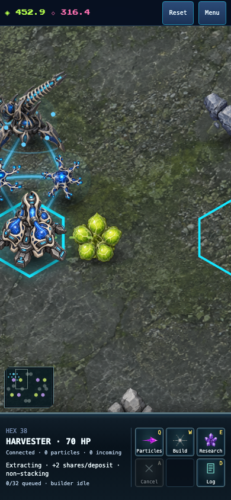
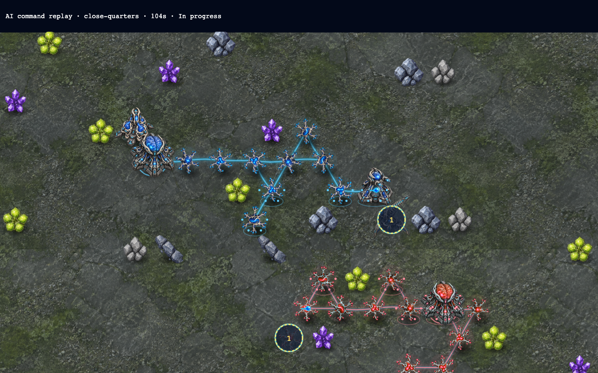

# Fuse Craft expansion and balance evidence — 2026-09-27

The current game uses **world rules 9 and AI policy 4**, with adapter compatibility
`neural-defence-9-watch-3`. The [latest complete comparison](verification/brain-finisher-2026-09-27/README.md)
covers 210 map/opening/seat cases: 206 finish within 900 simulated seconds and four
reach the cap, with no rejected commands. All six openings win at least one
different-opening matchup on the default arena. Both Pressure/Relay seat
continuations finish at 968 seconds; their original 900-second results remain a
timeout. These are deterministic policy comparisons, not proof of equal human
strategy strength.

The [current tech tree](TECH_TREE.md) describes the active rules, and the
[live battle captures](verification/battle-framing-2026-09-27/README.md) show the
normal watch UI under its ordinary clock. The remaining Balanced mirror stalemate
is under investigation; its experimental durable repair is not part of the current policy.

Everything below preserves the **historical rules-5 expansion matrix**. Its
Defensive-opening losses and timeout totals are superseded by later work:
[Defensive opening](DEFENSIVE_OPENING.md), [rules-6 baseline](RULES6_BALANCE.md),
[flank recovery](FLANK_RECOVERY.md), and the latest comparison linked above.

## Delivered changes

- Growth unlocks the **Harvester** (economic conduit, one specialist extraction bonus per deposit) and **Bastion** (durable, supplied, range-one defense). Shared catalogs control prerequisites, placement, costs, timing, durability, weapon capability and extraction. Harvesters cannot receive attack orders.
- Both have matching transparent sculpted art in the battlefield, placement ghost, command card and portrait. Connected specialist extraction has a resource-colored animation, disabled by reduced-motion preferences. [Asset paths and exact imagegen prompts](art/EXPANSION_SPRITES.md).
- Paid construction uses its building's durability and retains damage through completion. Weapons prioritize brains and connected retaliating threats over scaffolds. Siege now fires four particles every four seconds: reach is its advantage, not high close-range damage.
- Six deterministic AI openings use ordinary commands, with equal resources, one builder and the normal 128-particle pool. They prioritize active guns, recognize enemy weapon reach, counter artillery, reconnect isolated investments and pursue the living enemy network instead of orphaned branches.
- Four additional playable maps cover open approaches, narrow passages, scarce resources and close starts. **Close Quarters is the default**, with all larger arenas still selectable. The [tech tree](TECH_TREE.md) now describes the newer active rules. UI combat and build-time help reads the catalog rather than duplicating balance numbers.

## Reproduction and scope

Final authoritative source: `907df9cb39b7864678037031942d13ec9631eb89`, rules 5. Later UI-only changes select the new default and derive help text from the same catalog; they do not change tournament behavior. Comparison source: `8ecedcdfe7e896dfcd72fc5146abb54abafdfdcb`, rules 4. The original pre-expansion three-policy baseline is preserved separately in [balance-baseline](verification/balance-baseline/).

```sh
pnpm exec tsx scripts/fuse-craft-tournament.ts --maps all --seconds 900 --out /tmp/fuse-craft-tournament
pnpm exec tsx scripts/neural-defence-tower-assay.ts
pnpm exec tsx scripts/fuse-craft-replay-capture.ts docs/neural-defence/verification/expansion-2026-09-27/close-quarters.replay.json
```

The replay capture needs Vite at `http://127.0.0.1:5174/games/neural-defence/?mute`. Its images are diagnostic views of a hash-verified command replay using the production renderer, not evidence of interacting through the player UI.

Each map runs 21 unordered policy pairs including mirrors, in both starting positions: **42 matches per map**. The cap is 18,000 ticks (15 simulated minutes). No instant settings, extra resources, privileged AI attacks or modified clocks enter the rules. A timeout is **not** an engine draw. Exact deterministic repeats are not independent statistical samples; swapped seats check fairness. These policies are handcrafted opponents, not an exhaustive search of human play.

Raw comparison: [168 rules-4 matches](verification/expansion-2026-09-27/rules4-matrix.jsonl). Raw final results: [210 rules-5 matches](verification/expansion-2026-09-27/rules5-matrix.jsonl). Rows record source, rules, strategies, seats, contact time, result, state hash, income, builds, losses, research, empty supply-destination samples, disconnected structures, idle builder samples and lost construction investment. These are simulation metrics, not network bandwidth or rendered frame-rate measurements.

## Matrix results

| Arena                | Rules 4 finished / 42 | Rules 5 decisive wins | Rules 5 actual draws | Rules 5 timeouts |
| -------------------- | --------------------: | --------------------: | -------------------: | ---------------: |
| Synaptic Reach       |                     8 |                    14 |                    0 |               28 |
| Open Synapse         |                     6 |                    14 |                    0 |               28 |
| Twin Pass            |                    10 |                     6 |                    0 |               36 |
| Scarce Reach         |                     0 |                    28 |                    0 |               14 |
| Close Quarters (new) |                     — |                    30 |                    8 |                4 |

Across the four comparable maps, finished matches increased from **24/168 to 62/168**. Twin Pass regressed from ten finishes to six: the improved durability and positioning do not solve choke-point stalemates. Across all five final maps, **100/210 finish**, with 110 timeouts. No command was rejected in either matrix.

All 105 paired matchups preserve their outcome when starting positions are swapped. Duration, first contact and all recorded player metrics also match for 104 pairs. The exception is Relay versus Defensive on Twin Pass: Relay wins in 470 versus 463 seconds, with different construction and economy totals. This is a residual positional difference, not evidence of perfect rotational symmetry. Every map's representative logged-command replay reproduced its final hash.

## Default arena: actual counterplay

Close Quarters completes **38/42** matches: 30 decisive results, eight actual mutual-destruction draws, and four timeouts. **All 30 non-mirror matches finish**, from 134 to 372 seconds; median 168 seconds. Relay and Defensive mirrors remain unfinished at the cap.

The same matchup result occurs from both starting positions. The following records show the winning opening once per pair; reversing seats reproduces it.

| Opening   | Beats                                | Loses to                   |
| --------- | ------------------------------------ | -------------------------- |
| Balanced  | Economy, Defensive                   | Pressure, Siege, Relay     |
| Pressure  | Balanced, Economy, Defensive         | Siege, Relay               |
| Economy   | Siege, Relay, Defensive              | Balanced, Pressure         |
| Siege     | Balanced, Pressure, Defensive        | Economy, Relay             |
| Relay     | Balanced, Pressure, Siege, Defensive | Economy                    |
| Defensive | None                                 | Every other tested opening |

This is useful counterplay among five openings, not proof of universal competitive balance. **The defensive bot needs a stronger opening** on the fast arena. Do not weaken the Bastion merely to compensate: the separate weapon assay confirms its close-range role, whereas this bot also makes expansion, research and supply decisions.

## Weapon-role assay

[32 controlled engagements](verification/expansion-2026-09-27/tower-assay.jsonl) compare four towers at one and two hexes, with equal initial supply, research and Pulse profile. These prebuilt positions are **not equal-cost economy matches**. Routing cuts and finite ammunition still apply.

Bastion defeats Pulse, Siege and Relay at one hex in 6–7 seconds. At two hexes it cannot fire: Pulse and Relay destroy it; the Siege engagement remains unresolved at the 60-second cap, with Bastion inflicting zero damage. Several mirrors stall after supply routes are cut, so an unresolved assay is not a draw or a claim that both units are immortal.

## Verification and remaining limits

- Full repository suite: **1,700 tests passed**. Typecheck, production build and lint passed. Focused tests cover catalog requirements, non-stacking extraction, disconnection, noncombat priority rejection, construction damage preservation, threat targeting, AI repair decisions, deterministic replay and symmetric maps. Independent review findings were fixed and rechecked.
- Chromium and WebKit: actual normal-time Growth and specialist research, new buildings and all towers, construction clocks, ghost/portrait identity, supplied stock, and no attack controls on Harvesters. Desktop and 390×844 phone layouts inspected. The phone Harvester explanation was shortened after visual inspection found crowding.
- Chromium and WebKit: all four new map choices, actual blocked/deposit tile counts, six-opening setup control, tap/focus help for locked commands, no horizontal phone overflow, and default brain cells 175/304.
- Chromium and WebKit: normal-speed unattended-human defeat, result geometry at 568×320 and direct rematch. No runtime page errors in these flows.
- [Command replay](verification/expansion-2026-09-27/close-quarters.replay.json) reproduces hash `650617de` after 3,120 ticks. Three frames were rendered for inspection. Automated tournament replay checks also run independently of the policy code for a representative pair on every map.
- Wider and narrow-passage arenas still contain long stalemates. The matrix reports them explicitly. Human playtesting and physical-phone/trackpad acceptance remain separate; this pass does not certify either. No public multiplayer release or production deployment occurred.






