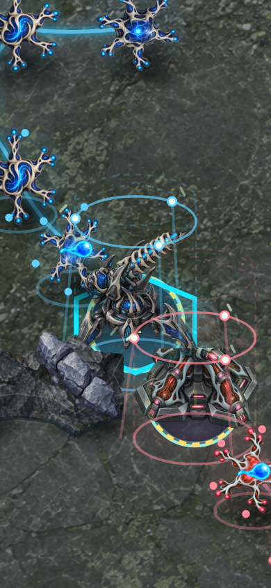
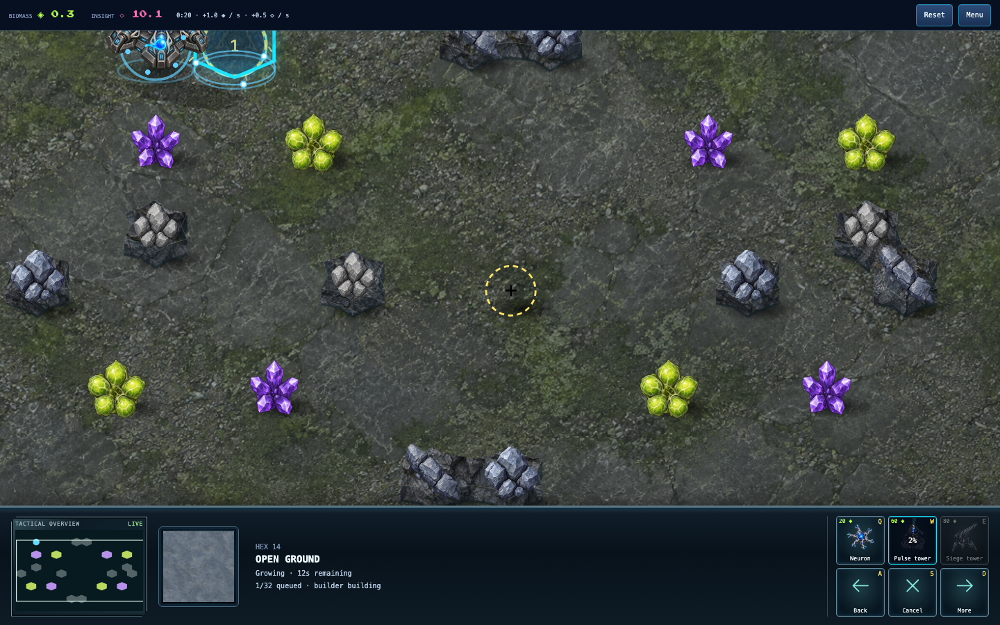

# Raised fabrication and assembly

Paid construction now has a projected frame, a faint outline of the intended
building and a material reveal that rises from its foot to its top. The revealed
height comes directly from the construction job's authoritative progress. Three
moving tools, six short sparks and a scan ring show active fabrication only while
the builder is working. Paid sites waiting for their builder remain still.

Construction bodies share the ground-depth ordering of completed structures,
rocks and deposits. Queue numbers, ground selection and placement remain on the
ground layer. All fabrication artwork is decorative and cannot intercept input.
An upgrade retains its existing structure beneath the new blueprint.

Absolute presentation time drives the tools and sparks, so re-rendering the same
state does not restart their phase. There is no new animation loop, randomness or
authority. Reduced motion hides moving assembly parts while preserving progress.
Cancellation, destruction, completion and rollback update the existing queue
rendering lifecycle. The engine permits one paid job per player, bounding these
effects to four sites; unpaid plans have no raised fabrication body.

## Reproduction

With the source preview running on port 5174:

```sh
pnpm exec tsx scripts/fuse-craft-construction-smoke.ts
pnpm exec tsx scripts/neural-defence-ui-smoke.ts 'http://127.0.0.1:5174/games/fuse-craft/?mute' /tmp/fuse-construction-ui
pnpm exec tsx scripts/neural-defence-build-queue-smoke.ts
```

The first command replays the current ordinary-command rules-9 recording through
hash `20f8e061`, captures the same surviving Siege construction at 15%, 50% and
85%, and checks motion, depth, input transparency and state immutability in
Chromium/WebKit desktop and phone viewports. It renders diagnostic replay states;
the separate UI smoke verifies normal setup, placement and cancellation and
captures the live construction flow. Queue smoke verifies multiple plans and
ground input. Phone viewports are emulation, not physical-device qualification.





This adds visible height and continuous build animation to the illustrated RTS
style. It does not establish AAA-quality acceptance or complete the balance goal.

Verification: **1,738 repository tests**, build/typecheck and focused lint pass.
The construction replay, normal UI and multi-plan queue checks pass in Chromium
and WebKit. Independent review found no blocking issue; its renderer-only smoke
caveat is addressed by the normal-flow selection/cancellation check above.
