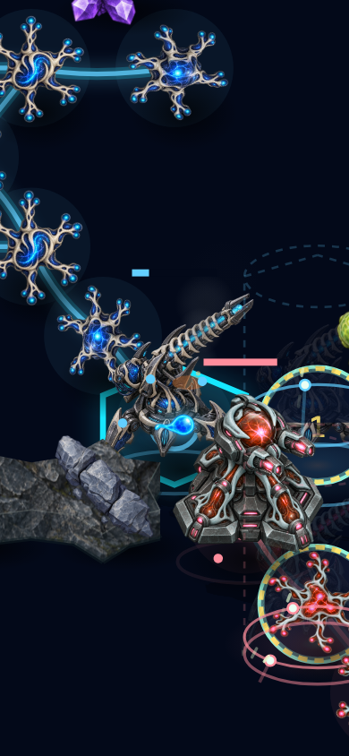

# Persistent building damage

Buildings below half health now vent four rising smoke puffs and three short-lived
embers. The plume emerges above the building body, follows its depth ordering,
and grows more visible with damage. Neurons keep their existing organic animation;
healthy buildings and health bars retain their appearance.

Each damaged building has a fixed number of decorative SVG nodes. Absolute
presentation time preserves the smoke phase across renderer updates; no new
animation loop or mutable randomness is introduced. Reduced motion freezes the
smoke and hides embers. The effect cannot intercept input, and restoration,
destruction or rollback follows the existing structure-rendering lifecycle.

## Verification

All 1,739 repository tests, typecheck, build and focused lint pass. The focused
renderer regression checks healthy/damaged/restored state, fixed particle counts,
repeatable animation, reduced motion and unchanged authority.

`pnpm exec tsx scripts/fuse-craft-damage-smoke.ts` replays the existing ordinary
combat recording to hash `20f8e061` and selects an actual damaged building. Both
Chromium and WebKit pass desktop and emulated-phone motion, reduced-motion,
visibility, input-transparency and state-immutability checks. Captures show the
isolated renderer, not the normal app HUD or terrain background.

The separate `scripts/neural-defence-ui-smoke.ts` also passes the ordinary
Chromium/WebKit desktop, portrait and landscape menu/game flows. These browser
viewports do not establish physical-phone or human visual acceptance.

Independent review found no blocking issue. This is an additional visual and
tactical cue; it does not establish AAA-quality acceptance or complete balance.
