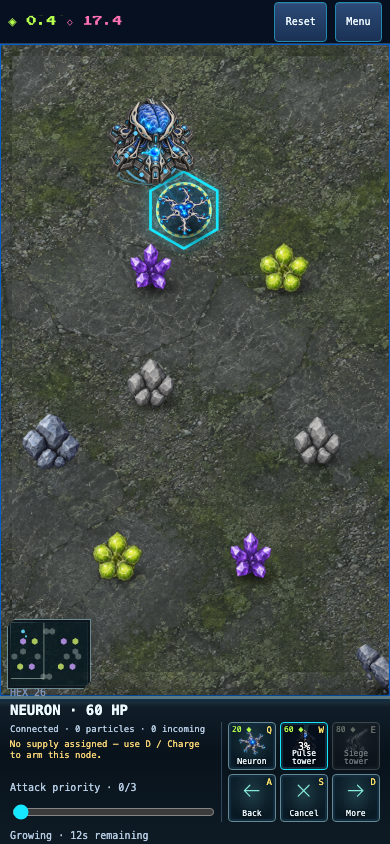
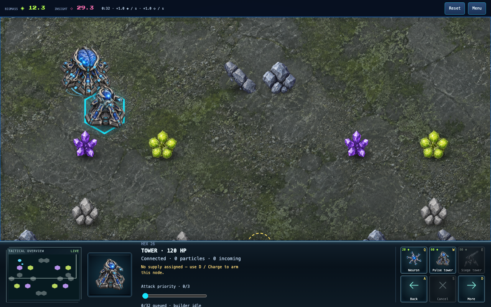

# Timed neuron specialization

Stalled-match inspection found that conduits permanently occupy useful weapon positions. Add a deliberate construction choice: place a building ghost on an owned neuron to specialize it in place. This is a gameplay feature available equally to humans and AI, not a bot shortcut.

The shared construction catalog declares permitted source kinds. The normal price, research, one builder, travel time, build duration and connected-neighbor requirements apply. The neuron continues supplying and fighting during work. Completion preserves its entity identity and health fraction, changes its kind, and removes attack orders if the new building cannot fire. Canceling leaves the neuron unchanged and does not refund delivered work. Losing the source neuron cancels its queued/paid upgrade; a replacement at the same cell cannot inherit that job.

Queue state records the source entity ID. Checkpoint validation rejects foreign, mismatched, duplicate or obsolete source references. Upgrading has one damage target: the original neuron; it does not add a second shield or invulnerable scaffold. Rules and online compatibility change together.

The UI must explicitly say when placement upgrades a neuron, show the target building ghost and normal clock, and distinguish it from open-ground placement. AI may consider its own neurons as weapon sites and must preserve active upgrade jobs. Tests cover normal completion, damage retention, cancellation, source destruction, prerequisites, duplicate plans, noncombat priorities, rollback/checkpoint validity and both browser input paths. Balance claims require fresh ordinary-command trials under the new rules.

## Implementation evidence

Implemented in `13599ed2`, rules 6. Five new engine regressions cover timed completion/checkpoint replay, health retention, cancellation, destruction of a paid upgrade, invalid source identities and economic specialization. All 1,707 tests passed at that milestone, along with build/typecheck and lint. Independent review found no actionable issues.

Chromium and WebKit each performed an ordinary neuron-to-Pulse specialization on desktop and 390×844 phone layouts, with normal resources and timing. They verified the explicit upgrade prompt, ghost identity, construction clock, retained neuron during work, one completed tower and no horizontal overflow. These are emulated phone checks, not physical-device evidence.

The first Twin Pass trial still stalled. The mechanic provides a usable player choice but does not by itself establish a balance improvement. A separate AI correction allocates ammunition to weapons able to hit paid sites or disconnected structures and avoids making exposed reconnects its first construction choice. Strategic pursuit still follows the living enemy network. Full new-rules results must be reported separately from the older rules-5 matrices.
