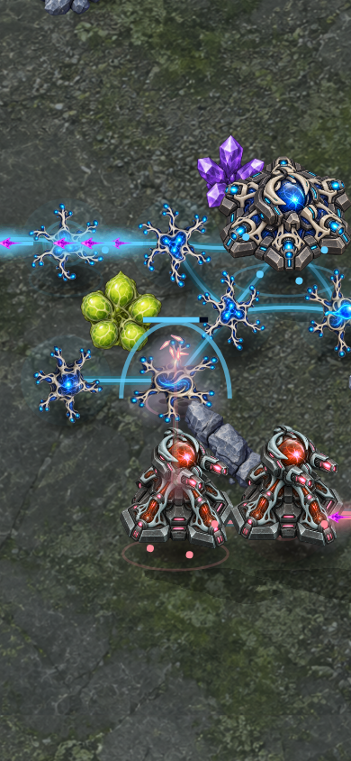

# Supplied Bastion protection — rules 7 candidate

The implementation evidence below is historical. The newer visual response is
documented in [projected shield response](WEAPON_EFFECTS.md#projected-shield-response);
the engine's protection rules are unchanged.

Bastions previously had no useful answer to longer-range fire: even increasing their weapon range failed to stop the defensive opening losing. Rules 7 adds a support role that competes for the same finite ammunition as offense. The current candidate costs 45 Biomass and takes 8 seconds plus builder travel; Growth remains required. Weapon range remains one, with 240 HP and the existing 12-particle volley.

The catalog defines a two-hex field that can absorb at most 50% of incoming damage to friendly structures and paid sites, including itself. Each supplied stationed particle can absorb up to twice its attack value before entering ordinary recovery. Excess capacity on a spent particle is discarded. Empty or disconnected Bastions have no field. Overlapping fields cannot compound the percentage. A specializing neuron is a single target, not a source plus a second shielded scaffold.

All offensive salvos reserve their ammunition before protection resolves. Remaining supplied particles are then allocated to brain attacks first, strongest salvos next, with home-relative target/source cell ties. Protectors are also ordered relative to their owner's home. Damage applies simultaneously afterward. This makes allocation independent of structure-array insertion order; a review caught and fixed a mixed-strength order dependency before delivery. Damage statistics record damage after absorption. No separate regenerating shield resource is introduced.

AI supplies threatened fields and keeps one low-weight protective reserve before contact. The defensive opening builds one anchor before adding supporting artillery. All decisions enter normal commands. This deliberately trades some frontline gun ammunition for protection.

Actual absorption emits `shielded` with source cell, protected cell and absorbed damage. Rendering shows a brief raised arc and ground light only on those outcomes, within the existing event budget and reduced-motion behavior. Command help reads range, percentage and particle capacity from the catalog. Old rules checkpoints are rejected; online compatibility is `neural-defence-7-skirmish-1`.

## Evidence and limits

- Eleven dedicated tests cover supplied/empty/disconnected fields, self-protection, shared ammunition, non-stacking fields, mixed-strength insertion-order invariance, paid construction, upgrade sources, offense-before-protection, AI supply, checkpoint validation and deterministic replay.
- The focused tuning trial gives Defensive a win against Pressure at 152 seconds and a loss against Siege at 160 seconds; its mirror ends in mutual destruction at 172 seconds. Both seats agree. These preliminary trials used a working-tree candidate; they are not the authoritative full-matrix result.
- Full repository tests: 1,721 passed. Build/typecheck and lint passed. Independent review confirmed the allocation-order fix and found no further correctness issues.
- Chromium and WebKit passed the ordinary setup/map/locked-help flow at phone size. Both rendered real shield events at 80, 180 and 360 ms and ordinary combat at 80, 240 and 650 ms in desktop and phone viewports. The complete recorded command replay reproduced `8918c067` before rendering. These are diagnostic animation captures and emulated phones, not physical-device or human acceptance.
- The full five-map tournament must be run against the final committed source. Defensive viability across all six openings and wide-map stalemates remain open. This candidate is not a claim of finished balance.

The earlier rules-6 saving-policy tournament is a separate baseline. Do not mix its outcomes with rules 7 or infer balance from passing technical tests.

Reproduce the shield capture with `pnpm exec tsx scripts/fuse-craft-effects-smoke.ts docs/neural-defence/verification/protection-2026-09-27/close-quarters.replay.json /tmp/fuse-shield-effects shielded` while the source preview runs on port 5174.

