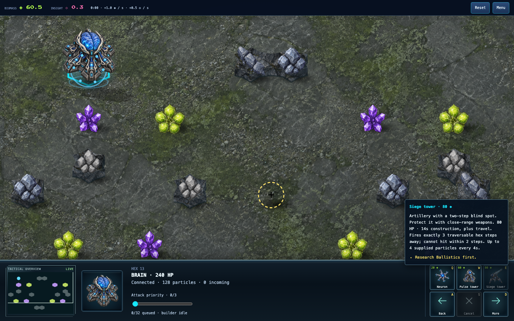

# Artillery and close-range support

Rules 9 gives Siege a two-step blind spot: it attacks only targets exactly three
traversable hex steps away. Pulse, Relay, Bastion, Neuron and Brain retain their
existing reach. Siege's cost, health, cadence, volley and supply demands are
unchanged. Protect artillery with shorter-range weapons; a successful close
approach can now bypass unsupported artillery fire.

`attackCells` is the shared weapon contract for combat, retaliation priority,
AI threat assessment, counterbattery positioning and firing-site selection.
`weaponCells` remains general terrain-aware reach, and Bastion protection keeps
its filled radius. Minimum range follows the existing traversable graph metric,
not geometric distance: an obstacle can make a nearby cell three steps away.

When an AI would build Siege but the closest connected enemy is inside the blind
spot, it builds its opening's short-range weapon instead. Siege/Economy openings
use Pulse towers for this support. This preserves artillery at distance while
allowing mixed close-range defenses, without hidden resources or private AI state.

World/checkpoint rules advance to 9 and online compatibility to
`neural-defence-9-skirmish-2` after the follow-up AI correction described in
`FLANK_RECOVERY.md`. Rules-8 checkpoints are rejected. New visual replay
evidence must be generated with rules 9; historical recordings retain their
original versions and hashes.

The command card explains the exact range and need for close support before
purchase. Selecting a structure shows dashed firing cells on the ground using
the same terrain-aware attack contract, so Siege's blind spot remains empty.
The overlay shows reach, not ammunition availability or a promise to fire; it
does not intercept placement or selection. Focused tests cover blind distances one/two, firing at three, finite
ammunition, retaliation priority, terrain detours, unchanged shielding, source
immutability, replay and rejection of the previous checkpoint version. Existing
target-priority and cadence fixtures now use legal Siege firing distances.

The isolated comparisons and rejected alternatives are in
`SIEGE_COUNTERPLAY_EXPERIMENT.md`. The selected prototype completed all 21 default
pairings with every strategy winning and losing; it resolved Narrow Front
Pressure/Siege from both starting sides, while Balanced/Relay still stalled.
Those prototype results do not replace committed-source qualification or human
playtesting.

## Initial committed-source qualification (policy 1)

Source `290c4086add601da89249a79544036a3d499208d` completed 42 Close Quarters
matches and six Narrow Front Pressure/Siege matches, including mirrors and both
starting sides, with a 900-second cap. None timed out or rejected a command.
All 24 swapped-seat pairs agree on outcome, duration and complete player stats.
On the default map, excluding mirrors and counting each pairing once, records are:
Balanced 3–2, Pressure 1–4, Economy 3–2, Siege 4–1, Relay 2–3, Defensive 2–3.
This is evidence of counterplay, not equal strength or full-map balance.

Manifests and results are in `verification/rules9-2026-09-27/`. The fresh
Balanced/Economy combat replay reproduces `67aef741`; Balanced/Relay reproduces
`56cb6fa2`. Current visual smoke defaults use the former; historical recordings
remain unchanged. Chromium and WebKit passed construction progress, destruction,
Siege/Relay attacks, shields and damaged-building motion checks at desktop and
phone sizes. The normal menu-to-skirmish browser flow also passed both engines;
the Siege tooltip screenshot below was visually inspected. These are emulated
browser checks, not physical-phone or human play-feel acceptance.

All 1,742 repository tests, typecheck, build and focused lint passed. Independent
reviews found no blocking production or replay-migration findings. Wider-map
rules-9 qualification remains in progress. The completed 42-match Skirmish 24
subset has 17 timeouts versus 8 in the rules-8 policy-5 baseline. This is a
material regression; default-map success does not qualify the change broadly.
Its rows and the wider-run source manifest are archived alongside the default
results. Balanced/Defensive has different outcomes across starting sides because
both players contest the same construction cell at tick 5,441. The independently
reproduced first divergence and intentional slot arbitration are documented in
`verification/claim-order-2026-09-27/`. The other 20 paired results agree.

