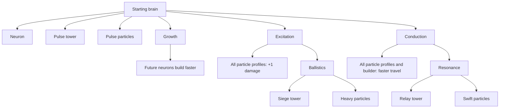

# Neural Defence tech tree

Current implemented rules, verified **2026-09-25**, engine **rules version 3**. This is the current game reference, not a list of planned features. Update this document in the same change as any tech-tree rule change.

The authoritative definitions are [the engine catalog](../../games/neural-defence/src/engine/catalog.ts), [rule constants](../../games/neural-defence/src/engine/types.ts), and [simulation behavior](../../games/neural-defence/src/engine/index.ts). Display names come from [the command card](../../games/neural-defence/src/app/command-card.ts).

## Unlock tree

Arrows mean **requires completed research**, not merely queued research. The three starting research branches are independent; Growth is not required for either specialist branch.

## Resources and timing

All costs below use **displayed resource units**: 1 unit = 1,000 engine units. The simulation runs at 20 ticks per second. Times below assume normal settings, not debug instant construction/research.

- Start with **60 Biomass**, **0 Insight**, one brain, one builder and **128 reusable attack particles**.
- Biomass pays for construction; Insight pays for research.
- Passive income is **1 Biomass/second** and **0.5 Insight/second**.
- Each completed, brain-connected structure adjacent to a deposit adds **1 Biomass/second** or **0.5 Insight/second**, according to the deposit type. Multiple adjacent structures contribute independently. Build beside deposits, not on them.

## Research

| Research   | Prerequisite | Insight | Time | Effect / unlocks                                                                                                           |
| ---------- | ------------ | ------: | ---: | -------------------------------------------------------------------------------------------------------------------------- |
| Growth     | None         |      10 | 20 s | Reduces future neuron construction from 6 s to 4 s.                                                                        |
| Excitation | None         |      10 | 20 s | Adds 1 damage per particle to every profile; unlocks Ballistics research.                                                  |
| Conduction | None         |      10 | 20 s | Removes 1 tick from particle travel per link; builder travel falls from 4 to 3 ticks per link. Unlocks Resonance research. |
| Ballistics | Excitation   |      20 | 20 s | Unlocks Siege towers and Heavy particles.                                                                                  |
| Resonance  | Conduction   |      20 | 20 s | Unlocks Relay towers and Swift particles.                                                                                  |

One research job can run per player, alongside construction. Starting research requires sufficient Insight and pays immediately; research does not queue while waiting for funds. Cancelling research does not refund its cost. Each technology is researched once.

Growth determines a construction job's duration when the builder is dispatched; it does not shorten an already dispatched job. Particle upgrades take effect when particles refresh their profile at the brain, on return or departure. Existing frontline and in-flight particles retain their current profile until then.

## Structures

| Structure   | Catalog ID | Prerequisite                        | Biomass |           Build time |  HP | Range | Volley cap | Firing interval |
| ----------- | ---------- | ----------------------------------- | ------: | -------------------: | --: | ----: | ---------: | --------------: |
| Brain       | `brain`    | Starting structure; cannot be built |       — |                    — | 240 |     1 |          4 |             1 s |
| Neuron      | `neuron`   | None                                |      20 | 6 s; 4 s with Growth |  60 |     1 |          4 |             1 s |
| Pulse tower | `tower`    | None                                |      60 |                 12 s | 120 |     2 |          8 |             1 s |
| Siege tower | `siege`    | Ballistics                          |      80 |                 14 s |  80 |     3 |         12 |             2 s |
| Relay tower | `relay`    | Resonance                           |      45 |                  8 s |  90 |     2 |          3 |           0.5 s |

Build times exclude builder travel and waiting. Range is measured in hex steps; attacks beyond adjacent tiles need a route through open intermediate tiles. The volley cap is the maximum number of supplied particles fired, **not fixed damage**. Actual damage is the sum of the fired particles' attack values. All structures, including brains and neurons, need stationed particles to fire. Disconnected structures cannot mine or fire.

Map terrain is authoritative: rocks occupy blocked cells; resource deposits occupy deposit cells. Neither accepts construction or conducts the network. The floor texture depicts traversable ground only; obstacle artwork and the minimap derive from these cell categories. Cosmetic variants cannot change a tile's gameplay category.

### Planning versus building

Choose **Build → structure → tile**. A plan requires completed prerequisite research, an open tile without a structure or paid construction site, no duplicate in your own queue, and space in the 32-job queue.

**Disconnected plans are allowed.** They remain unpaid ghosts until construction can start. Every buildable structure requires at least **one adjacent completed friendly structure connected back to the brain** before dispatch, plus sufficient Biomass and an idle builder. A queued ghost is not a connection. The builder must physically travel through the network.

The queue dispatches the first currently eligible job, so a distant plan does not block a later connecting plan. Biomass is charged at dispatch. One builder means one active construction job per player.

The brain's **Auto expand** toggle requires no research. It proposes neurons when resources, the builder and a valid connected tile are available. It stays enabled while waiting, respects manual queues, and does not automatically research or choose specialist towers. Turning it off does not cancel the active construction.

## Particle profiles

Press **Q / Particles** from the main commands; no brain selection is required. Choosing an unlocked profile has no resource cost and does not create extra particles; it changes how the existing reusable pool is equipped at the brain.

| Profile | Prerequisite | Base damage | With Excitation |  Travel per link |  With Conduction | Recovery after firing/loss |
| ------- | ------------ | ----------: | --------------: | ---------------: | ---------------: | -------------------------: |
| Pulse   | None         |           2 |               3 | 4 ticks / 0.20 s | 3 ticks / 0.15 s |                        6 s |
| Heavy   | Ballistics   |           4 |               5 | 7 ticks / 0.35 s | 6 ticks / 0.30 s |                       12 s |
| Swift   | Resonance    |           1 |               2 | 2 ticks / 0.10 s |  1 tick / 0.05 s |                        3 s |

Heavy necessarily has Excitation researched because Ballistics requires it, so newly equipped Heavy particles deal **5 damage**. Swift necessarily has Conduction, so newly equipped Swift particles travel at **1 tick per link**. Base values are shown to distinguish the profile from its prerequisite upgrades.

Recovery returns particles to the brain; travel back to the frontline takes additional time. Network capacity, supply allocation and travel can reduce actual firing rates. Tower type and particle profile are independent: for example, a Relay tower can fire Heavy particles once both research branches are unlocked.

## Keeping this reference current

When changing the tech tree, update the relevant catalog entry and simulation effect, then update this document's diagram and affected tables together. Check:

- Prerequisites and unlocks in `CONSTRUCTIONS`, `RESEARCH` and `PARTICLES`.
- Costs, durations, capacities and tick conversion in `RULES`.
- HP, range, cadence and volley caps in `STRUCTURES`.
- Upgrade application, income and queue/dispatch behavior in the simulation.
- Player-facing names and explanations in the command card.

The tables are manually maintained; the runtime remains authoritative. This document describes implemented behavior only. Put proposed additions in a separate design document until they exist in the catalog and simulation.
