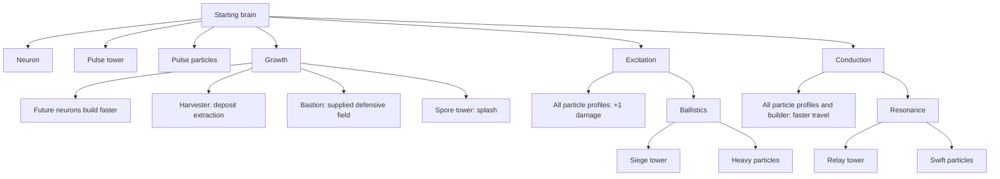

# Fuse Craft tech tree

Current implemented rules, updated **2026-09-30**, engine **rules version 12**. This is the current game reference, not a list of planned features. Update this document in the same change as any tech-tree rule change.

Buildings may be placed on open ground or used to specialize an owned neuron in place. Specialization uses the normal full building price, prerequisites, builder and duration. The neuron remains connected and vulnerable during work; completion preserves its identity and health fraction. Canceling retains the neuron without refunding paid work. Destroying the neuron cancels its upgrade. Brains and existing buildings cannot be replaced. See [specialization behavior](NEURON_UPGRADES.md).

The authoritative definitions are [the engine catalog](../../games/neural-defence/src/engine/catalog.ts), [rule constants](../../games/neural-defence/src/engine/types.ts), and [simulation behavior](../../games/neural-defence/src/engine/index.ts). Display names come from [the command card](../../games/neural-defence/src/app/command-card.ts).

## Unlock tree

Arrows mean **requires completed research**, not merely queued research. The three starting research branches are independent; Growth is not required for either specialist branch.

```mermaid
flowchart TD
    Start[Starting brain]
    Start --> Neuron[Neuron]
    Start --> Tower[Pulse tower]
    Start --> Pulse[Pulse particles]
    Start --> Growth[Growth]
    Start --> Excitation[Excitation]
    Start --> Conduction[Conduction]
    Growth --> Fast[Future neurons build faster]
    Growth --> Harvester[Harvester: deposit extraction]
    Growth --> Bastion[Bastion: supplied defensive field]
    Growth --> Spore[Spore tower: splash]
    Excitation --> Damage[All particle profiles: +1 damage]
    Excitation --> Ballistics[Ballistics]
    Ballistics --> Siege[Siege tower]
    Ballistics --> Heavy[Heavy particles]
    Conduction --> Speed[All particle profiles and builder: faster travel]
    Conduction --> Resonance[Resonance]
    Resonance --> Relay[Relay tower]
    Resonance --> Swift[Swift particles]
```

## Resources and timing

All costs below use **displayed resource units**: 1 unit = 1,000 engine units. The simulation runs at 20 ticks per second. Times below assume normal settings, not debug instant construction/research.

- Start with **60 Biomass**, **0 Insight**, one brain, one builder and **128 reusable attack particles**.
- Biomass pays for construction; Insight pays for research.
- Passive income is **1 Biomass/second** and **0.5 Insight/second**.
- Each completed, brain-connected structure adjacent to a deposit adds **1 Biomass/second** or **0.5 Insight/second**, according to the deposit type. At most **two** of a player's structures mine the same deposit; more crowd it without more income, so an economy grows by holding more deposits. Build beside deposits, not on them.
- **Territory** pays **0.016 Biomass/second per claimed cell** (16 cells: about 0.25/s; 200 cells: 3.2/s). See [Territory and dominance](#territory-and-dominance).
- A connected **Harvester** adds one extra share per adjacent deposit: **+1 Biomass/second** or **+0.5 Insight/second**. A deposit gets only one specialist bonus per player, even with several adjacent Harvesters. Its ordinary adjacency share still counts. Losing its brain connection stops both contributions.

## Research

| Research   | Prerequisite | Insight | Time | Effect / unlocks                                                                                                           |
| ---------- | ------------ | ------: | ---: | -------------------------------------------------------------------------------------------------------------------------- |
| Growth     | None         |      10 | 20 s | Reduces future neuron construction from 6 s to 4 s; unlocks Harvester, Bastion and Spore.                                  |
| Excitation | None         |      10 | 20 s | Adds 1 damage per particle to every profile; unlocks Ballistics research.                                                  |
| Conduction | None         |      10 | 20 s | Removes 1 tick from particle travel per link; builder travel falls from 4 to 3 ticks per link. Unlocks Resonance research. |
| Ballistics | Excitation   |      20 | 20 s | Unlocks Siege towers and Heavy particles.                                                                                  |
| Resonance  | Conduction   |      20 | 20 s | Unlocks Relay towers and Swift particles.                                                                                  |

One research job can run per player, alongside construction. Starting research requires sufficient Insight and pays immediately; research does not queue while waiting for funds. Cancelling research does not refund its cost. Each technology is researched once.

Growth determines a construction job's duration when the builder is dispatched; it does not shorten an already dispatched job. Particle upgrades take effect when particles refresh their profile at the brain, on return or departure. Existing frontline and in-flight particles retain their current profile until then.

## Structures

| Structure   | Catalog ID  | Prerequisite                        | Biomass |           Build time |  HP |     Range | Volley cap | Firing interval |
| ----------- | ----------- | ----------------------------------- | ------: | -------------------: | --: | --------: | ---------: | --------------: |
| Brain       | `brain`     | Starting structure; cannot be built |       — |                    — | 240 |         1 |          4 |             1 s |
| Neuron      | `neuron`    | None                                |      20 | 6 s; 4 s with Growth |  60 |         — |          — |               — |
| Pulse tower | `tower`     | None                                |      60 |                 12 s | 120 |         2 |          8 |             1 s |
| Siege tower | `siege`     | Ballistics                          |      80 |                 14 s |  80 | exactly 3 |          5 |             3 s |
| Relay tower | `relay`     | Resonance                           |      45 |                  8 s |  90 |         2 |          3 |           0.5 s |
| Harvester   | `harvester` | Growth; adjacent deposit            |      60 |                 12 s |  70 |         0 |          0 |               — |
| Bastion     | `bastion`   | Growth                              |      45 |                  8 s | 240 |         1 |         12 |             1 s |
| Spore tower | `spore`     | Growth                              |      55 |                 10 s |  70 |         2 |          6 |             1 s |

Neurons carry no weapon: they claim territory, mine and conduct supply, and every tower is built on one. Build times exclude builder travel and waiting. Range is measured in hex steps; attacks beyond adjacent tiles need a route through open intermediate tiles. The volley cap is the maximum number of supplied particles fired, **not fixed damage**. Actual damage is the sum of the fired particles' attack values. Armed structures (brains and towers) need stationed particles to fire. Harvesters cannot fire or receive attack-priority orders. Disconnected structures cannot mine or fire.

Siege cannot hit within two traversable steps. Protect artillery with Pulse,
Relay or Bastion structures against a close assault. Both minimum and maximum
range use terrain-aware reach: an obstacle can make a geometrically nearby
target three traversable steps away. Other weapons and Bastion protection retain
their filled-radius reach.

**Spore splash:** a Spore salvo also deals 50% of its damage to every enemy structure beside the target, so it out-damages a Pulse tower against a dense network. Spores aim at the target with the most enemy structures beside it; other weapons finish the weakest target first.

Weapons prioritize an enemy brain in range, then completed weapons able to hit them, then other completed structures, then paid construction. Within a priority, they target the lowest HP and rotate equivalent targets deterministically. A new scaffold cannot indefinitely distract a weapon from a completed threat.

**Bastion protection:** a connected Bastion can absorb up to 60% of incoming damage to itself and friendly structures or paid sites within two hex steps through open intermediate tiles. Protection spends stationed particles assigned to the Bastion: each absorbs up to twice its attack value and enters normal recovery. Unused absorption capacity on that particle is lost. Empty or disconnected Bastions provide none. Overlapping fields share the cost but do not stack the 60% cap. Firing reserves ammunition first, so the same particle cannot fire and protect in one tick. Shared protection prioritizes attacks on brains, then strongest salvos, with home-relative cell ties. Damage statistics count damage after protection. A neuron being specialized is protected once as the source, not again as a scaffold.

Map terrain is authoritative: rocks occupy blocked cells; resource deposits occupy deposit cells. Neither accepts construction or conducts the network. The floor texture depicts traversable ground only; obstacle artwork and the minimap derive from these cell categories. Cosmetic variants cannot change a tile's gameplay category.

### Planning versus building

Choose **Build → structure → tile**. A plan requires completed prerequisite research, an open tile without a structure or paid construction site, no duplicate in your own queue, and space in the 32-job queue.

**Disconnected plans are allowed.** They remain unpaid ghosts until construction can start. Every buildable structure requires at least **one adjacent completed friendly structure connected back to the brain** before dispatch, plus sufficient Biomass. A queued ghost is not a connection.

**Neurons sprout; the builder upgrades.** A paid neuron grows by itself while it touches the connected network, like creep. Each player grows **one sprout at a time plus one per 50 territory cells, up to four**. Towers and other specialists are upgrades of a neuron: they need an idle builder, which physically travels through the network, and one builder means one active upgrade per player. The queue dispatches the first currently eligible job of each kind, so a distant plan does not block a later connecting plan. Biomass is charged at dispatch.

Paid construction has the catalog HP of its building and can be attacked immediately. Damage persists through completion; construction does not heal it. Unpaid plans cannot be attacked. This makes building durability meaningful during construction as well as afterward. Cancelling paid work gives no refund.

The brain's **Auto expand** toggle requires no research. It proposes neurons when resources, a free sprout slot and a valid connected tile are available. It stays enabled while waiting, respects manual queues, and does not automatically research or choose specialist towers. Turning it off does not cancel the active construction.

## Territory and dominance

Every connected structure claims its own cell and the six around it (blocked rock excluded). A cell claimed by two players is **contested** and counts for nobody. A player's territory is the number of cells they alone claim; it pays income (above), grows the sprout slots, and decides **dominance**: holding **40%** of the map's claimable cells in a duel, and at least **1.5 times** any rival's territory, for **60 seconds** wins outright. With more players the share falls a little (`0.3 + 0.2 / players`: 37% with three, 35% with four, 33% with six). If several players have held a dominant share for the full minute on the same tick, the longest hold wins, then the larger territory; an exact tie plays on. Losing the share resets the clock. Eliminating every rival brain still wins at any time.

## Particle profiles

Press **Q / Particles** from the main commands; no brain selection is required. Choosing an unlocked profile has no resource cost and does not create extra particles; it changes how the existing reusable pool is equipped at the brain.

| Profile | Prerequisite | Base damage | With Excitation |  Travel per link |  With Conduction | Recovery after firing/loss |
| ------- | ------------ | ----------: | --------------: | ---------------: | ---------------: | -------------------------: |
| Pulse   | None         |           2 |               3 | 4 ticks / 0.20 s | 3 ticks / 0.15 s |                        6 s |
| Heavy   | Ballistics   |           4 |               5 | 7 ticks / 0.35 s | 6 ticks / 0.30 s |                       12 s |
| Swift   | Resonance    |           1 |               2 | 2 ticks / 0.10 s |  1 tick / 0.05 s |                        3 s |

Heavy necessarily has Excitation researched because Ballistics requires it, so newly equipped Heavy particles deal **5 damage**. Swift necessarily has Conduction, so newly equipped Swift particles travel at **1 tick per link**. Base values are shown to distinguish the profile from its prerequisite upgrades.

Recovery returns particles to the brain; travel back to the frontline takes additional time. Network capacity, supply allocation and travel can reduce actual firing rates. Tower type and particle profile are independent: for example, a Relay tower can fire Heavy particles once both research branches are unlocked.

## Keeping this reference current

When changing the tech tree, update the relevant catalog entry and simulation effect, then update this document's diagram and affected tables together. Check:

- Prerequisites and unlocks in `CONSTRUCTIONS`, `RESEARCH` and `PARTICLES`.
- Costs, durations, capacities and tick conversion in `RULES`.
- HP, range, cadence and volley caps in `STRUCTURES`.
- Upgrade application, income and queue/dispatch behavior in the simulation.
- Player-facing names and explanations in the command card.

The tables are manually maintained; the runtime remains authoritative. This document describes implemented behavior only. Put proposed additions in a separate design document until they exist in the catalog and simulation.
