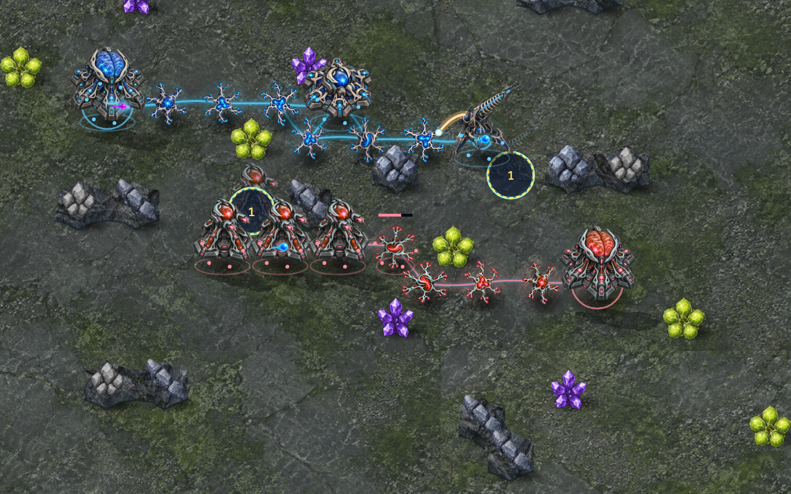
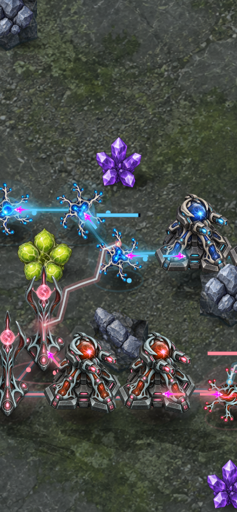
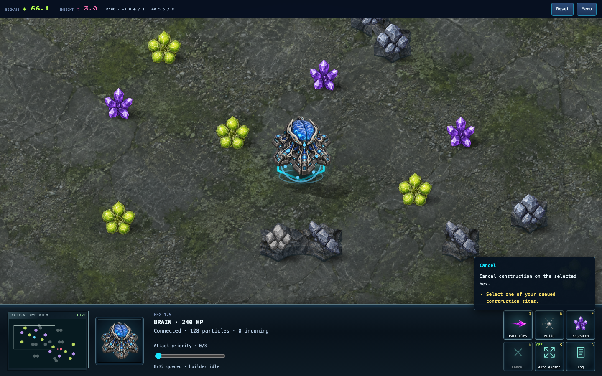
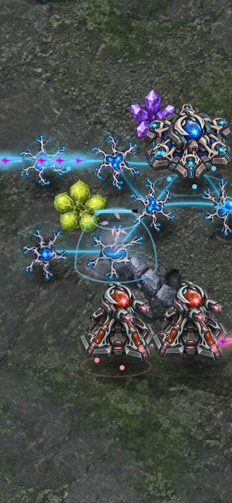

# Distinct weapon motion

Siege shots now follow a projected ballistic arc with a warm trail, moving shell
and ground shadow. Relay fire uses a short electrical bolt whose bends
flicker between anchored endpoints. Other guns use fast pulse streaks. Muzzle
light starts at launch; impacts, shielding and destruction follow the cosmetic
arrival. A destroyed gun retains its last known weapon style for the immediately
following tick, scoped to its owner and cell.

These are presentation effects for damage already resolved by the engine. No
damage, collision, targeting, construction or simulation time changes. The
renderer retains its shared 48-event budget, reduced-motion cleanup, expiry and
rollback reset. Cosmetic paths depend only on endpoints, event identity and age;
they introduce no random state. The longest visual flight is 180 ms.

Review found that lethal Siege explosions initially preceded shell arrival.
The final implementation delays paired shield and destruction effects to the
longest incoming cosmetic flight for that cell. Regression coverage verifies
that timing, trajectory height, deterministic revisiting of an animation age,
Relay endpoints, zero-length shots, attacker removal, state immutability and
expiry. Existing budget and reduced-motion regressions remain in place.

Verification including the shield update: all 1,730 repository tests,
build/typecheck and focused lint pass.
Chromium and WebKit pass the recorded effects checks and ordinary desktop,
portrait and short-landscape UI flow. These viewport checks emulate phones.

## Reproduce the captures

Run the source preview on port 5174, then:

```sh
pnpm exec tsx scripts/fuse-craft-effects-smoke.ts docs/neural-defence/verification/protection-2026-09-27/close-quarters.replay.json /tmp/fuse-siege siege
pnpm exec tsx scripts/fuse-craft-effects-smoke.ts docs/neural-defence/verification/weapons-2026-09-27/relay.replay.json /tmp/fuse-relay relay
pnpm exec tsx scripts/neural-defence-ui-smoke.ts 'http://127.0.0.1:5174/games/neural-defence/?mute' /tmp/fuse-weapons-ui
```

The effect harness checks the complete authoritative recording before rendering
40, 90, 200 and 400 ms snapshots in Chromium and WebKit at desktop and phone
sizes. The Siege recording reproduces `8918c067`; the Relay recording reproduces
`8e079ce0`. The latter is an ordinary 180-second Relay mirror recorded at
`0eeff333` for effects inspection, not a balance result at the tournament's
900-second cap. Captures show diagnostic views of real recorded attacks;
the separate skirmish screenshot comes from the ordinary menu-to-game UI flow.





This improves weapon readability and motion depth. It does not establish AAA
quality, physical-phone acceptance, or completion of the broader game goal.

## Projected shield response

Protection outcomes now create a translucent hemisphere with meridians, curved
latitude rings and a moving energy ripple. A contact glow faces the strongest
recorded incoming damage source for that cell. It is a cosmetic indication of
the local hit, not a protection-range preview or a new persistent shield.
The shell contains 12 SVG nodes and inherits the event cap, expiry and
reduced-motion handling. It appears only after actual absorption and remains
hidden until the incoming shot's cosmetic arrival.

The focused regression checks opposing impact directions, movement of the
projected ripple, finite coordinates and delayed onset. Independent review found
no actionable issues. Chromium and WebKit render the original protection replay
at 80, 180 and 360 ms in desktop and phone viewports, reproducing `8918c067`.
Run the same effect command with `shielded` instead of `siege` to reproduce it.


