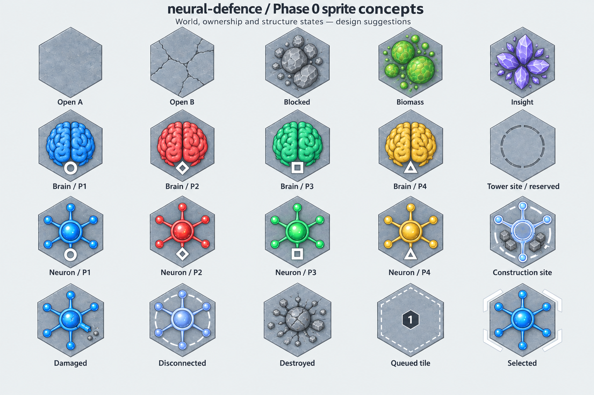
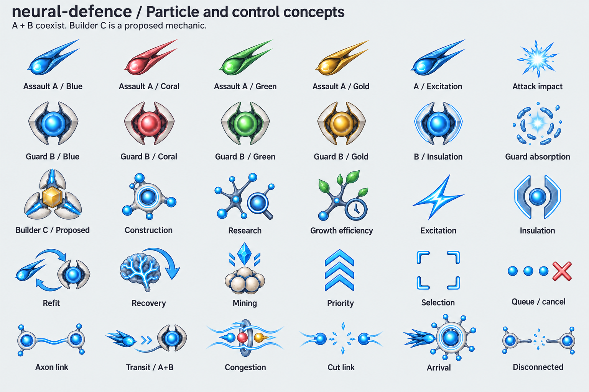

# Phase 0 sprite suggestions

Review-only concept sheets for [Phase 0](../../PHASE_0.md). These images do not implement gameplay and are **not transparent, cut-ready production atlases**. Exact prompts are in [PROMPTS.md](PROMPTS.md).

## Camera comparison

[Top-down world candidate](world-topdown-v2.png) keeps regular pointy-top hex footprints, brighter slate terrain, overhead brains and readable labels. [Dimensional world candidate](world-dimensional-v1.png) keeps a more sculptural pitched view for comparison; its dark captions and visible tile sides are unresolved limitations. The user has not made a final camera choice. A dimensional treatment must still preserve exact board geometry, unobscured adjacent cells and clear connections.

## Coverage

| Sheet               | Concepts represented                                                                                                     |
| ------------------- | ------------------------------------------------------------------------------------------------------------------------ |
| World, row 1        | Two open terrain variants; blocked rock; distinct organic Biomass and crystalline Insight deposits                       |
| World, row 2        | Four player brains with circle/diamond/square/triangle identity markers; reserved tower-site marker                      |
| World, row 3        | Four owned neurons; construction site                                                                                    |
| World, row 4        | Damaged, disconnected and destroyed neuron treatments; queued tile; selection                                            |
| Particles, rows 1–2 | Assault A and Guard B in four ownership colors; Excitation and Insulation appearance variants; attack/absorption effects |
| Particles, row 3    | Proposed Builder C; construction, research, Growth Efficiency, Excitation and Insulation glyphs                          |
| Particles, row 4    | Refit, recovery, mining, priority, selection and queue/cancel controls                                                   |
| Particles, row 5    | Axon connection, mixed transit, congestion, cut, arrival and disconnected indicators                                     |

## Scope and production follow-up

- Builder C is a **proposed construction mechanic**, visibly labelled as such. Its art does not settle the engine rules.
- Towers remain deferred; the empty tower-site marker is metadata only, not a buildable tower sprite. No repair unit, AI faction, fog, powerup or research tree beyond the planned initial research is implied.
- Neuron states are shown in blue as representatives. A production pack needs each state for all owners, corresponding brain damage/destruction states, and animated construction/combat/arrival transitions. Stable entity ownership, not sprite color, drives rules.
- Runtime HP/progress bars, particle counts/ETAs, ownership badges, path previews, invalid-placement reasons and menu/loading/error/debug controls should be crisp code-rendered UI. They do not need separate raster sprites. Menu decoration can reuse brain art; no splash-art dependency is needed.
- **Selection is a shared overlay on every selectable entity**, including every brain, neuron, site and inspectable resource; the selected blue neuron on the sheet is only one demonstration, never a special sprite that alone can be selected. Selection, hover, valid-placement and invalid-placement use reusable code-rendered hex/ring/bracket overlays independently of owner, damage or connectivity. Hover and valid/invalid overlay variants are not drawn in these sheets and remain explicit production UI work.
- The congestion glyph remains an abstract schematic, not a literal simulation frame. The production board must show cohorts moving along actual authoritative edges and arrival times. Upgrade decoration must be legible without changing hit geometry or implying instantaneous travel.
- Before production use: approve camera/material style; generate isolated transparent assets with fixed canvas/pivots; align all six connection ports with the engine's hex neighbors; test all four owners at actual small render sizes, including color-vision/grayscale readability; verify masks, contrast and animation frames. The current five-arm-looking neuron motifs are visual sketches, not an approved six-port connection layout.

The sheets cover the known visual categories; they deliberately do not claim every animation frame or player/state permutation is already delivered. No balance or gameplay acceptance is established by these images.
