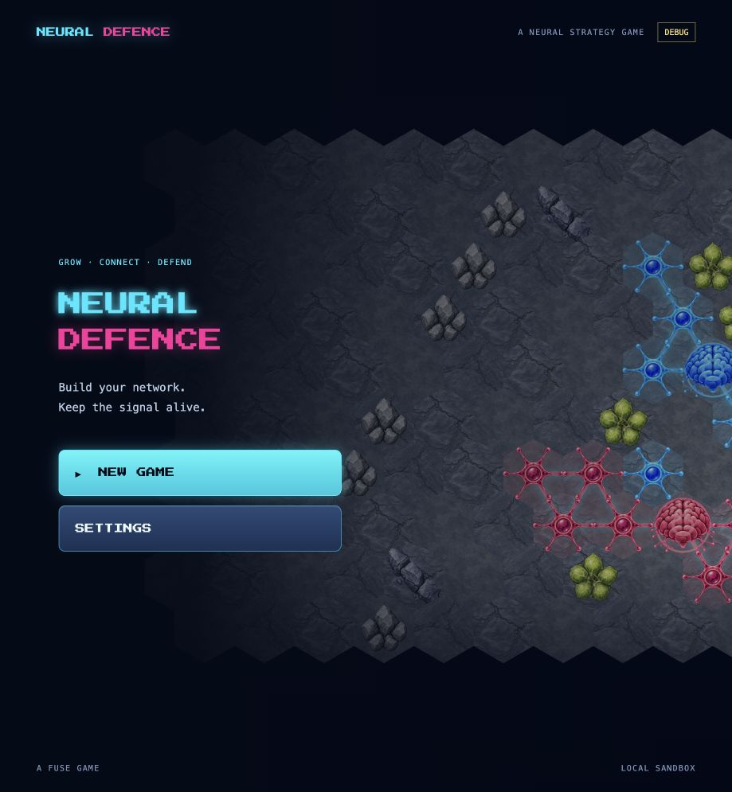
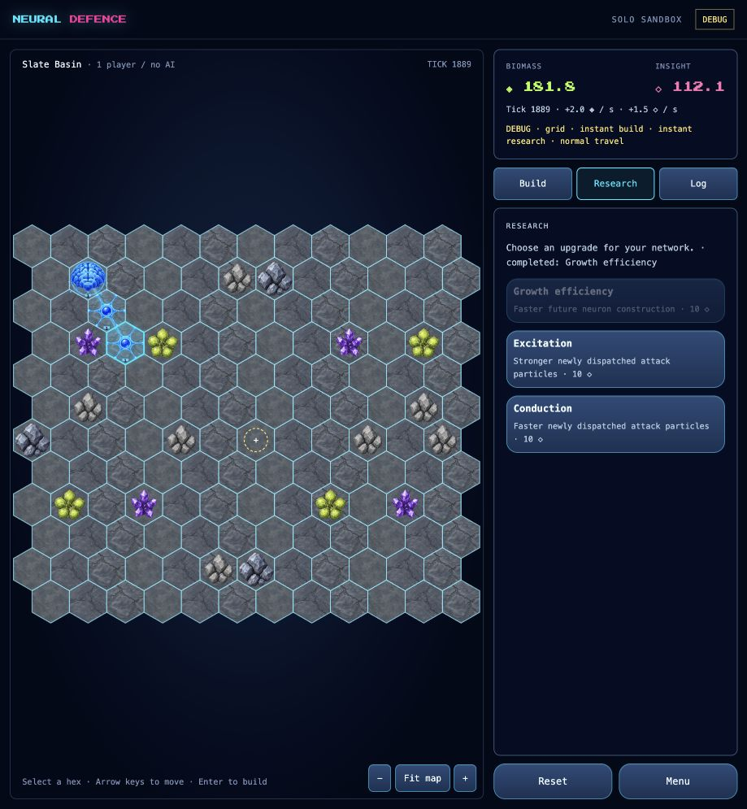
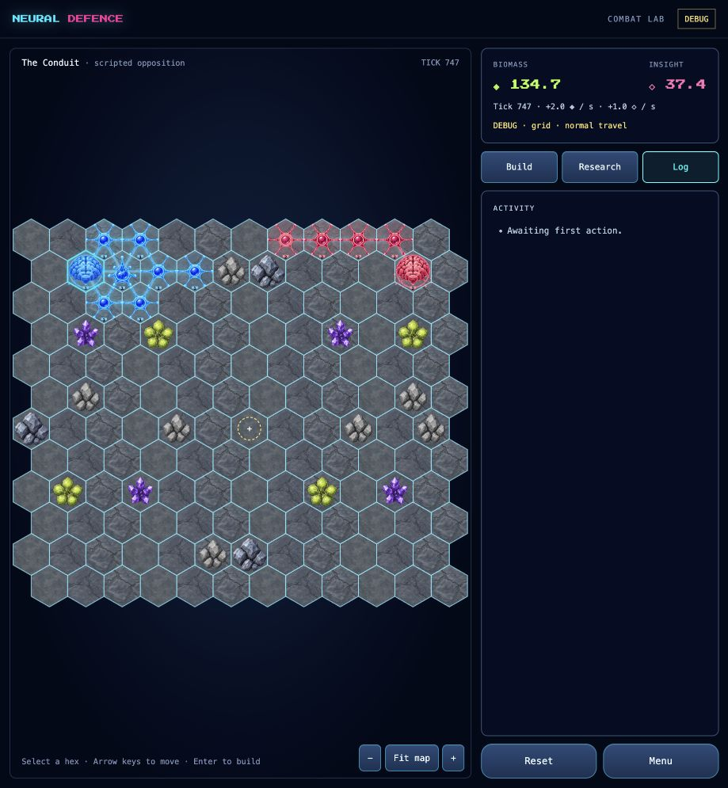

# Phase 0 verification — 25 September 2026

Implementation checkpoints: `d80dc94f`, `8dd2a789`, `a9163e81`, `12a09512`, `36171725`, `9d3886a3`, `1ff138b2`, `a4b0f717`. Screenshots are from the real built `/neural-defence/?mute&debug` route, using separate sessions from the user's preview.

- Full coverage suite: **1,654 tests passed**, 95.81% statements/lines, 94.52% branches, 98.46% functions. Coverage thresholds were not changed. Neural Defence contributes 44 tests.
- Typecheck, Vite production build, focused ESLint and diff checks passed. Vite retains the existing large-chunk warning.
- The original full run caught a missing Docker workspace manifest; its regression passes after the fix. A separate pre-existing child-startup timeout was quarantined from the parallel suite under [issue #250](https://github.com/andeplane/fuse-riders/issues/250#issuecomment-5828682726); the explicit `pnpm test:service-health` smoke passed. This is not a claim that its concurrent timing race is fixed.
- Typed injected app tests exercise catalog and map errors/retries, late responses after abort, disposal and frame cancellation. Those are not browser network-impairment tests.
- Browser sandbox: built neurons at cells 26 and 38, observed rates increase from 1.0 Biomass / 0.5 Insight to 2.0 / 1.5 per second, completed Growth research, reset to starting state and returned to menu. Debug instant work was enabled for this flow; travel and costs remained active.
- Browser controls: priority 3 on a new neuron, select the priority-0 brain, verify live slider property and label both reset. Keyboard navigation/construction worked. Normal-timing combat lab showed its two networks, one test tower and destroyed front-line cells.
- UI agent checked 1440×900, 390×844 and 568×320 layouts: no document overflow or console errors in exercised flows. No physical-device or real multiplayer qualification is claimed.
- The [headless benchmark](../BENCHMARK.md) records seed, rules hash, source revision, workload, timing and equal replay hash. It is not an AI balance result.

Visual feel remains for the user to review. The draft PR is not merged or deployed.
