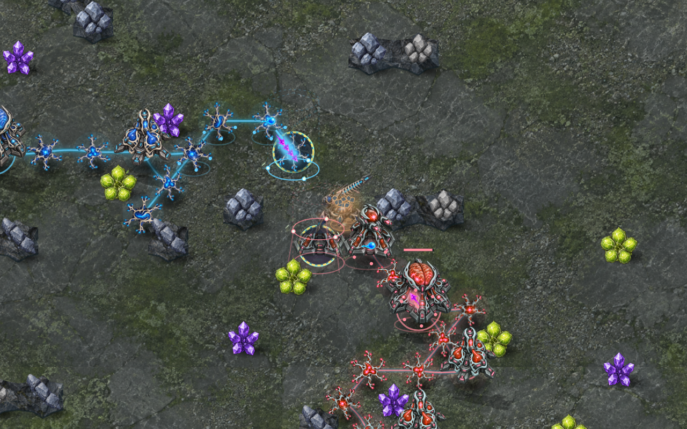
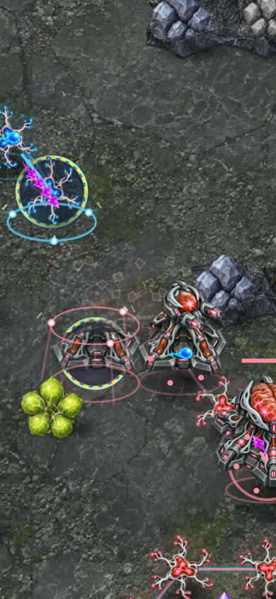
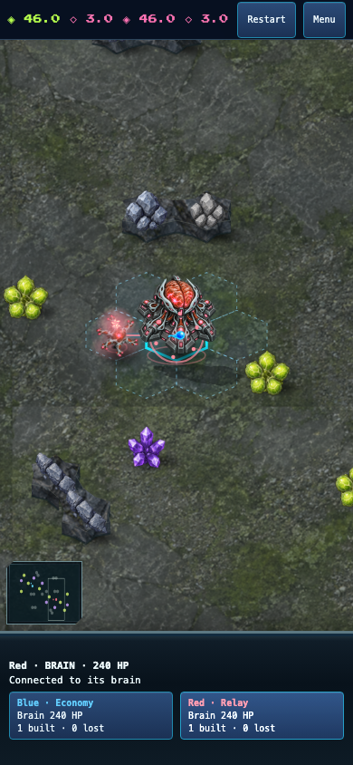

# Building collapse after destruction

Destroyed buildings retain a cosmetic silhouette briefly, then lean and settle
onto their ground footprint under the blast. The silhouette stays intact until
cosmetic projectile arrival, then collapses over 850 ms. A ground shadow follows
the same absolute-time animation. Neurons and unfinished sites keep their
existing debris effect; no historical silhouette is invented on a fresh render.

Solid wrecks share the terrain/building depth order. Review caught an initial
implementation that placed them above foreground objects; this was corrected.
Active wrecks survive structure markup refreshes and are removed on normal effect
expiry, reduced motion, match replacement or rollback. They use the existing
48-effect cap, never intercept input and do not modify authoritative state.

## Verification

- All 1,780 repository tests pass after the depth correction; typecheck, focused
  ESLint and build pass. The strengthened markup-refresh regression also passes.
- The effects smoke replays ordinary commands and verifies the final hash
  `67aef741`, then renders an actual building destruction at 80, 240 and 650 ms.
  Chromium and WebKit pass desktop and phone rendering, shared depth order,
  visible wrecks, no horizontal overflow and no page errors.
- The normal AI-vs-AI menu flow passes Chromium and WebKit at desktop, phone
  portrait and landscape sizes. The last solid-body change is additionally
  covered by the real destruction replay and depth-order checks.
- Independent review confirms the layering correction and lifecycle handling.

Reproduce the effects checks from the repository root:

```sh
pnpm exec tsx scripts/fuse-craft-effects-smoke.ts docs/neural-defence/verification/rules9-2026-09-27/combat.replay.json /tmp/fuse-wreck-smoke wreck
```

The images below are diagnostic renders of a verified real-command replay,
followed by a normal-menu watch-mode capture. They are not physical-phone or
human visual acceptance evidence.




