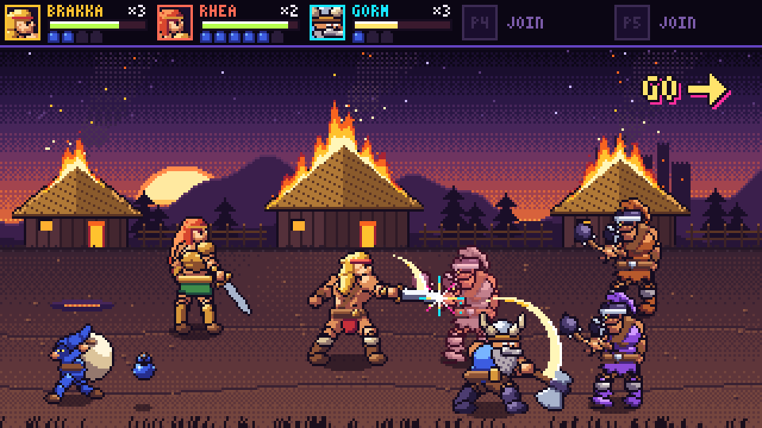

# Fuse Axe — game design

A co-op side-scrolling beat-em-up for 1–5 players, in the spirit of Golden Axe II: three sword-and-sorcery heroes
walk left to right through four hand-drawn pixel-art stages, cleave through waves of raiders, kick blue-hooded imps
for magic pots, steal the beasts their enemies ride, and finish at the keep of the warlord who shattered the Ember
Axe. A full run is about 15–20 minutes; one stage is 3–5.

Concept art: [`concept-art.html`](concept-art.html) (open it in a browser; everything is drawn from palette-indexed
pixel data in the page, `?still` freezes the animation).

The full line-up (heroes, enemies, mounts, the boss, magic and the palette) as one image:
[`images/concept-lineup.png`](images/concept-lineup.png).

## Story in one breath

The warlord **Vorhal** broke the Ember Axe that kept the realm's hearth-fires lit and carried the shards to his keep.
Villages burn behind his raiders. Three heroes take the road east.

## Heroes

Every hero has the same three buttons — **Attack**, **Jump**, **Magic** — and differs in reach, speed, power and
magic. Duplicates are allowed: a second Brakka gets a palette swap, so five players can pick freely.

| Hero                   | Weapon     | Feel                                             | Magic                                                                | Max pots |
| ---------------------- | ---------- | ------------------------------------------------ | -------------------------------------------------------------------- | -------- |
| **Brakka** — barbarian | broadsword | balanced reach, speed and damage                 | **Storm**: lightning strikes the screen; level 4 calls a thunderhead | 4        |
| **Rhea** — amazon      | longsword  | fastest and longest reach, lighter hits          | **Fire**: rolling flame wall; level 6 is a firebird                  | 6        |
| **Gorm** — dwarf       | battle axe | slow and short, hits hardest, hard to knock down | **Earth**: boulders fall; level 3 splits the ground                  | 3        |

Magic spends pots: tap Magic to cast at the level of every pot held (up to the hero's max), or hold Magic to charge
level by level and release early to save pots, as Golden Axe II allowed. Magic hits every enemy on screen, more at
higher levels, and never hurts other heroes.

## Moves

- **Walk** in eight directions on the floor: left/right along the road, up/down in depth (slower, as in the
  original). The floor is a depth band in the lower half of the screen.
- **Run**: double-tap left or right, on a phone's d-pad too. **Dash attack** (shoulder charge) from a run knocks
  down. If double-taps prove unreliable on glass in playtests, a phone gets a run toggle instead.
- **Combo**: Attack three times — two slashes and a heavy finisher that knocks down.
- **Throw**: walk into a dazed enemy and Attack to grab and throw them; a thrown body knocks down anyone it hits.
- **Jump** and **jump attack** (a downward stab).
- **Back attack**: on the floor, Attack and Jump pressed within a couple of steps of each other (the window is a
  tuning constant) strike behind you, for when you are surrounded. In the air Attack is always the jump attack.
- Heroes do not hurt each other.

Hits connect only when attacker and target are within a few pixels of each other in depth, so lining up on the road
is the core skill, as in the original.

## Enemies

| Enemy          | Role                                                                                                       |
| -------------- | ---------------------------------------------------------------------------------------------------------- |
| **Ravager**    | foot soldier with a mace; the bread and butter. Tiers by palette (ash, rust, violet) add HP and aggression |
| **Lancer**     | spear, longer reach, jumps in from the screen edge                                                         |
| **Brute**      | huge, slow, a club with knockback; takes several knockdowns                                                |
| **Bonewalker** | skeleton swordsman that claws up out of the ground (crypt stage)                                           |
| **Sack imp**   | blue-hooded thief carrying a sack; flees, drops a magic pot (or meat in camp) each time it is kicked       |
| **Ogre twins** | stage 1 boss pair with hammers                                                                             |
| **Vorhal**     | final boss: horned dark knight with a greatsword, a fire spell and summoned bonewalkers                    |

Enemies ride beasts in later stages. Knock a rider off and anyone can climb on:

- **Clawbeak** — a bipedal beaked beast; its tail sweep hits everything around it.
- **Ember drake** — a small dragon; breathes a stream of fire in front of it.

A mounted hero who takes a hard hit is thrown off and the beast wanders until someone else takes it.

## Stages

1. **Ashen Village** — a dusk road through burning thatched huts. Ravagers and lancers; boss: the Ogre twins.
2. **Wyrmbone Pass** — a mountain path through the ribs of a dead giant wyrm. Mounts appear; boss: a lancer captain
   on an ember drake.
3. **Drowned Crypt** — a flooded graveyard under a broken cathedral; bonewalkers rise from the ground.
4. **Vorhal's Keep** — torch-lit halls to the throne room and Vorhal.

Between stages the heroes make **camp**: a short night scene by a fire where sack imps sneak in to steal; kicking them
drops pots and meat (meat heals). Then the next stage.

## Structure

- A stage is a long horizontal strip a few screens wide. The camera only moves forward and never leaves a hero
  behind: the leftmost hero holds the left edge, the screen edge holds everyone in.
- **Waves.** Trigger points along the strip spawn a wave and lock the screen until it is cleared; then a flashing
  **GO →** sends the party on. The last trigger is the stage boss.
- **Scaling.** Wave size and enemy HP grow with the number of heroes.
- **Life.** Each hero has a health bar and three lives. A hero who loses a life drops back in from the top after a
  short delay with brief invulnerability; teammates keep fighting. When every hero is out, the party may continue
  (once per stage) or the run ends.
- **Score.** Damage, knockdowns, throws and magic are tallied per hero and shown at each camp and at the end.

## Screen and art

- Native resolution **320 × 180**, scaled by whole numbers to fill the screen (6× at 1080p), nearest-neighbour.
- Heroes and grunts are about 32 × 48 pixels, bosses up to 64 × 72. Sprites face right and flip for left; every
  entity has a soft ellipse shadow on the floor, which also shows a jumping figure's depth.
- Sprites are drawn from palette-indexed pixel data in code, so palette swaps (enemy tiers, duplicate heroes,
  damage flash) are free and no sprite sheet is checked in. (The PNGs under `docs/images/` are screenshots of the
  concept page and of the Stage 1 backdrop, for readers who cannot open them.)
- Draw order is by floor depth (further up the screen is further away), then by height.
- Parallax backgrounds (`src/render/backdrop/`, one module per stage): static layers are painted once and blitted at
  whole-pixel offsets, and only fires and torches draw per frame. Stage 1 has the sky, a ridge with Vorhal's keep (1/8
  speed), hills (1/4) and the village at the floor's speed behind the heroes, and grass (5/4) in front; it ends at the
  village gate ([screenshot](images/stage1-backdrop.png)).
- Palette: warm dusk golds and embers against deep violet shadows, with the platform's neon accents for UI, magic
  and hit sparks. The HUD is a strip along the top: per hero a portrait, health bar, pots and lives.

## Players, rooms and controls

- Online room play like the other Fuse games: each device controls its own hero, or a shared screen shows the game
  while phones act as controllers (a d-pad plus Attack, Jump and Magic).
- Local play on one machine: keyboard and gamepads.
- A solo player can bring bot companions. Bots press the same buttons as a human and get no privileged rules.

## Technical shape

Fuse Axe follows Fuse Choppers (`games/fuse-choppers/`), the closest existing game: an online rollback side-scroller
for up to five seats with bots, rooms and a shared screen.

- **Layers.** `src/engine/` is the deterministic simulation and imports nothing outside itself; `src/online/` is the
  `RollbackGame` for `fuse-netcode`, its codec and room runtime; `src/render/` draws the engine's view and imports
  only `engine/view.ts` and `engine/view-kit.ts`; `src/app/` owns the page, menus, rooms, input and audio.
  `tests/architecture.test.ts` enforces this, as in Choppers.
- **Simulation.** 60 steps a second, three steps per 50 ms log tick. Positions are integers in sub-pixel units
  (`px(n)`), so there is no floating-point drift between peers. Space is x (along the road), y (depth on the floor
  band) and z (height above the floor). Randomness is a seeded generator whose state lives in the world, so replay and
  rollback reproduce it. Entities are kept in id order and processed in that order.
- **Input.** Each seat logs its held bits — left, right, up, down, attack, jump, magic — in the netcode's per-tick
  entries, as Choppers does: every entry a seat logs in a tick is folded into the tick's first step (so a tap shorter
  than 50 ms still counts as a press) and the last one is held for the other two. The engine derives presses (double
  taps, combos, charge) from the previous step's bits, which live in the world and so in every snapshot: a late input
  rewinds and replays to the same presses, and none is lost to a rollback.
- **Rendering.** Canvas 2D at the native 320 × 180 into an offscreen canvas, copied to the page at the largest whole
  scale with smoothing off. Sprites are built once from palette-indexed data into offscreen canvases through an
  injectable surface factory, so tests can draw into a fake context.
- **Tests.** `node:test` via `tsx`; engine unit tests, codec round trips, an architecture test, and a golden test that
  plays a recorded bot run and checks world hashes and the `RULES` version. Browser smokes live in `preview/`.

## Delivery plan

Small pull requests, each reviewed and merged before the next one that depends on it:

1. Design outline, the package skeleton and the concept art.
2. Engine core: world state, fixed-step tick, seeded randomness, movement on the floor band, jumping, camera.
   Sprite pipeline: palette-indexed sprite data, surface builder, the heroes' idle, walk and jump frames. (In
   parallel.)
3. Renderer: stage 1 parallax backdrop, depth-sorted sprites, shadows, camera, with a preview page.
   Combat: combo, hit boxes, depth lanes, hitstun, knockdown, health and lives. (In parallel.)
4. Online: the `RollbackGame`, codec, checkpoint and room runtime.
   First enemy (ravager) with AI, waves, screen lock and GO. (In parallel.)
5. App shell: page, landing, rooms, hero select, controls, shared screen with phone pads, portal entry and service
   registration. The game becomes playable here.
6. HUD; run, dash attack, throw, jump attack and back attack.
7. Sack imps, pots and magic for each hero.
8. More enemies (lancer, brute), the Ogre twins and the stage flow.
9. Camp, stages 2–4, mounts, bonewalkers and Vorhal.
10. Sound effects and music; bot companions.
