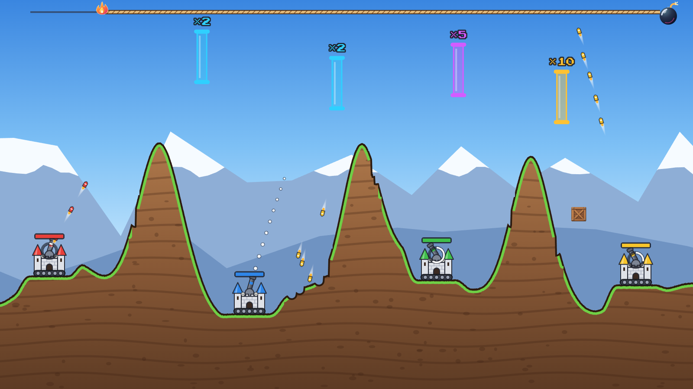
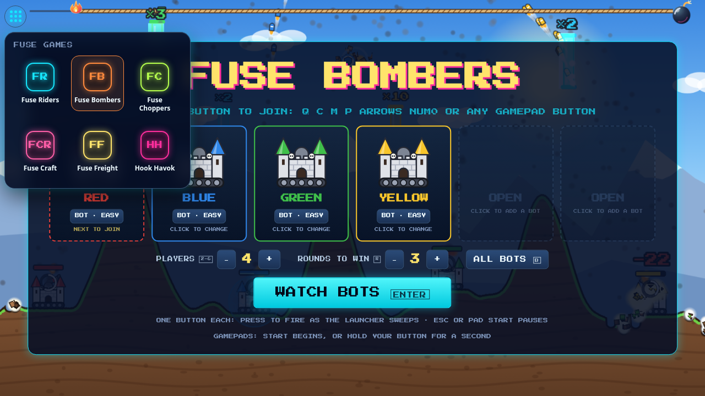

# Fuse Bombers

A one-screen party artillery game for 2–6 players, humans and bots, on one keyboard, a few gamepads or a touch screen.
Castles on treads lob rockets across a destructible landscape, and the rockets fly through multiplier gates to turn a
handful into a swarm.

**Play it: <https://andeplane.github.io/fuse-riders/fuse-bombers/>**, or pick it from the app portal (the dot-grid
button at the top left of every Fuse game's lobby). It is a local game: no rooms, no accounts, everyone at one screen.



## How to play

- **One button each.** Your launcher sweeps back and forth like a metronome. Press your button to fire a volley at the
  current angle; the launcher then reloads. Timing picks range and target, and a dotted guide shows the first part of
  the path.
- **Gates multiply.** Gates (×2, ×3, ×5, ×10) drift in the sky. A rocket that flies through one splits into that many
  rockets, so five rockets through a ×10 gate is fifty.
- **Crates.** Floating crates give a card to the first volley that hits them: an extra rocket per volley, a shield, a
  faster reload, a repair or a mega bomb.
- **Terrain.** Every rocket carves a crater, so the peaks between the castles wear away over the round.
- **The fuse.** The burning fuse across the top is the round timer (90 s). When it burns out, sudden death begins:
  bombs rain down and damage keeps growing. At 3 minutes the round ends on HP: the castle with the most HP wins, and
  a tie is a draw.
- **Ghosts.** When your castle is destroyed you keep playing as a ghost blimp (your colour, your key on the side)
  drifting along the top. Your button drops a bomb when one hangs under the blimp; a short dotted guide shows where it
  falls. Ghosts cannot win, but they can decide who does. Once every human is out and no ghost has pressed for a few
  seconds, the bots finish the round at up to double speed (⏩ in the bottom bar).
- **Winning.** The last castle standing wins the round (a wipe-out is a draw); if more than one is still standing at
  3 minutes, the highest HP wins (a tie is a draw). First to N round wins takes the match;
  N is 3 by default and set in the lobby (up to 9).

## Controls

In the lobby, press your button to join and press it again to leave. Seats up to the player count that nobody holds are
played by bots.

| Device   | Your button                                                   | Menus                                                                                           |
| -------- | ------------------------------------------------------------- | ----------------------------------------------------------------------------------------------- |
| Keyboard | `Q`, `C`, `M`, `P`, any arrow key, `Num0` (or numpad `Enter`) | `Enter`/`Space` confirm, `Esc` pause or back, `Backspace` quit                                  |
| Gamepad  | Any face button (A/B/X/Y on a standard pad)                   | Start confirms and pauses, Back goes back or pauses; hold your button 1 s in the lobby to start |
| Touch    | Your coloured tap zone along the bottom edge                  | Tap the on-screen buttons; the `II` corner button pauses                                        |

Lobby shortcuts: `2`–`6` sets the player count, `R` cycles rounds to win (1–5; the `+`/`−` buttons go up to 9), `B`
cycles every bot's level (bots start on easy), and `Enter` starts. Click a bot to change its level. Mid-round, `Esc` or a pad's Start/Back
pauses; while paused, `Enter`/`Space`/`Esc` resume and `Backspace` quits to the lobby. On the winner screen, `Enter`
plays again and `Esc` or `Backspace` returns to the lobby.

A gamepad that is unplugged and comes back at the same index is the same player. Tap zones appear on touch devices; on
a desktop, `?touch` shows them.

### URL flags

Add them to the address, for example `?mute&speed=4`.

| Flag       | Effect                                                                                       |
| ---------- | -------------------------------------------------------------------------------------------- |
| `?mute`    | No music or sound effects for this load (`?mute=0` or `?mute=false` leaves them on).         |
| `?calm`    | Turns off screen shake and full-screen flashes (also on with the OS reduced-motion setting). |
| `?speed=N` | Runs the game and its timers N times as fast (whole numbers, 1 or more).                     |
| `?seed=N`  | Fixes the random seed so matches replay the same landscapes.                                 |
| `?touch`   | Forces the touch zones on a non-touch device.                                                |
| `?debug`   | Exposes `window.fuseBombers` (`game`, `flow`, `audio`) for browser tests.                    |

## Development

Fuse Bombers lives in the Fuse Riders monorepo and uses its tooling: run everything from the repo root.

```sh
pnpm install
pnpm dev          # builds, then serves every game; this one is at http://localhost:8787/fuse-bombers/?mute
pnpm build        # type check (tsc --noEmit) and production build of every game
pnpm exec tsx --test games/fuse-bombers/tests/*.test.ts   # this game's suites (`pnpm test` runs the repo's)
pnpm lint         # eslint
pnpm format       # prettier --write (CI runs format:check)
node games/fuse-bombers/preview/flow-check.mjs     # Playwright: portal, lobby, match, winner and back (by hand)
```

`npx vite` from the repo root also serves it, unbuilt, at `/games/fuse-bombers/`. Open it with `?mute` so you do not
blast audio. The flow check starts its own Vite server and needs Chromium once: `pnpm exec playwright install chromium`.
`preview/browser-check.mjs` screenshots bots-only rounds and measures the frame rate against a running `pnpm dev`.

### Code

| Path          | Owns                                                                                                  |
| ------------- | ----------------------------------------------------------------------------------------------------- |
| `src/engine/` | Deterministic, fixed-step, seeded simulation: terrain, castles, rockets, gates, crates, fuse, bots.   |
| `src/render/` | Phaser scenes that draw the engine's state. No game rules or authoritative timers.                    |
| `src/app/`    | Entry (`main.ts`), menus and lobby, input (keyboard, gamepad, touch), audio, match flow, page styles. |
| `tests/`      | `node:test` suites; engine tests are `tests/engine*.test.ts`.                                         |

`src/engine/` imports nothing outside itself: no `render/`, no `app/`, no Phaser, no npm or `node:` packages, and no
DOM globals (`window`, `document`, `performance`, `Date.now`, `Math.random`). Randomness comes from the engine's seeded
RNG, time from the fixed step. Bots use the same one-button input as humans and get no privileged physics.
[tests/engine-boundary.test.ts](tests/engine-boundary.test.ts) fails on a cross-layer import, and on an import of
another game: like every game here, Fuse Bombers may use `packages/` but never another game.

From the shared packages it takes the neon tokens (`fuse-ui/tokens.css`), the app portal (`fuse-ui/portal`) and the
music catalogue (`fuse-ui/assets`). Its music, the crate and the fuse's flame and bomb are the site root's shared
`public/` files (`music/`, `props/desert-industrial-v1/`, `themes/clean-neon/`), loaded through
`import.meta.env.BASE_URL`; everything else is drawn in code, and sound effects are synthesized. It has no rooms,
accounts or `platform.ts`. The portal sits in the lobby's top-left corner and hides once a match starts:



## More

- [docs/design.md](docs/design.md): the game design.
- [docs/engine.md](docs/engine.md): the engine.
- History before the move into this repo: [andreavs/fuse-bombers](https://github.com/andreavs/fuse-bombers).
