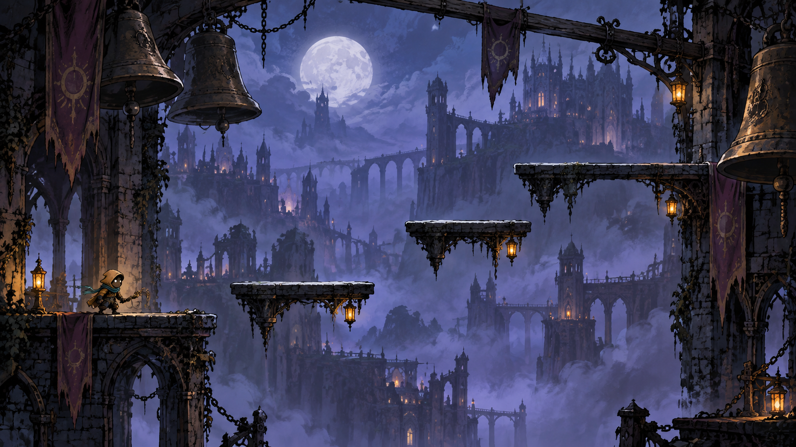
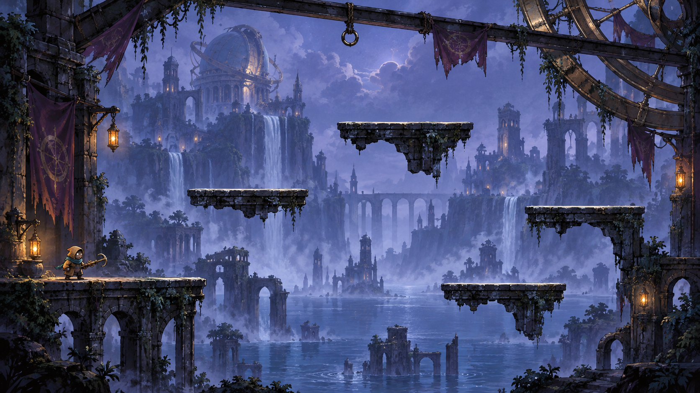
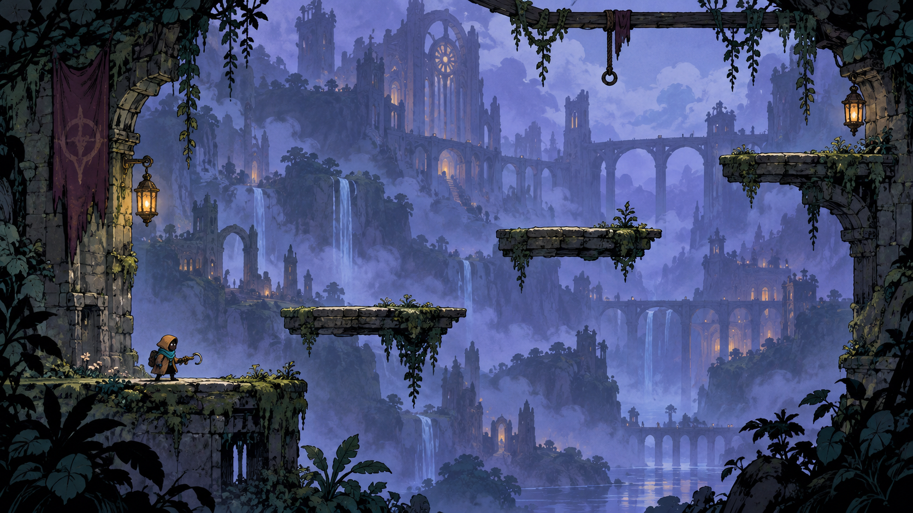

# Hook Havok

An illustrated 2D grappling-platformer experiment for the Fuse party pack.

## Current milestone

Phase 7A adds [presentation polish](docs/presentation.md): compact controls, player cards with matching arena colours/numbers, clearer labels, and consistent animation for remote keepers. After entering a room, use **Focus arena** to hide setup controls while retaining the game and round status. **Show controls** restores the workshop and room controls. Physics and rules are unchanged.

Platforms now let players jump through from below and catch them on descent. **S / Down arrow** drops through the current ledge; on touch, slide the left pad down. Release down before dropping again. Dropping releases an attached hook. Hook shots and the dummy retain solid platform collision. These rules apply in free play and competitive rounds; dropping off the bottom can eliminate you or cost points. Refresh every player tab and start a new room after this update (`hook-havok-5`).

Phase 6D adds [rules comparison](docs/rules-comparison.md): **Free play**, **Last keeper standing**, and **Hook score**. Competitive trials wait for two players, count down, lock entrants, and finish with a shared result. Falls eliminate in Last keeper standing; Hook score awards +1 for player hits and −2 for falls with respawns over 60 seconds. Late joins wait for the next round; disconnects forfeit. The manager restarts or switches rules. Balance and physical-phone playtesting remain open.

Phase 6C adds [shared free play](docs/multiplayer.md): create a room, copy its invite, and bring up to five keepers into the same arena. Hooks knock rivals back; falls respawn them. The shared display watches without taking a player seat. The room manager selects experiments and restarts the shared trial. This is a movement/combat test, with no elimination or scored rounds yet.

Phase 6B adds the [phone controls trial](docs/touch-controls.md). Enable **Touch controls** above the arena (automatic on touch devices). Left pad moves and jumps; right pad aims and holds the hook. Compare **8 directions** and **Free aim** in all three experiments. Portrait/landscape layouts keep pads outside the arena. Phones now join the shared room as individual players; dedicated controller-only pairing is later work. Browser multi-touch checks pass; physical-phone usability needs user playtesting.

Phase 6A adds the [solo combat sandbox](docs/combat-sandbox.md): choose **Knockback target** or **Splitting ball** above the scene after entering the belfry. Hold a shot until impact, then release before firing again. R restarts the selected trial. The dummy uses the real platforms; the orb and its descendants bounce within a visible ball-only field. Neither damages the keeper. Movement tuning is unchanged.

Phase 5 technical review is complete. [POC review](docs/poc-review.md) records the successful traversal/recovery route, visual findings, benchmark and movement questions for the next discussion. User playtesting still determines acceptance; no new movement tuning was applied.

Phase 4: the playable solo movement playground has view-driven airborne poses, landing compression/dust, hook sparks and release/respawn feedback, short synthesized effects and an opt-in shared radio. Run, jump, aim and grapple around eight solid platforms; falls automatically return the keeper. A workshop exposes bounded movement tuning and collision overlays. It uses a real room service connection with one playable seat.

- [Experiment plan](docs/experiment-plan.md)
- [Art direction](docs/art-direction.md)
- [Asset manifest and generation prompts](docs/asset-manifest.md)
- [Animation trial, exact prompts and verification](docs/animation-trial.md)
- [Phaser showcase and validation](docs/showcase.md)
- [Movement architecture, controls and validation](docs/movement-playground.md)
- [Feedback and audio](docs/feedback-audio.md)

The working direction combines **A's belfry/character identity with B's denser platform composition**. The user likes both qualities; this combination is the implementation recommendation, not a claim of final artistic acceptance. The art lab displays all eight platforms from the planned map.

## Open the movement playground

Build with `pnpm build`, then run `node --import tsx service/dev.ts --port 8787` (or `pnpm dev` in a shell supporting the repository's scripts). The existing server selects a free port if needed. Open `/hook-havok/?mute` on the printed origin, or follow the landing-page link. Click **Enter the belfry**. A/D or arrows move; Space jumps (release early for a shorter jump); mouse aims; hold left mouse to hook/pull, release to detach; R resets. The **Movement workshop** changes settings and restarts the exercise. For Vite source development, the page is `/games/hook-havok/`; built output is `/hook-havok/`.

The **Art showcase** link opens the previous authored study at `?showcase=1&mute`.

To hear the playground, remove `?mute` and interact with the page. Effects unlock on a key or pointer gesture; **Play radio** explicitly starts music. Music/effects have independent volume sliders and pause on focus loss. The muted preview does not change saved preferences.

Use **Planted idle** to inspect the fix: one stable source pose, a 0.9% vertical breath and an unchanged foot baseline. The second generated idle drawing remains in the source sheet but is not played. A later rig can keep boots completely rigid while moving knees/chest/scarf independently.

Use the sequence slider to inspect attachment, pull and landing. **Atmosphere** toggles moving mist and motes; reduced-motion preference starts paused with these effects off. Audio is intentionally off for this art milestone.

```sh
node games/hook-havok/preview/showcase-check.mjs http://localhost:PORT/
```

## Previous source-animation study

The previous Canvas asset inspector remains useful for enlarged frames and source props. It is separate from the Phaser scene and never runs alongside its loop.

From the repository/worktree root:

```sh
node games/hook-havok/preview/serve.mjs
```

Open the local URL printed by the command (with `?mute`). The server binds only to loopback and asks the OS for a free port. It serves only this game's review directory. Stop it with Ctrl+C. This is an art-review tool, not a replacement game server.

Compare Idle and Run at 64/96 world units, change playback speed, pause/step and show alignment guides. The larger sample exposes frame inconsistencies. Reduced-motion preference starts paused. The props are separate from the actor for eventual independent aiming and lighting.

Browser check against the printed URL:

```sh
node games/hook-havok/preview/check.mjs http://127.0.0.1:PORT/?mute
```

The check defaults to Playwright Chromium; set `BROWSER_CHANNEL=chrome` to use installed Chrome. It saves desktop/mobile screenshots under the ignored root `artifacts/` directory.

## Review board

### A — Lantern Belfry



### B — Flooded Observatory



### C — Overgrown Sanctuary



Compare silhouette readability, atmosphere and foreground clutter. These generated paintings approximate an arena; they do not represent the specified collision map.

Separate original trials: [character reference](art-source/character/lantern-keeper-idle-source.png), [background](art-source/backgrounds/belfry-background-source.png), [ledge](art-source/platforms/belfry-ledge-source.png). The newer [six-pose sheet](art-source/character/lantern-keeper-six-pose-source.png) simplifies the profile and proves frame playback. It remains a rough animation study rather than a finished locomotion set.

## Source assets

Keep original supplied backgrounds in `art-source/backgrounds/background-option-01.png` (then `02`, `03`). Keep reference screenshots in `art-source/references/`. Do not resize or overwrite originals. Generated concepts live in `art-source/concepts/`; production experiments live in `art-source/character/`, `platforms/`, and `backgrounds/`.

These are source assets, not runtime exports. The later scene will use optimized files in the repository's `public/games/hook-havok/`, referenced through the configured base URL. No image is collision geometry.

## Intended first playable

One character, one fixed arena, running, variable-height jumping, a hook that pulls toward static surfaces, quick respawn, simple effects, and the shared radio. No opponents, balls, progression, procedural maps, or physical rope simulation initially.

The `/hook-havok/` route serves the playable sandbox in built output; `?showcase=1` opens the authored art showcase. The previous `art-preview.html` asset inspector remains local review tooling outside the build. No production deployment is included.
