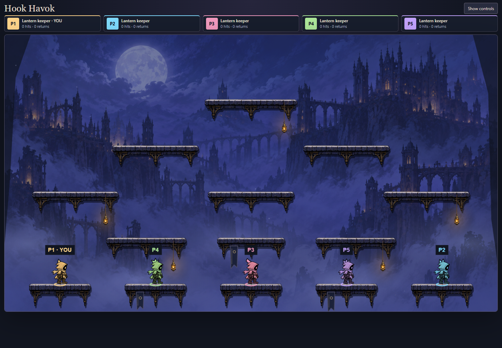
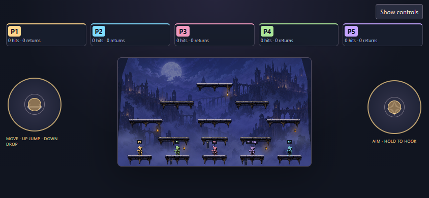

# Phase 7C — selectable arena trial

Keep Lantern Belfry as the default and add Crossroads, a symmetric competitive layout in the same illustrated setting. Five evenly spaced bottom pads spread starting players across the screen. Intermediate ledges offer outer climbing routes and a central route to an upper grapple beam. Gaps retain fall risk. This is a comparative map trial; it does not choose a primary game mode or rebalance movement/combat.

## Implementation contract

Map geometry, five slot spawns, target spawn and ball exercise bounds belong to an engine-owned registry. A validated `map` id is part of room tuning and therefore the shared log, replay, hash and checkpoints. All collision, support, grapple attachment and checkpoint validation use the selected map. No arbitrary client-supplied geometry is accepted. Rules advance to `hook-havok-6`; all clients must refresh and start a fresh room.

The manager changes maps through the normal shared settings operation, which recreates the arena, resets results and increments the round. Existing round scoping rejects prior-round controls; local held controls and cosmetic history clear on the new round. Peers and displays receive the same choice; late join and refresh recover it from peers. No local storage or second simulation path is added.

The renderer reads map geometry through the view contract and replaces a bounded group of platform art, cloth and lanterns when the map changes. Keepers and the background persist. A scene rebuild must not add another render loop or retain old terrain sprites. The authored art showcase remains the original belfry sequence.

Tradeoff: Crossroads reuses the current art kit and physics so the comparison isolates layout. Fixed spawn slots provide reproducible positions, not proven competitive balance. More platforms increase visual density; desktop and phone playtesting must assess whether the extra routes help.

## Playtesting

Enter the belfry, then select **Arena → Crossroads** above the game. Only the room manager can change it. Keep Free play while learning the routes, then compare Last keeper standing and Hook score. **Focus arena** hides setup; **Show controls** brings the selector back. The original Lantern Belfry is one selection away. Both maps support the dummy and splitting-ball experiments; their positions/bounds are map-owned.

Crossroads has fourteen platforms and five bottom spawns spaced 310 world units apart. The two outer routes can be climbed all the way to the highest beam with ordinary run/jump inputs. The middle route includes directly stacked lower ledges and diagonal hook opportunities toward the upper sides. Drop-through, respawn and hook physics are unchanged. Geometry and spawn definitions are authoritative in [engine/maps.ts](../src/engine/maps.ts).

The underlying belfry painting and art kit are reused; this phase adds a layout rather than a second visual theme. Hanging lanterns are placed on higher ledges in Crossroads to avoid clipping below the arena. Phone emulation confirms the controls fit; actual-phone feel and fairness with different player counts still need user playtesting.




## Verification

```sh
pnpm build
node --import tsx --test games/hook-havok/tests/*.test.ts
node --import tsx service/dev.ts --port 8787
node games/hook-havok/preview/arena-check.mjs http://localhost:PORT/
```

The service selects a free port when occupied. Open `/hook-havok/?mute` on the printed origin. Build includes typecheck; changed game TypeScript also passes ESLint.

Eight map regressions cover five supported spawns, unchanged belfry defaults, ordinary-input climbs from both sides to the highest beam, central jump/drop, selected-map hook attachment and checkpoint continuation, target respawn/edge departure, ball splitting/bounds, competitive replay with reversed membership, stale input cancellation, invalid map/support/attachment rejection, and room recovery under loss/reordering/duplication plus manager succession. Map changes are not interpolated.

Real Chrome verification uses five players and a seatless display. It checks manager-only selection, actual platform sprite positions/counts on every device, held-input cancellation, ordinary jump/drop, portrait/landscape controls, refreshed-peer recovery, active competitive-round reset, shared restart and repeated switching without accumulating terrain containers or canvases. No world state is injected for screenshots. The existing authored-showcase load/retry, pause/scrub and context-loss smoke also passes. Evidence is from Windows, Node 24.14.0 and installed Chrome; this is not physical-phone qualification.

Independent engine review found that an added target-grounding invariant rejected a reachable edge-departure state. That extra invariant was removed to preserve existing target physics; a regression verifies checkpoint continuation on both maps. UI/render review found no correctness blocker; screenshots were recaptured after its evidence-freshness note.

Final local results: **55/55 Hook Havok tests pass**; full repository suite **1661/1669 pass** using `node --import tsx --test tests/*.test.ts packages/*/tests/*.test.ts games/*/tests/*.test.ts`. The same eight Windows backend-paths, CI-manifest and new-game failures remain, matching the clean-main reproduction documented in [Phase 7B](art-production.md#verification-record). No assertions were removed or weakened. No merge, deployment or physical-device qualification is included.
