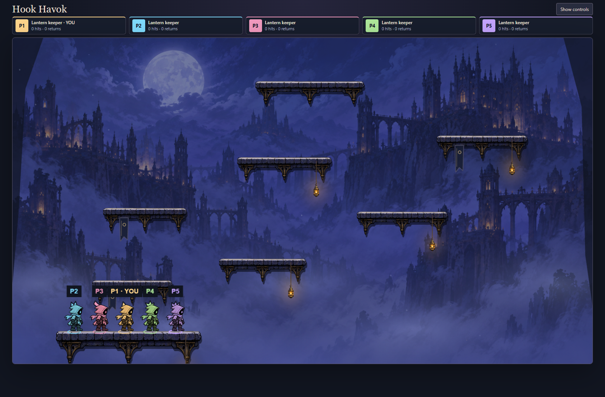
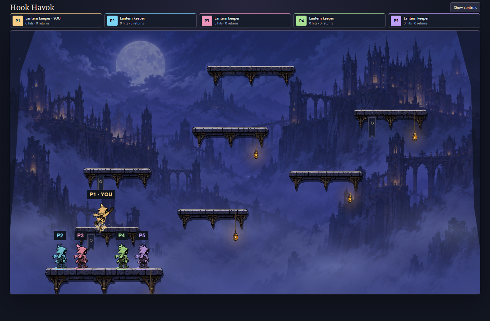
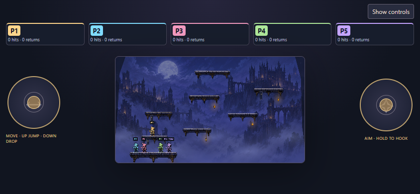

# Phase 7B — art-production trial

The playable belfry now uses an original nine-pose keeper sheet, five slot-coloured costumes and five small hood crests. P1–P5 labels and the existing roster remain the primary identity cues at phone size. This is an art trial for user review, not final acceptance of character design or animation.

## What changed

- Neutral ivory source fabric supports the existing amber, cyan, rose, green and violet player palette. Phaser applies the same tint and crest to local and remote keepers, including the seatless display's focused keeper. Black ink preserves silhouette contrast. Colour also tints hardware and eyes; bespoke individually painted costumes remain a possible later refinement.
- Nine source poses: planted idle, four running poses, rise, fall, launch and pull. Launch and pull override running, even when the feet are grounded. Reduced motion retains authored action poses and suppresses recoil/lean/stretch. A unit regression covers this distinction.
- Tethers have a dark outline, coloured core, bounded brass highlights and an anchor ring. Impact/pop use sharp radial strokes, jump/landing use flattened dust, and remote jump/attach/release feedback is now drawn. Cosmetic history remains bounded to twelve short bursts per keeper; no new simulation or sound clock.
- Cool background grading, darker stone undersides, warm top edges and three hanging cloth pennants help separate playable surfaces from the distant belfry. All dressing sits at/below the existing platform tops. Rectangles, movement, collision, scores and rules version are unchanged.

## Asset and registration

`art-source/character/lantern-keeper-nine-pose-source.png` is the selected generated source: **1254 × 1254, 763,989 bytes, PNG with actual alpha** (transparent corner alpha 0). The loader inspects alpha bounds independently in nine equal 418 × 418 cells and rejects empty or boundary-crossing drawings. The first generation touched cell boundaries and failed this check; the second generation adds gutters. The check was preserved.

The original six-pose source and its source-animation inspector are retained. The live playground and authored Phaser showcase use the new sheet. All frames share a scale based on the tallest silhouette, with each frame anchored to its alpha foot baseline and cell centre. This remains a modest frame-animation trial: some anatomical registration drift and abrupt four-frame running remain. It is not a rig or a claim of final hand-authored animation.

Generated using built-in ImageGen on 2026-09-24. Source pixels and alpha are copied unchanged. Hood crests, cloth, lighting and effects are renderer-authored geometry, not new collision surfaces. No generated background replaces the selected belfry painting.

## Reproduce and playtest

Build with `pnpm build`; start `node --import tsx service/dev.ts --port 8787` (the service chooses another free port if occupied). Open `/hook-havok/?mute`, enter the belfry, invite up to four peers and choose **Focus arena**. Try running in both directions, jumping, falling, firing while moving, pulling and hitting another keeper. Compare players at actual screen size; use **Show controls** to return to the workshop. The Art showcase link retains pause, scrub and atmosphere controls.

```sh
node --import tsx --test games/hook-havok/tests/*.test.ts
node games/hook-havok/preview/art-production-check.mjs http://localhost:PORT/
node games/hook-havok/preview/showcase-check.mjs http://localhost:PORT/
```

The new browser check creates a real five-player room, uses ordinary jump and hook inputs, checks rise/fall/pull poses, captures desktop and phone layouts, and aborts the new atlas request to check visible failure and successful retry. No world state is injected to stage screenshots. Browser emulation is not physical-phone evidence. Review at 390-pixel portrait size confirms that costumes help, but labels and colour remain more useful than tiny crest details.





## Generation prompts

Initial reference: `art-source/character/lantern-keeper-six-pose-source.png`. Exact prompt:

```text
Create a refined production sprite sheet for Hook Havok using the attached keeper as IDENTITY AND STYLE REFERENCE. Keep original small hooded lantern keeper with one pale eye in black face, short trailing scarf, gloves, boots, chunky bold irregular ink outlines and hand-painted shapes. Change cloak/hood/scarf to LIGHT SILVER/IVORY neutral grayscale fabric so game runtime can tint per player, dark charcoal boots and belt, no saturated colors, no equipment. Exactly NINE poses in uniform 3 columns by 3 rows, square 1536x1536 transparent PNG canvas, nine 512x512 cells. All figures strict right-facing side profile, same proportions and head size, body root at cell horizontal center. No perspective view. Order row-major: 1 planted neutral idle; 2 running near leg forward far leg back; 3 running passing with knee lifted; 4 opposite running contact; 5 opposite running passing; 6 rising jump with legs tucked; 7 falling with legs downward and scarf lifted; 8 hook launch arm extended right with planted feet; 9 airborne grapple pull arm extended diagonally upward right, legs trailing. Important strong clear pose silhouettes and consistent compact costume. Every entire character isolated within its own cell with generous transparent gutters. Real transparent alpha outside characters, NO dark background, NO halo, NO glow, NO drop shadow, NO floor, NO grid lines, NO lettering, NO particles. Clean production sprite atlas, sharp silhouette at 64px gameplay height, simplified detail.
```

Correction reference: the first nine-pose result. Exact prompt:

```text
Edit this exact sprite atlas ONLY for cell padding and registration. Preserve all NINE existing character drawings, their order, gray/ivory costume, bold ink style, right-facing direction and genuine alpha transparency. Keep exact UNIFORM 3 columns by 3 rows square grid. Each entire pose must fit inside the CENTRAL 75 PERCENT of its OWN cell, leaving at least 12 percent empty transparent padding on ALL FOUR sides of EVERY cell. Shrink ALL characters uniformly to achieve generous empty gutters; no hand, scarf, boot or hood may touch any cell boundary. Place the character torso at each cell horizontal center. Nine poses remain idle, run contact, run passing, opposite run contact, opposite passing, jump rising, falling, launch right, pull up-right. No outlines around cells, no labels, no background, no halo, no shadow, no extra poses. Actual transparent PNG output. This is a sprite packing correction; do not redraw design.
```

Requested size is not guaranteed by generation; the actual decoded dimensions above are authoritative.

## Verification record

Verified on Windows / Node 24.14.0 / installed Chrome, against phase 7A base `ab1b691d` plus this phase's diff. Typecheck/build, changed TypeScript ESLint, formatting and diff checks pass. All **47 Hook Havok tests** pass, including action priority and reduced-motion firing. Both browser commands above pass, covering a real five-member room, desktop, 390 × 844 portrait and 844 × 390 landscape, new-sheet load/retry, showcase pause/scrub/replay and context-loss retry. Screenshots were visually inspected.

The full repository suite was run with `node --import tsx --test tests/*.test.ts packages/*/tests/*.test.ts games/*/tests/*.test.ts`: **1653 pass / 1661 total**. The package-script invocation exceeded Windows' command-length limit, so the same test globs were passed directly to Node. The eight failures in backend-paths, CI-manifest and new-game tests reproduce in the existing clean-main baseline at `0386f4af` (29/37 pass); those three test files also match current `origin/main`. No failing assertions were disabled.

Independent static review found reduced-motion firing incorrectly tied to recoil suppression. The pose state is now independent of recoil, with a regression. Review otherwise found no simulation/lifecycle blocker. No production deployment, performance improvement or physical-device qualification is claimed.
