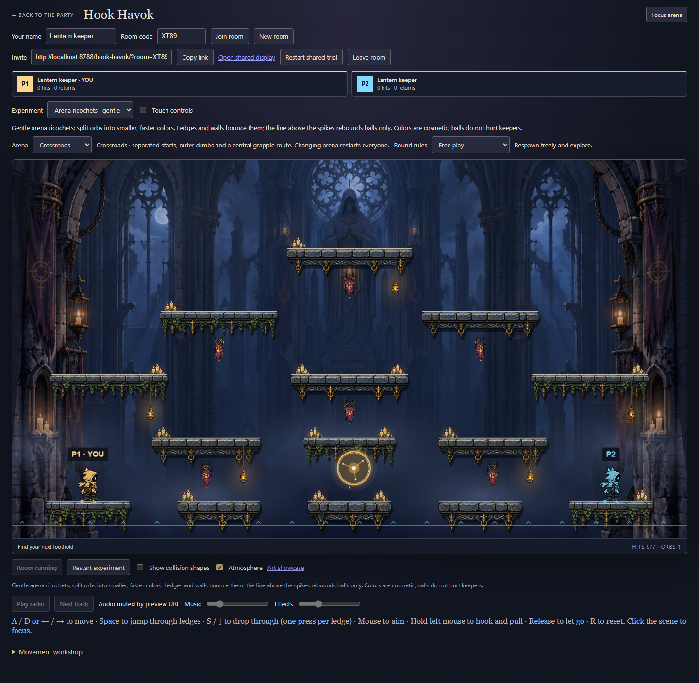
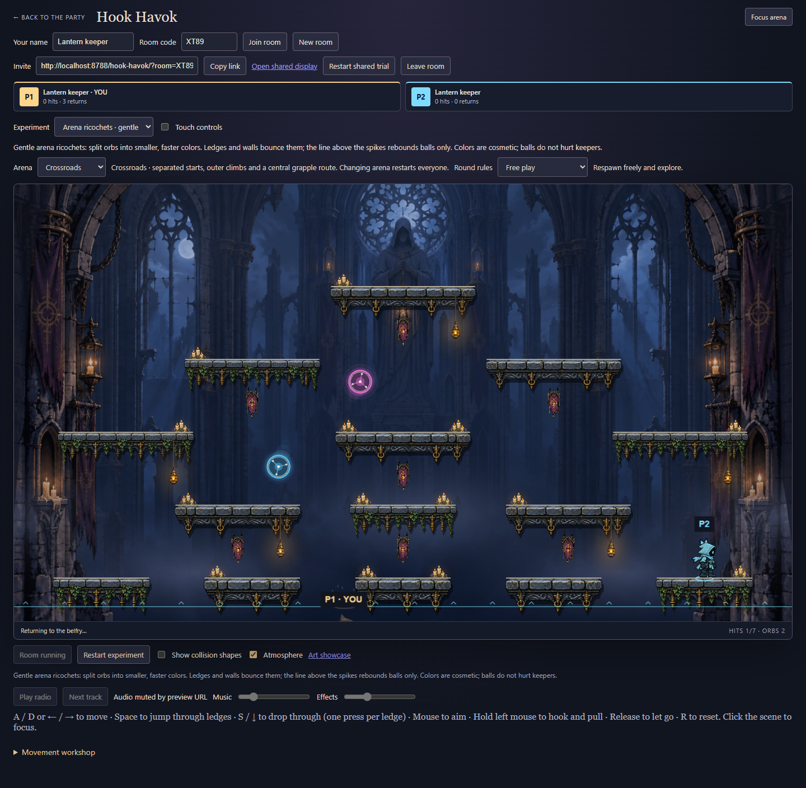
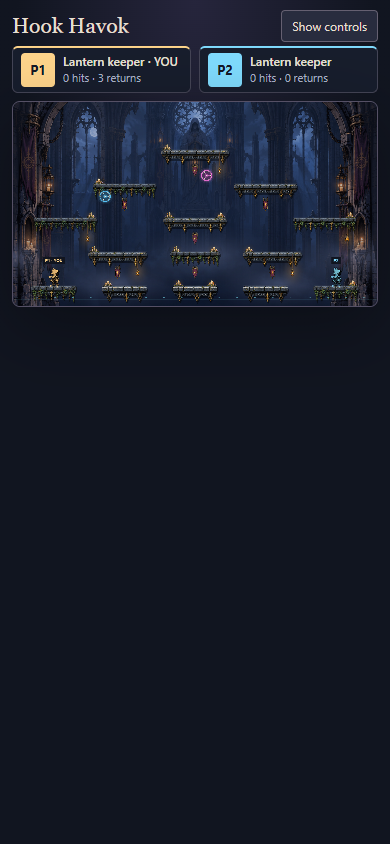

# Phase 7G — Arena ball trial

Compare **Splitting ball** (the existing bounded exercise), **Arena ricochets · gentle**, and **Arena ricochets · surge** in the Experiment selector. The manager's choice resets the shared trial. Try both arenas. Aim a hook at an orb, release, and fire again; seven hits clear the family. Restart the shared trial to restore it.

## Rules and tradeoffs

This increment keeps one initial large orb and the existing binary split family: medium children, then up to four small orbs. Smaller orbs travel faster. Gentle and surge compare horizontal speed and bounce height together; they are authored presets, not independent balance sliders. More initial families, damaging balls, and color-specific powers remain future decisions after playtesting.

Orbs traverse the whole arena and rebound from all platform faces, walls, the ceiling, and a visible cyan boundary above the spikes. The bottom boundary applies only to balls; keepers can still fall. Balls do not damage keepers or change competitive scoring. Hook contact still gives terrain priority on ties and consumes only one ball per shot.

The pure fixed-step engine sweeps each ball's conservative square envelope against radius-expanded platform rectangles. Corners therefore collide slightly before a true circle would. Platform index breaks equal-time ties, followed by arena boundaries. Each tick consumes the remaining movement through at most four contacts, with integer final positions and one-subunit separation. Downward contacts launch upward at a preset height; sides and undersides reflect. Children begin at the parent center so splitting beside a ledge cannot place them inside stone.

The checkpoint guard retains ordered tree IDs, ancestry exclusion, exact horizontal speeds, hit conservation, and the four-orb cap. Arena mode additionally rejects platform overlap. Rules change to `hook-havok-7`: refresh every client and create a fresh room. Existing rooms on older clients are not a compatibility target.

## Presentation

Gold, blue, pink, green, violet, teal, and coral identify stable split-tree IDs. Colors are cosmetic. Code-drawn luminous rims, moving internal filaments, pulsing cores, velocity accents and color-matched split bursts complement the painted arena. Effects reuse the Phaser presentation clock; no particle history feeds simulation. Reduced motion removes pulsing, core rotation, and trails while preserving color and hit feedback. No new raster asset is required for these procedural effects.

## Verification

The orb starts in the lower action area so the first shot is reachable from the starting ledges. Both maps and presets pass 3,600-tick replay tests with every-tick checkpoint validation, periodic restore, all seven splits/pops, arena travel, and population bounds. Additional tests cover top/side/underside/bottom contacts, splitting beside stone, and rejection of forged geometry, speed, ancestry and hit totals. The runtime impairment fixture now runs surge balls through packet loss, duplication, reordering and refreshed-member recovery.

**65/65 Hook Havok tests pass.** Typecheck/build and changed-source ESLint pass. The full repository suite is **1671/1679**, with the same eight Windows backend-paths, CI-manifest and new-game baseline failures documented in [7B](art-production.md#verification-record). No assertions were removed or weakened.

The real Chrome browser smoke creates two players plus a shared display, selects both presets through the manager UI, verifies peer refresh, fires ordinary hooks until an arena orb splits, observes the hit on every page, checks phone layout/reduced-motion flow, and returns to the bounded exercise then movement mode. Screenshots contain actual gameplay without injected world state. Phone evidence is emulation, not a physical device. The existing bounded combat smoke is also retained.

```sh
pnpm build
node --import tsx --test games/hook-havok/tests/balls.test.ts games/hook-havok/tests/multiplayer.test.ts
node games/hook-havok/preview/balls-check.mjs http://localhost:PORT/
node games/hook-havok/preview/combat-check.mjs http://localhost:PORT/
```





Independent review found no actionable issues and separately passed all eleven ball/multiplayer tests. It checked collision ordering, child placement, checkpoint guards, rules compatibility, UI and presentation boundaries. The available inherited model was used because Sonnet is unavailable. After review, the initial arena orb height changed from near the ceiling to the lower action area; the full ball replay suite and browser flow were checked again.

User acceptance of the presets, density and effects remains open. There is no performance claim, merge or deployment in this phase.
