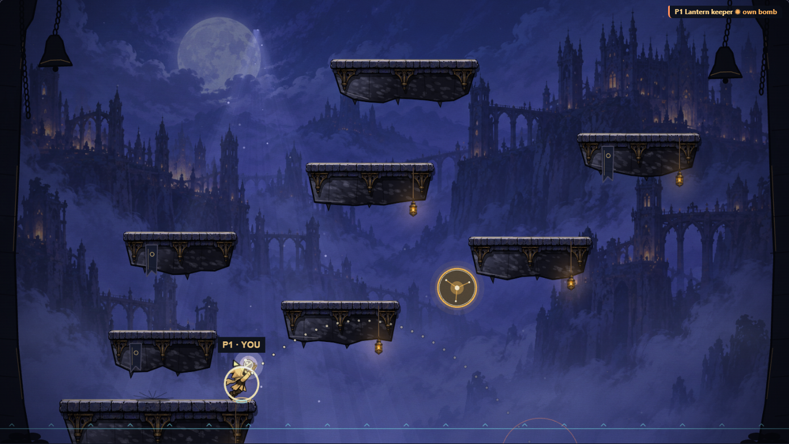
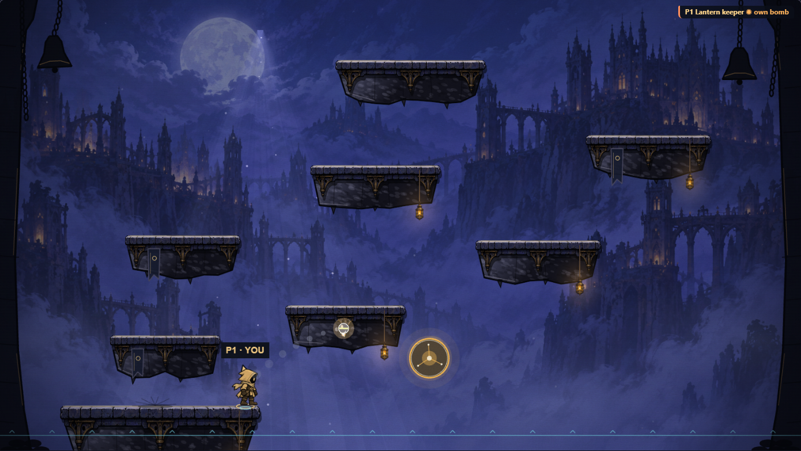
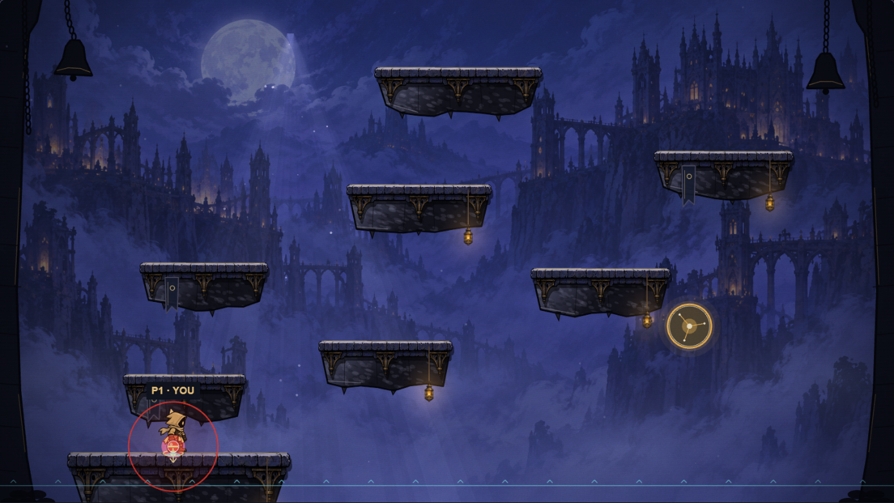
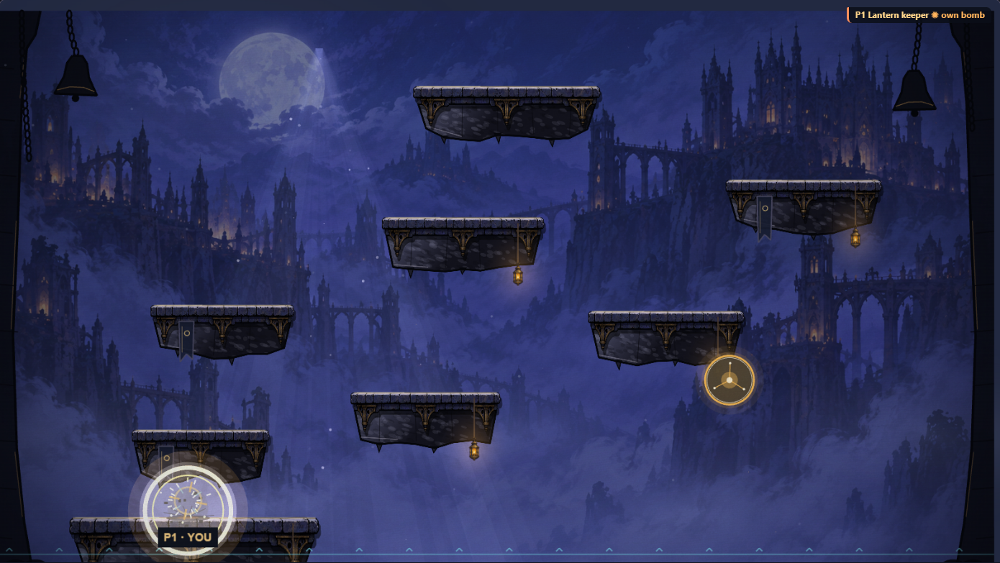
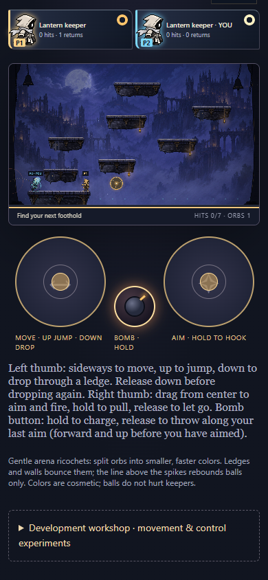

# Spiked wire everywhere and a thrown bomb (11A–11B)

Rules are now **`hook-havok-12`** (11A was `hook-havok-11`). Refresh every client and create a fresh room: older clients cannot read the new input, settings or checkpoints.

## 11A. Spiked wire everywhere

### Why

Playtesting after 10D found that the spikes lied. The wire only existed while the hook flew or held with fire down, so a retracting hook drew a plain rope that popped nothing. The lethal segment also stopped at the first ledge, although since 10A the rope passes through ledges, and it vanished while the hand was inside a platform.

### Rules

- **The wire is the rope.** With **Tether → Spiked wire**, the lethal segment runs from the keeper's chest to the hook in every phase the rope is drawn: flying, attached and retracting. Ledges neither clip nor disable it, and a hand inside stone does not either. Only a rope shorter than one unit, which draws nothing, is inactive. `activeWire` in `engine/wire-contact.ts` owns this; `paintSpikes` draws exactly that segment.
- **Balls only.** The wire still pops only balls. Rival knockback and the brass target keep tip-only contact.
- **A pop ends the shot.** Because a retracting rope is now lethal, a pop by the wire or by the tip ends a spiked shot at once (the hook is ready again) instead of retracting. Otherwise the children, which spawn on or beside the rope, would pop on the next tick and one shot could clear a family. One shot still pops one ball. Tip mode keeps its harmless six-tick retract.
- **Spiked is the default** for new rooms. `CLASSIC_TUNING` keeps the tip so older fixtures stay pinned.

## 11B. Controls and a thrown bomb

### Controls

| Action | Keyboard · J hook / K bomb (standard) | Mouse aim (classic) | Touch                               |
| ------ | ------------------------------------- | ------------------- | ----------------------------------- |
| Move   | A / D or ← / →                        | A / D or ← / →      | Left pad sideways                   |
| Jump   | Space (J no longer jumps)             | Space               | Left pad up                         |
| Drop   | ↓ + Space, or Shift + ↓               | S / ↓               | Left pad down                       |
| Aim    | WASD / arrows, eight directions       | Mouse               | Right pad direction                 |
| Hook   | Hold J, or hold left click            | Hold left click     | Drag the right pad                  |
| Bomb   | Hold K, or hold right click           | Hold right click    | Hold the bomb button beside the pad |
| Throw  | Release                               | Release             | Release                             |

Whichever button was used last owns the keyboard scheme's aim: J or K take it for the keys, a click for the mouse. Keyboard throws get the hook's aim assist (upward rays bend up to 15° onto a ledge). The canvas suppresses its context menu, and a right press while the left is held (or the reverse) is read from the pointer's button mask, so hook and bomb work together. The touch button throws along the aim pad's last direction; before the aim pad has been used it lobs forward and up at 45° from the facing direction, because a level throw from the chest barely clears the ledge. The engine reads a throw's aim on the release tick; the hook still reads it on the press.

### Rules

All of it is engine-owned (`engine/bomb.ts`, numbers in `engine/bomb-rules.ts`) and runs inside the deterministic fold after keepers move, hooks hit and orbs step.

- **Setting.** **Development workshop → Bombs**: Off, **Fuse · 1.5 s** (default) or **Impact on a rival**. Changing it restarts the shared trial like the other settings.
- **Charge.** Holding the bomb while armed charges it, one tick at a time, full after 36 ticks (0.6 s); holding longer stays full. Holding through the end of a cooldown starts the charge then. The release throws. A press and release inside one 20 Hz log tick still throws (the fold keeps the press for the first of its three engine steps). A cancelled input (disconnect, a new generation, elimination, the end of a round) drops the charge without throwing.
- **Launch.** From the chest toward the aim point at 450 units/s for a tap up to 950 units/s at full charge, linear in the charge, plus half the keeper's velocity, so a swing slings it. At 45° a tap lands 107 units away (2.1 keeper heights) and a full charge 490 units (9.4 heights, about a third of the arena). The plan asked for about 2 and 10.
- **Flight.** Keeper gravity (1800 units/s² by default), a 30 units/tick terminal speed and a 10-unit radius. Ledges are solid to bombs from every side, like orbs, and so are the side walls. A bounce keeps 0.45 of the normal speed and 0.8 of the tangential speed; a bounce slower than 90 units/s rests, a rolling bomb keeps 0.95 of its speed per tick and stops below 6 units/s. A bomb that falls out of the bottom of the arena fizzles without a blast.
- **Fuse.** 90 ticks (1.5 s) from the throw. In the impact variant a bomb also goes off the tick its body touches a rival keeper who is in play; it never goes off on its thrower.
- **Blast.** Radius 80 units (about 1.5 keeper heights). Every keeper in play whose body box the circle touches is knocked out, the thrower included, unless spawn-protected; since 11D a [Shield](power-ups.md) absorbs one blast. Orbs whose circle the blast reaches pop once, splitting like a hook hit; their children wait until the next tick. Other bombs within reach go off 8 ticks later, so chains ripple. Bombs blast in id order, keepers are checked in slot order, and a keeper already knocked out this tick is not knocked out twice.
- **Knockout.** The body leaves the arena as a fall does and returns after 60 ticks (1 s) with 60 ticks of spawn protection; falls keep 30 and 30. Free play only tallies. Score rules give the thrower +1, or −1 for their own bomb on top of the victim's usual −2 (so a self-knockout costs 3). Elimination rules put the victim out; one blast can leave nobody standing, a draw.
- **Supply.** Unlimited, with a 150-tick (2.5 s) cooldown from the release. The cooldown is longer than the fuse, so each keeper has at most one bomb out; the state also caps live bombs and refuses a throw beyond the cap (five in 11B; fifteen since the 11D [Cluster bomb](power-ups.md), whose three bomblets each count).
- **Tallies.** Each keeper's round tally keeps bombs thrown, knockouts, self-knockouts, times bombed and how they last went down (fell, own bomb, or bombed by whom). A round start resets it with the rest of the keeper.

### Checkpoints

Input has a ninth field, `bomb`; settings a thirteenth, `bomb`; the world a `charge`; the arena `bombs`, `blasts` and `knockouts`; and each keeper a `bomb` kit (cooldown and tally). Decoding checks exact keys and integer bounds everywhere, and rejects: more bombs than the cap, unordered or future ids, two bombs of one owner (since 11D: two thrown bombs, or more than three bomblets; see [power-ups](power-ups.md#checkpoints)), an owner who is not a keeper or whose cooldown is too low for a live bomb, fuses outside 1–90, speeds above the terminal speed, positions outside the arena, blast and knockout events outside the 30-tick presentation window or out of order, a charge while cooling down, respawning or released, a charge above full, a tally that exceeds the keeper's deaths, a fate without a death (or a death without a fate), a "bombed by" without a thrower, spawn protection above 60, and any bomb state while bombs are off. A rejected checkpoint leaves the healthy state untouched. The hash covers all of it through `encode`.

### Presentation

Cosmetic only; the look never changes geometry or timing.

- **Wind-up and throw.** While charging, the keeper leans back on the raised-arm pose, holding a glowing bomb whose glow grows with the charge, inside a charge ring that fills (white when full). Rivals see the same. The release plays the follow-through pose for 180 ms.
- **Arc preview.** The local thrower alone sees dotted dots where a release now would go (same launch and gravity, bounces not predicted) and the blast ring where it would first land.
- **Bomb.** Dark iron with a rim, a band and halo in the owner's colour, spinning with its speed, squashing on a bounce, with fuse sparks and a smoke trail. Over the last half second it blinks red faster and faster inside a red ring showing the blast area. Impact bombs wear a gold ring.
- **Blast.** A white flash, a shockwave, debris and smoke, a scorch that fades from the ledge over seven seconds, and the 10D shake and zoom (stronger near your keeper). A knocked-out keeper flashes and sparks where the blast caught them; a knockout feed in the arena corner names both keepers.
- **HUD.** A cooldown ring on each keeper card fills as the bomb recharges and glows when ready. The touch button dims while recharging. Results list, per entrant, knockouts, self-knockouts, bombs thrown and, in elimination, how they went out; in score rounds falls, times bombed and the last way down.
- **Sound.** Synthesized: a filtered-noise hiss on each throw, a short clink on a hard bounce and a low-passed noise boom. The six-voice limit still bounds concurrency, each bomb cue is rate limited, `?mute` creates no audio context, and teardown closes it.
- **Reduced motion** keeps the bomb, its blink and red ring, the flash and the shockwave, and drops spin, squash, smoke, debris, shake and zoom.

## Verification

- `tests/bombs.test.ts` (16 tests): launch speed and carry, charge→range (the numbers above), bounce, roll and rest, wall bounce, the 90-tick fuse, blast reach including the thrower, spawn protection, orb pops with children waiting, chain delay, cooldown and hold-through, the hard cap, impact versus fuse, fizzling, a departing keeper's bomb, score (+1, −2, −3) and elimination (out, draw) rules, free play and the off setting, a tap inside one log tick, held and cancelled charges through the room fold, strict input and settings parsing, a 1,500-tick three-keeper replay with a checkpoint round trip every tick and a restore every 17, and 26 corrupt-checkpoint cases with the healthy hash unchanged.
- `tests/control-trials.test.ts` covers 11A: the retracting wire (direct and through an ordinary release step), a rope through the lower-middle ledge, a chest inside that ledge, the degenerate short rope, respawn and tip mode, a pop ending the shot with children surviving, a tip pop in both modes, stable priority between two wires, and the new defaults. It also covers the new keyboard mapping.
- `tests/touch-input.test.ts` covers the bomb button; `tests/feedback.test.ts` the cue rate limit.
- `preview/bombs-check.mjs` plays a real room in Chrome: short and full keyboard throws, no charge while recharging, the arc, a self-knockout with the fuse ring, blast, feed and a one-second return with protection, a right-click bomb in the mouse scheme with the context menu suppressed, and a phone guest's bomb button along the aim pad's direction. `control-trials-check`, `look-check` and `effects-check` now jump with Space and hook with J.

## Limits

- Losing focus releases held input as before; a charging bomb is then thrown, because a release is a throw and the room protocol has no separate cancel. Disconnects, eliminations and round ends do cancel it.
- **Sticky** bombs are not in this trial. They belong to the 11D Sticky bomb power-up, which needs a bomb to ride a moving keeper.
- Bombs do not interact with hooks, wires, the brass target or power-up pads, and they do not knock keepers back; a blast is a knockout or nothing.
- Feel and balance (range, radius, fuse, cooldown, self-knockout cost) need a playtest with several keepers; bots arrive in 11C. Physical-phone use of the third touch control is untested.
