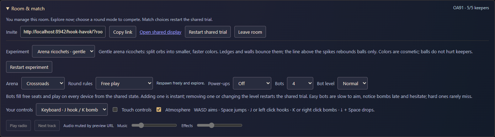
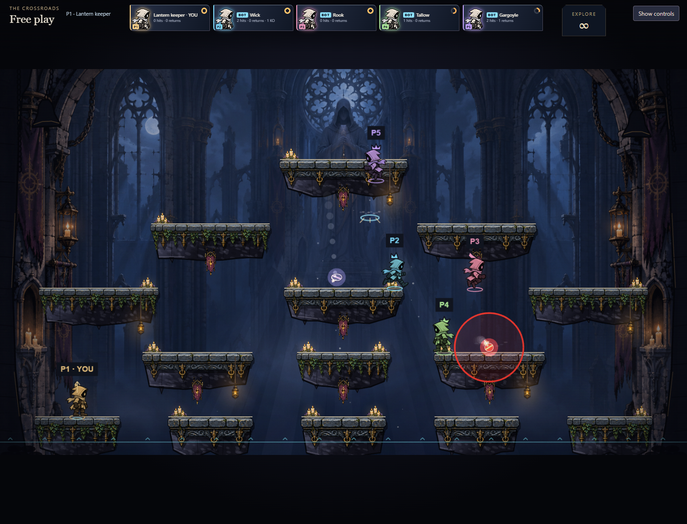
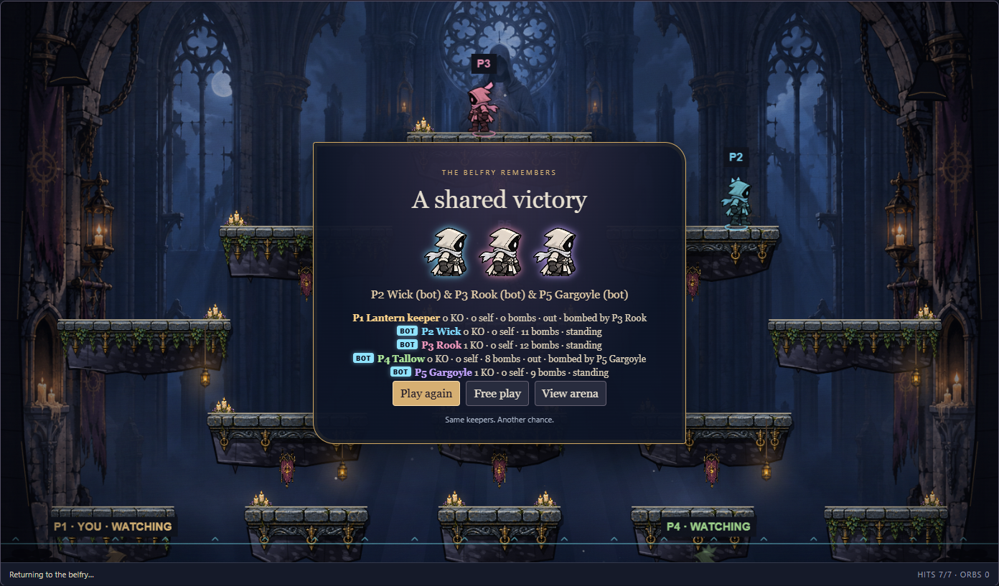
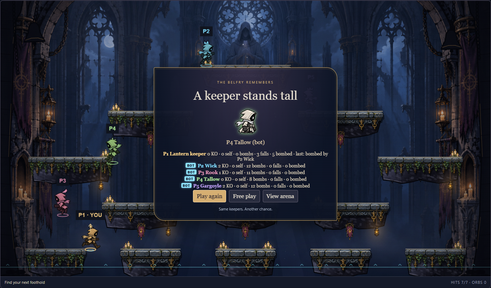
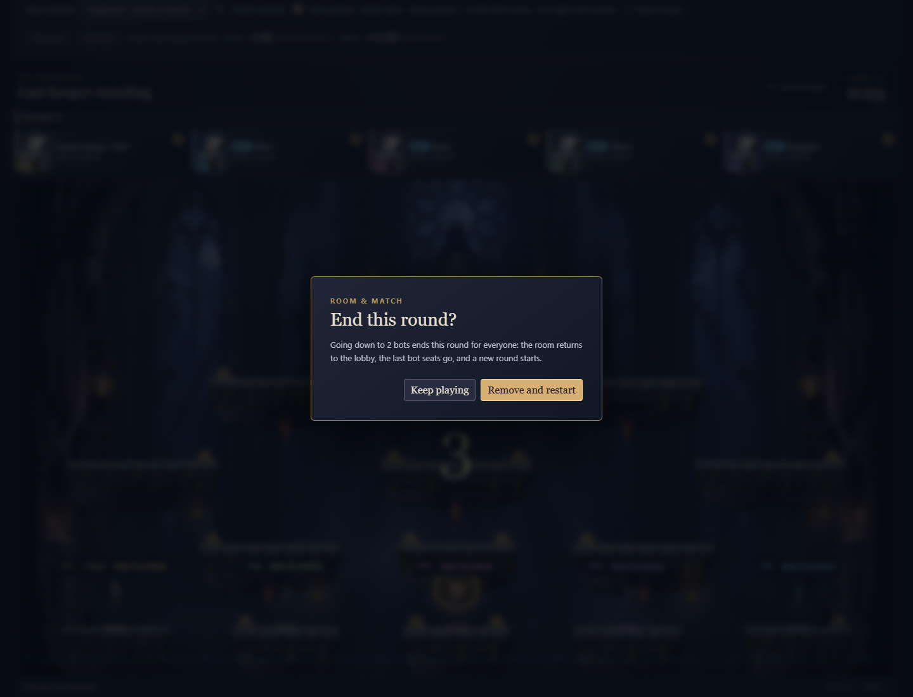

# Bots v1 (11C)

Rules are now **`hook-havok-15`**, on top of the 11D power-ups (`hook-havok-14`; 11B was `hook-havok-12`, and 13 went unused). Refresh every client and create a fresh room: older clients cannot read the new setting, seats or checkpoints.

## Playing with bots

**Room & match → Bots** seats up to four AI keepers in the free seats (five in all, you included), and **Bot level** chooses easy, normal (default) or hard for all of them. Only the room manager changes either. New rooms have no bots.

- Adding a bot seats it at once, like a friend joining; in a competitive round it waits for the next round.
- Removing bots (a lower count) and changing the level restart the shared trial, like the other match choices. The netcode only removes a seat between rounds, so the page returns the room to the lobby, removes bots from the last seat down, and starts again. During a competitive round (countdown or play) the page asks first, since that ends the round for everyone; in free play or after a round it goes ahead. Raising the count again before the lobby arrives cancels the removal.
- A room with one person and one bot is enough to start a competitive round.
- Bots wear a cyan **BOT** tag on their keeper card and in the results, and a winning bot is named "(bot)".
- Bots are Clapper, Wick, Rook, Tallow and Gargoyle, one name per seat.

## How a bot plays

Everything is engine code (`engine/bot.ts`, `engine/bot-nav.ts`, `engine/bot-mind.ts`) and runs inside the fold: once per 20 Hz log tick, before the three 60 Hz engine steps, `planBots` computes every connected bot's ordinary `Input` from the arena alone. No peer sends a bot's input; every peer computes the same one. Bots use the same step as people: they cannot move, jump, hook or throw in any way a keyboard cannot, and they read nothing a person could not see on screen.

### Navigation

When a map and its movement tuning (speed, jump, gravity, air control, reel, range, jump mode) are first used, `navGraph` finds a graph of ledge-to-ledge moves. For every ordered pair of ledges in reach it proposes moves (run and jump, jump straight up through a ledge, walk off an edge, drop through, hook the underside or a near corner and climb with a rope jump) from a few launch points, and flies each one with the bots' own pilot through the real keeper `step`, once from a run-up and once from a standstill. Only moves that land on the target ledge both times are kept, at most two per pair, with their measured time. Shortest times between ledges follow by Floyd–Warshall.

| Map (default tuning) | Edges | Jump / walk off / drop / hook | Build (Node, first use) | Unreachable pairs |
| -------------------- | ----: | ----------------------------- | ----------------------: | ----------------: |
| Crossroads, double   |   105 | 62 / 20 / 11 / 12             |                   24 ms |                 0 |
| Belfry, double       |    59 | 28 / 15 / 4 / 12              |                    6 ms |                 0 |
| Crossroads, single   |    79 | 36 / 18 / 11 / 14             |                    9 ms |                 0 |
| Belfry, single       |    48 | 15 / 13 / 4 / 16              |                    9 ms |                 0 |

The graph is cached per peer and is never part of the room: it is a pure function of the map and the tuning, so every peer builds the same one. So that a fold or a checkpoint decode does not pay for a build, each peer builds the graphs for every map and jump mode (`prewarmNav`) when its room runtime starts, and a manager builds a new movement tuning's graphs as it applies it. Another peer still builds those in the fold that applies a new movement tuning, which only the Movement workshop's fields change.

The pilot (`pilot` in `bot-nav.ts`) flies one edge: run to the launch point, press jump, drop or fire, then steer onto the landing ledge in the air, holding a jump while it rises and double jumping at the top when a fall would come up short. A hooked rope is reeled in and left with a rope jump. When nothing below can be reached and no air jump is left, it hooks an anchor above that a straight shot reaches first and whose rope would still hold after the fall, and climbs. A bot knocked off course lands on whatever it can still reach and routes again from there.

### Goals

Every re-plan interval a bot chooses where to go:

1. a ready power-up pad within the level's travel limit;
2. in ball modes, half the time, the ledge under the nearest orb;
3. otherwise a rival: the cheapest to reach (sticky, with some noise), and a stand-off point 200 units from them on the reachable ledge nearest it, never inside a blast of them;
4. with nobody to chase, a random ledge.

A bot that reaches neither a ledge nor its goal for eight seconds picks a random ledge instead. Pads are read in one place, `botPads` in `bot.ts`, through the pads' own read `padList` (11D): any ready pad, whatever it shows.

### Attack

- **Bombs.** On its attack beats, a grounded bot with a ready bomb and a rival in range (560 units across, 420 up, 360 down) plans a throw. For charges of 9, 18, 27 and 36 ticks, as a flat throw and as a lob, it solves the ballistic launch that passes the rival's ledge top (with a lead on the rival's velocity), flies it with the real `bombLaunch` and bomb flight for the whole 1.5 s fuse (bounces and rolls included, or the first touch in the impact variant), and corrects the aim point twice for where the bomb actually ends up. It keeps the plan whose blast is nearest the rival, if that is within the level's accepted miss and at least 140 units from itself, then stands still, holds the bomb until the charge is reached and releases with a fresh solve at the rival's position then, nudged by the level's aim error. A charge left without a plan is thrown as a lob away from itself.
- **Hook.** A grounded bot shoots the hook at an orb in reach, or at a rival standing within 70 units of the edge the hit would push them over, leading the target by the hook's flight time, and lets go if the hook bites stone instead. In score rounds hook hits are points, so it tries more often.

### Defence

Every live bomb's flight to its fuse is predicted once per log tick (`bombPath` in `bomb.ts`), with its own blast radius (a bomblet's is 48 units). A cluster bomb is taken to blow where it will first touch stone, a bomblet fuse later, with a whole bomb's radius for the bomblets' spread. A bomb matters to a bot when its fuse is within the level's reaction time, its blast could reach the bot, and the bot noticed it (its own bombs always; a rival's with the level's notice chance). Then the bot flies a ghost of itself through the keeper `step`, detached from the room, for each of a few escapes: its planned input, run away, run away and jump (with an air jump at the top), hop over the bomb, jump in place, drop through the ledge, run the other way. The first that ends outside every blast by the level's margin, alive and over a ledge, wins; otherwise the one that comes closest. The same test keeps a bot off its own bomb.

The ghost (`ghost` in `bot.ts`) is a copy of the bot's keeper in which every object that `step` or a power's tick writes is its own: the body with its input, previous input and hook, the power (kind, timer, cluster charges) and the bomb kit, with the scalars (dash timer, bonus jumps, spawn guard, charge) copied by the spread, an empty combat and no mind. Tuning is only read. The ghost moves as the fold moves the bot: with its power's boost (`boostOf` in `arena.ts`) and the power running down each step (`tickPower`), so a Triple jump's extra air jumps and a Dash bump's dash are in the prediction and end when the power does. A test checks that planning with every power held writes the bots' minds and nothing else.

### Power-ups

Bots take any ready pad within their level's detour and do not choose between kinds. Holding one, they play on:

- **Triple jump.** The pilot uses the extra air jumps like the ordinary one, when a fall would come up short.
- **Dash bump.** The air jump is a dash along the aim, so the pilot aims it: up, leaning toward the ledge it is steering for (at most 140 units across per 200 up). A jumping escape from a bomb dashes up and away from it. The navigation graph is still built without powers, so every edge works with or without one.
- **Harpoon.** Hook strikes are chosen as before; a hit pulls the rival in instead of pushing them away.
- **Shield.** Bots still dodge; a Shield only stops blasts, so a shielded rival is still hooked, and a rival under spawn guard is not.
- **Cluster bomb.** A throw is planned and checked for clearance at the point where the bomb will split, not at the end of its fuse.

### Levels

| Level  | Re-plan | Aim error | Lead | Reacts at fuse | Notices | Margin | Hesitates | Attack beat | Hook chance | Accepted miss | Pad detour |
| ------ | ------: | --------: | ---: | -------------: | ------: | -----: | --------: | ----------: | ----------: | ------------: | ---------: |
| Easy   |   1.2 s |      16 % |    0 |         30 (½) |    55 % |    4 u |      20 % |       0.3 s |        15 % |          95 % |      1.5 s |
| Normal |   0.5 s |       7 % |  ½ × |         45 (¾) |    80 % |   12 u |       7 % |      0.15 s |        40 % |          75 % |      3.3 s |
| Hard   |   0.2 s |       2 % |  1 × |        90 (1½) |   100 % |   28 u |     1.5 % |       0.1 s |        80 % |          60 % |        6 s |

Aim error is the largest sideways nudge of the throw direction; lead is the share of the rival's velocity over 20 ticks; reaction is fuse ticks left (seconds); notice is the chance a rival's bomb is seen at all; margin is the clearance a dodge keeps; hesitation is the chance a one-second beat is spent doing nothing new (a held bomb stays held); hook chance applies to a rival next to an edge; accepted miss is a share of the 80-unit blast radius. The numbers live in `BOT_LEVELS` (`engine/bot-mind.ts`).

## Determinism and state

- Only `+`, `−`, `×`, `÷`, `sqrt`, rounding, `min`, `max` and `abs`, like the rest of the engine: no trigonometry, no `Math.random`, no clock. Chance is `noise(botId, tick, salt)`, a stateless integer hash; it is never consumed, so a replay or a rollback draws the same numbers.
- What a bot remembers lives in its keeper's **mind**, ordinary room state that is hashed, cloned by rollback and carried in checkpoints: the goal ledge and x, the edge being flown, a rescue ledge, the hook task (none, climbing, striking), the re-plan countdown, the stuck timer, the rival's slot, the planned charge and arc. People's keepers carry `mind: null`. Decoding checks exact keys and integer bounds against the map's ledges and the real graph's edge count, and a mind only on a bot's keeper.
- Bot seats are the netcode's BOT entries: ids `bot:1` … `bot:99` (the room service gives people UUIDs), a name, a slot, the keeper avatar, connected, no stream generation and never away. The wire guard (`isEntry`) takes a BOT entry only with such an id, and refuses a JOIN, LEAVE or PRESENCE naming one: the shared fold applies a LEAVE to any seat, and mid-round it would mark a bot absent and stop it. So a bot seat is always connected. Decoding refuses a bot seat with another id, absent, with a generation or `away`, a person's seat with a bot id, and a keeper whose mind disagrees with its seat. A rejected checkpoint leaves the healthy room untouched.
- Bots never manage a room: succession skips them, so when the manager leaves the room passes to the next person, and the bots stay and keep playing. The fold ignores a removal while a round runs; between rounds it applies.
- Settings gain a fourteenth field, `botLevel`, validated like the rest.

## Soak

`tests/bots.test.ts` runs five bots and nobody else for 2,400 log ticks (two minutes) on each map: every rule set at normal, and free play at easy and hard, each with all five power-ups (the default) and with none. A finished round starts another at once. Every run asserts that every input a bot played parses as a valid input, that no bot in play stays within 8 units for ten seconds, that a checkpoint every 50 ticks round-trips to the same hash, at least 40 bombs and that competitive rounds finish. Runs without power-ups each need knockouts (except hard against hard, which dodge one another); runs with them need at least ten pads taken and some cluster bombs, and knockouts across the map's easy and normal runs. Results at `hook-havok-15` (bombs are throws; a cluster's bomblets are counted apart):

| Map        | Rules       | Level  | Power-ups | Rounds done | Bombs | Bomblets | Knockouts | Own bomb | Falls | Hook hits | Pads taken | Dashes | Shield pops | Stuck |
| ---------- | ----------- | ------ | --------- | ----------: | ----: | -------: | --------: | -------: | ----: | --------: | ---------: | -----: | ----------: | ----: |
| Crossroads | free        | normal | all five  |           — |   122 |       51 |         6 |        0 |     1 |       140 |         43 |     11 |           1 |     0 |
| Crossroads | elimination | normal | all five  |           2 |    95 |       33 |         6 |        0 |     1 |        71 |         42 |      5 |           1 |     0 |
| Crossroads | score       | normal | all five  |           1 |   117 |       36 |         5 |        0 |     2 |       141 |         42 |      4 |           1 |     0 |
| Crossroads | free        | easy   | all five  |           — |    96 |       51 |        13 |        2 |     2 |        43 |         35 |      4 |           2 |     0 |
| Crossroads | free        | hard   | all five  |           — |   104 |       60 |         0 |        0 |     0 |       170 |         44 |     14 |           0 |     0 |
| Belfry     | free        | normal | all five  |           — |   106 |       48 |         7 |        0 |     4 |       120 |         43 |     13 |           2 |     0 |
| Belfry     | elimination | normal | all five  |           1 |    57 |       27 |         4 |        0 |     2 |        41 |         39 |      5 |           0 |     0 |
| Belfry     | score       | normal | all five  |           1 |    90 |       30 |         0 |        0 |     7 |       153 |         41 |      9 |           0 |     0 |
| Belfry     | free        | easy   | all five  |           — |   111 |       27 |        11 |        2 |     9 |        61 |         24 |      6 |           0 |     0 |
| Belfry     | free        | hard   | all five  |           — |    85 |       33 |         0 |        1 |     1 |       144 |         42 |     26 |           0 |     0 |
| Crossroads | free        | normal | none      |           — |   122 |        — |         6 |        0 |     4 |       107 |          — |      — |           — |     0 |
| Crossroads | elimination | normal | none      |           1 |    99 |        — |         4 |        0 |     0 |        77 |          — |      — |           — |     0 |
| Crossroads | score       | normal | none      |           1 |   118 |        — |         3 |        0 |     1 |       116 |          — |      — |           — |     0 |
| Crossroads | free        | easy   | none      |           — |    96 |        — |        22 |        0 |     2 |        36 |          — |      — |           — |     0 |
| Crossroads | free        | hard   | none      |           — |   113 |        — |         0 |        0 |     1 |       157 |          — |      — |           — |     0 |
| Belfry     | free        | normal | none      |           — |   118 |        — |         4 |        2 |     3 |       113 |          — |      — |           — |     0 |
| Belfry     | elimination | normal | none      |           2 |    82 |        — |         5 |        0 |     4 |        63 |          — |      — |           — |     0 |
| Belfry     | score       | normal | none      |           1 |   104 |        — |        10 |        1 |     4 |       120 |          — |      — |           — |     0 |
| Belfry     | free        | easy   | none      |           — |   105 |        — |        25 |        1 |     9 |        68 |          — |      — |           — |     0 |
| Belfry     | free        | hard   | none      |           — |    85 |        — |         0 |        1 |     1 |       135 |          — |      — |           — |     0 |

With pads, bots spend much of a round going for one (about 40 pads taken in two minutes, a power held about 40 % of the time) and meet one another there, so hook hits rise and bomb knockouts fall, most in score rounds, where a hook hit protects the rival: Belfry score at normal has no knockout with all five, 1–4 with other match seeds, and 2–6 with any one kind alone (10 without pads). That comes from the pads, not from a particular power. Balance needs a playtest.

Cost: two minutes of five bots fold in 0.11–0.32 s in Node with all five power-ups (0.12–0.30 s without; about 45–135 µs per log tick, three engine steps and a checkpoint every 50 ticks included). A dodge or a throw plan flies at most a few hundred keeper or bomb steps; a rollback replays the same work.

## Verification

- `tests/bots.test.ts` (17 tests): the wire guard takes BOT entries and still refuses spectators; strict `botLevel` parsing; only `bot:1` … `bot:99` pass the guard (`stranger`, `bot:100`, `bot:0`, `bot:01`, `Bot:3` would be seated where decoding refuses them), and a JOIN, LEAVE or PRESENCE naming a bot is refused; the Bots choice clears a pending removal when the count goes back up, removes the last seats first and asks only during a competitive round; for each level, two independent folds agree every tick for 700 ticks, rollback-style clones every 97 ticks and a checkpoint restored at tick 300 stay on the same hash; five bots with bombs and all five power-ups, restored from their own checkpoint every 7 ticks (each re-encoding exactly) and cloned for rollback every 5 for 600 ticks, stay on the hash of a room never restored (elimination, score and free play, double and single jump), taking pads themselves and, with a grant every 2 s, holding every kind, throwing cluster bombs and dashing; planning with one bot per power held (a Triple jump, Shield, Cluster bomb, Harpoon and Dash bump) and each bot's own bomb planted at its feet writes the bots' minds and nothing else for 400 ticks (hash and full state), and a clone plans the same inputs and minds; BOT entries seat bots in free slots (a taken slot is refused), succession skips a bot in a lower slot, bots keep playing after the manager steps away, a removal during a round is ignored and applies between rounds; the real room runtime adds bots only from the manager, two peers agree on the hash and both see the bots move, and the bots stay when the creator leaves; 20 corrupt bot seats, minds and settings are refused with the healthy hash unchanged; a hard bot escapes a bomb planted at its feet in its path (a keeper standing there is caught); a hard bot's throw at a keeper standing still 320 units away knocks it out (without pads, which it would go for first); a bot falling into the void between two floor ledges hooks the ledge above and climbs onto it (a keeper there dies); the soaks above; bots idle outside a round.
- `preview/bots-check.mjs` plays a real room in Chrome with the local keeper standing still: four bots from Room & match with BOT tags on the cards, free play at easy, normal and hard (bombs, hook hits and movement in 12 s), an elimination round at normal to its end with BOT tags in the results, **Play again** for a second round with the same bots, a score round at hard, and taking two bots away: during the first elimination round the page asks and **Keep playing** leaves the round and the four bots be; confirmed during a later round, the last seats go and the room restarts with two. `multiplayer-check`, `rules-check`, `bombs-check` and `power-ups-check` still pass against rooms without bots.

## Limits

- Hard bots rarely fall for one another's bombs, so a room of only hard bots has few knockouts; they are meant to be hard for people. Balance between the levels needs a playtest.
- Bots take any ready pad and do not value one power-up over another; they use a power only as far as their ordinary play does (a Harpoon hit, a planned cluster throw, a dash for an air jump). Pads they would pass for a better one, and chasing a rival who holds a Shield less, are not modelled. A pad they could collect in the middle of a trial is not in the prediction.
- The graph knows ledges, not the arena's orbs, brass target or other keepers; a bot routes through a rival's spot and fights its way past.
- Swings are not planned: a hook edge reels straight in and leaves with a rope jump. Wall-to-wall swinging, lift pads and moving lifts (12C) are not in the graph.
- A bomb that another blast will chain early, and a rival who might walk into an impact bomb, are not predicted.
- Bots do not use the drop-and-hook tricks people find, and do not chase a rival across the void by swinging.
