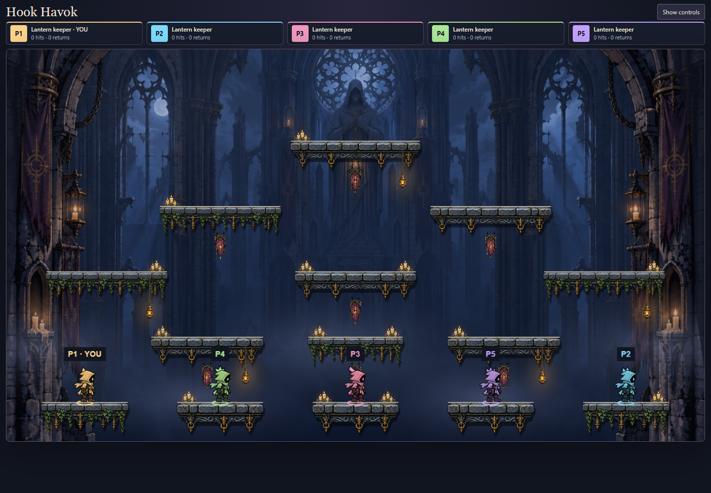
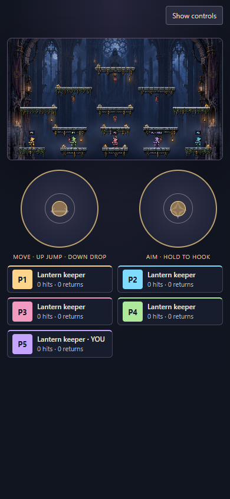
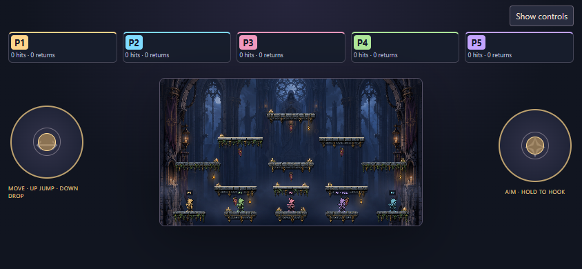

# Phase 7E — Crossroads cathedral and atmosphere

Extend the approved shrine kit across all fourteen Crossroads ledges and replace that map's distant outdoor painting with an original ruined lantern cathedral. Keep Belfry's painting and dressing for comparison. The new background supplies distant windows and a central lantern-bearer monument, middle-distance columns, and detailed outer arch framing. It contains no playable platforms. The fixed camera, geometry, player identity, combat and rules remain unchanged.

Alternate clean and ivy-covered stone, vary candle placement, and reserve hanging banners for ledges with space below. Retain the central shrine arrangement. Bright, continuous platform top edges and quiet low-contrast background areas preserve traversal and projectile readability. Dressing stays behind keepers and effects.

Animate suspended banners, candle light/flames, occasional local embers and sparse falling dust through the existing Phaser presentation loop. Reuse the current fog layer. No simulation clock, physics, independent animation timer or unbounded particle emitter is added. All environmental motion stops when Atmosphere is off or reduced motion is requested, including a live preference change. Static artwork and practical light remain visible.

Decoration belongs to the terrain container; switching maps destroys it and resets motion references. Reuse a bounded set of modular platform textures. The background image is one persistent scene object with a map-selected texture. Record the generated source, exact prompt, actual dimensions/size and actual-browser evidence. Verify all fourteen surfaces, repeated map switches, animation on/off, live reduced motion, loading/retry, five players, shared display and phone layouts. User playtesting remains the visual acceptance check.

## Sources and limits

The new [cathedral source](../art-source/backgrounds/crossroads-cathedral-source.png) was generated with built-in ImageGen; its [exact prompt](../art-source/backgrounds/crossroads-cathedral-prompt.md) is retained. Actual dimensions are **1672 × 941**, PNG size **1,961,129 bytes**. Source pixels are copied unchanged. The scene fits it to the existing 1600 × 900 view. Near/middle/far architectural depth is painted into this source; fog, terrain, suspended ornaments, flames and particles are separately rendered. There is no parallax camera or articulated cloth simulation.

The [7D shrine atlas](lantern-shrine.md) is reused. Crossroads now has fourteen decorated platforms, fourteen candle clusters and seven hanging ornaments. Candle placements and ivy variants vary across ledges. Hanging decorations remain below their platforms and above the next route; bottom platforms have none. The central three-ledged shrine composition is retained. Particle work is bounded to at most one ember per candle cluster and twelve drifting dust motes, with no retained particle history. Environmental animation reads only presentation time and never alters simulation.

The backdrop adds approximately 1.96 MB of PNG source data to the shared scene preload, including Belfry/showcase loading; this is not wire traffic measurement. No performance claim or physical-phone qualification is made. Fine details naturally collapse at phone size; silhouettes, top edges and warm accents carry readability.

## Playtesting and browser evidence

Refresh `/hook-havok/?mute`, enter a room, select **Arena → Crossroads**, then **Focus arena**. Invite other players to compare the scene with action. **Show controls** restores the **Atmosphere** checkbox and map selector. Compare Atmosphere on/off, Belfry/Crossroads and the splitting-ball exercise. A new rules version or room reset is not required for this art-only update.





```sh
pnpm build
node --import tsx --test games/hook-havok/tests/*.test.ts
node games/hook-havok/preview/environment-check.mjs http://localhost:PORT/
node games/hook-havok/preview/arena-check.mjs http://localhost:PORT/ games/hook-havok/docs/evidence/cathedral
node games/hook-havok/preview/shrine-check.mjs http://localhost:PORT/ games/hook-havok/docs/evidence/cathedral-ball.png
node games/hook-havok/preview/showcase-check.mjs http://localhost:PORT/
```

Environment checks observe actual rendered banner angles, candle/light alpha and fog positions across advancing presentation frames. They verify motion, stable disabled/reduced-motion state, resumption after a live preference change, fourteen platform sprites, original geometry and repeated map cleanup. Failed backdrop loading exposes retry and recovers to one canvas. The arena smoke uses a real five-player room and shared display, ordinary jump/drop inputs, refresh, round restart and phone layouts. The retained shrine smoke checks true source alpha and the existing ball exercise. Screenshots use real gameplay without injected state; phones are Chrome emulation.

Final local verification: **55/55 Hook Havok tests pass**, as do typecheck/build, changed-source ESLint, formatting/diff checks and the four browser commands above. The showcase command used `BROWSER_CHANNEL=chrome` because the bundled Playwright browser is not installed. Full repository suite: **1661/1669**, retaining the eight known Windows backend-paths, CI-manifest and new-game failures reproduced on clean main during [7B](art-production.md#verification-record). No assertions were removed or weakened.

Independent review found no actionable render, cleanup or geometry defects. Its observation that resumed motion was checked only by a flag was addressed with successive banner-angle and candle-alpha comparisons after restoring normal motion. Review used the available inherited model because the repository's requested Sonnet model is unavailable. User visual acceptance, physical-phone testing, merge and deployment are not included.
