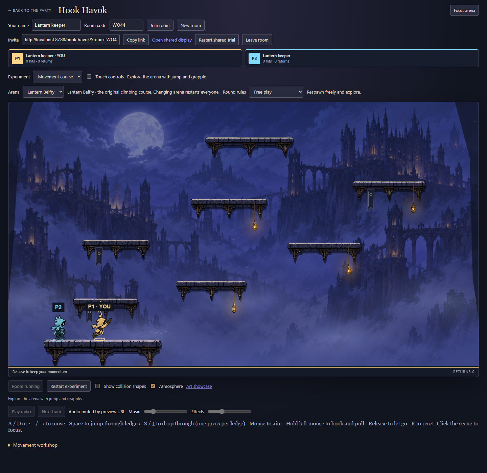
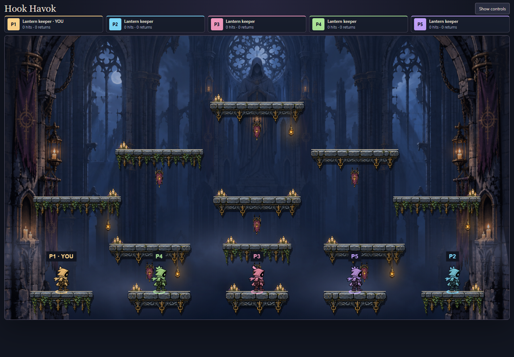
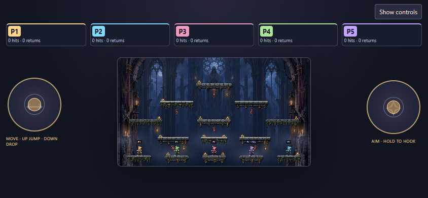

# Phase 7F — keeper animation and combat feedback

Add an original eight-frame running atlas that preserves the neutral lantern-keeper costume and player tint/crests. Retain the existing idle, jump, fall, launch and pull drawings. Normalize run size against the idle body and register frames at their cell root/alpha foot baseline. Drive gait from speed and bounded presentation-time deltas, restarting after idle instead of sampling a global animation clock.

Layer a short takeoff stretch, landing recovery, movement lean, hook launch/release recoil and target-only knockback reaction over those poses. Actions must not wait for animation; firing wins over landing decoration. Keep all actor/crest transforms cosmetic and keep authoritative positions, input, timing and collisions unchanged. Local, remote and shared-display keepers use the same pose selection.

Add directional player-hit accents, a distinct arrival ring and an exit burst for falls/elimination. Infer effects from observed view transitions, not predicted future outcomes. Scope target reaction to the struck keeper, suppress repeated/rollback ticks and large discontinuities, bound effect history and clear it on trial/round resets. Effects may be dropped after large checkpoint gaps rather than replaying stale events. No hit-stop, camera shake or simulation changes.

Reduced motion preserves readable action silhouettes while suppressing gait cycling, body deformation/rotation and expanding particles. Foot placement remains tied to the view; there is no motion-driven gameplay or independent rendering loop. Keep the existing source atlas and showcase intact, and retain exact generation prompts for the new run source. Verify actual alpha/registration, speed cadence, action priority, remote presentation, hit/exit/arrival feedback and reduced motion through focused tests and real-room browser checks. This remains frame animation, not a skeletal rig or final artistic acceptance.

## Source and presentation details

The new [run atlas](../art-source/character/lantern-keeper-run-source.png) is **1774 × 887**, **810,420 bytes**, generated with built-in ImageGen using the previous keeper sheet as an identity reference. The [exact prompt](../art-source/character/lantern-keeper-run-prompt.md) is retained. The loader checks all eight cells for clear alpha gutters and uses their alpha foot bounds and cell-centre roots. Uniform run scale matches the existing idle body's height. Source pixels are unchanged. The original nine-pose sheet remains for idle and action poses and the original authored showcase.

Gait advances one cycle per 150 world units of speed-integrated presentation time; individual deltas are capped at 50 ms. Stopping or entering an action restarts at a contact pose. Scarf movement is authored into the drawings, not simulated cloth. Some generated silhouette/limb variation remains; this is an incremental improvement over the four-frame loop, not a hand-registered skeletal animation claim. The source adds approximately 0.81 MB to scene preload before transfer encoding; no performance claim is made.

Each keeper has at most two faint airborne silhouette echoes, offset no more than 18 world units using current velocity. They are decorative streaks rather than recorded historical poses. The existing burst history stays capped at twelve per feedback instance and expires after 400 ms; large checkpoint gaps discard it. Global player-hit effects render once, while only the victim receives body recoil. Exits use the last observed position (clamped to the visible lower edge for falls), and arrivals use the spawn position. Round results retain the final exit event; entering a new round or changing the trial still clears feedback and held controls.

## Playtest and evidence

Refresh `/hook-havok/?mute`, enter a room and choose either map. Try short and long runs, stop/restart, jump and release early, hold a hook until attachment and release, then hit another keeper. Walk off a bottom ledge in free play to see departure and return. With two or more keepers, choose Last keeper standing and compare the final elimination. Use **Focus arena** for an unobstructed view. Reduced-motion preference changes take effect live.






```sh
pnpm build
node --import tsx --test games/hook-havok/tests/feedback.test.ts
node games/hook-havok/preview/character-check.mjs http://localhost:PORT/
node games/hook-havok/preview/arena-check.mjs http://localhost:PORT/ games/hook-havok/docs/evidence/character-arena
```

The character smoke uses ordinary controls in a real two-player room: it waits for spawn protection to expire, verifies local/remote run textures and advancing frames, target-only recoil, takeoff echoes, grapple/release, reduced motion, fall/arrival and final elimination, then aborts the new atlas request and verifies retry. Applied-round observation prevents test inputs being sent into a restart that is still pending. The arena smoke covers five members plus shared display, maps, ordinary jump/drop, refresh, restart and phone portrait/landscape. Screenshots are real gameplay without injected poses or world state. Phone evidence is Chrome emulation, not physical-device qualification.

Final verification: **59/59 Hook Havok tests pass**, including nine feedback/audio tests. Typecheck/build, changed TypeScript ESLint, formatting/diff checks, the character and arena smokes, and the retained authored-showcase checks pass. The full repository suite is **1665/1673**, with the same eight Windows backend-paths, CI-manifest and new-game baseline failures previously reproduced on clean main in [7B](art-production.md#verification-record). No test assertions were removed or weakened.

The existing local arena smoke could mistake the old active free-play frame for the selected score mode. It now waits for both rules and phase, and observes the new map's countdown before checking the other pages. The race is recorded in [flaky-test epic #250](https://github.com/andeplane/fuse-riders/issues/250#issuecomment-5813246900). The script is not registered in CI, so no CI case needed removal.

Independent review found no actionable correctness issues and independently passed all nine focused tests. It checked view-only animation, target scoping, local/remote consistency, reset/gap handling, bounded echoes/bursts and reduced motion. The available inherited model was used because Sonnet is unavailable in this session. Artistic acceptance, physical-phone qualification, merging and deployment remain outside this change.
