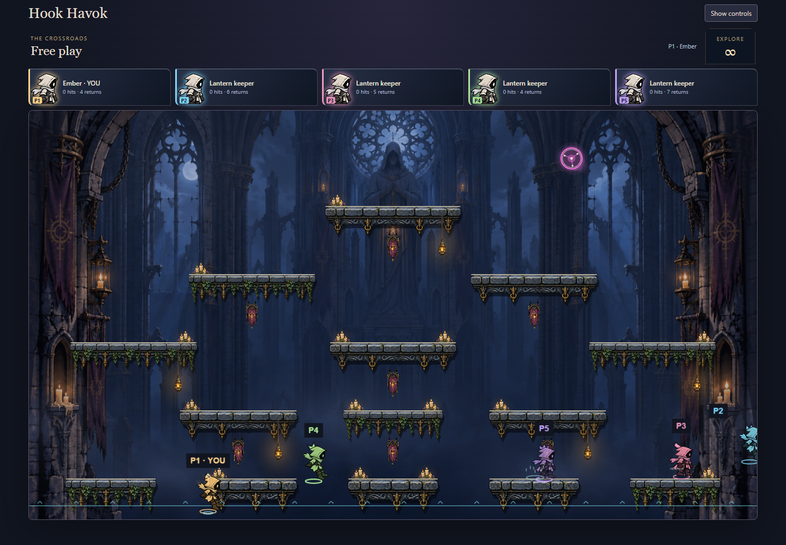
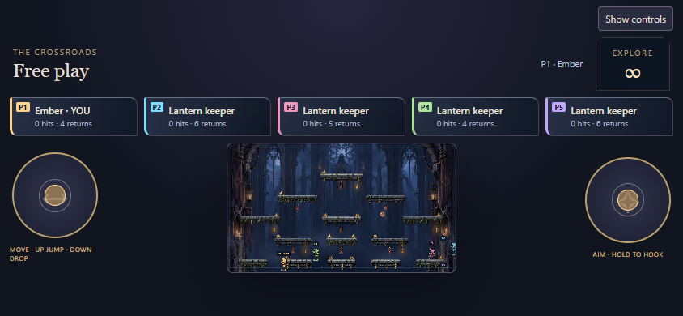

# Phase 8C: cohesion and local performance qualification

The arena's fog is less opaque so stone edges, characters and colored balls separate more clearly from the cathedral painting. Grounded keepers have a restrained contact shadow. Out/away cards retain readable text while their portrait dims, and keyboard focus has an explicit cyan outline. Existing keeper and ball identities, geometry and rules remain unchanged.

The reference images still have richer bespoke illustration and framing than the running game. This pass improves readability and consistency without adding more particles or obscuring the playable area. More decorative density should follow actual playtesting rather than a still-image comparison alone.

## Presentation work

- Static keeper crests are drawn once per slot change; their position/scale/rotation still follow the current pose.
- Pose feedback finds the newest relevant cues in one backwards scan, replacing six copied/reversed arrays per keeper per presentation frame. Victim-only hit selection and cue priorities are preserved.
- Frozen environmental dressing is repainted on map, Atmosphere or reduced-motion changes. Animated dressing remains on Phaser's existing clock. Fog visibility and candle/banner state are refreshed when the cache key changes.
- Scene captions and unchanged room text no longer replace their text nodes every frame. Detailed gameplay diagnostics remain available to the browser checks.
- Showcase landing/spark movement now respects reduced motion, like live-game bursts already did.

There is no additional game loop, simulation change, automatic quality downgrade or audio redesign. Existing limits remain: four live balls, twelve short-lived bursts per keeper, two silhouette echoes per keeper, bounded tether/spike geometry and six simultaneous audio voices. Mute and audio lifecycle tests remain intact; browser checks run muted and are not a listening assessment. Rules remain `hook-havok-8`.

## Reproducible local workload

The new [browser workload](../preview/cohesion-check.mjs) creates five real players in its own room: Crossroads, surge balls, double jump and spiked wire. Seed 1707 produces the retained keyboard schedule over 24 steps of 30 observed game ticks. It exercises moving/jumping keepers and repeated hooks, without injecting game state. Every recorded sample observed five simultaneous hooks and three live balls; it is not an exhaustive maximum-complexity workload. Network delivery, wall-clock timing and exact collisions can vary despite the seeded key schedule.

Recorded on Windows, AMD Ryzen 9 9950X3D, approximately 62 GiB usable RAM, headless Chrome 154.0.8037.57. Each sample has about 12 seconds of activity after setup/warmup. All five clients run on the same machine; only the host's main-thread metrics are recorded.

| Sample                    | Browser rAF callbacks | rAF p95 / p99 (ms) | Host task time (s) | Caption mutations | Intervals >33.4 ms | Long tasks |
| ------------------------- | --------------------: | -----------------: | -----------------: | ----------------: | -----------------: | ---------: |
| Before, 1440×1000         |                  1517 |          8.3 / 8.5 |              2.750 |              1517 |                  0 |          0 |
| After, 1440×1000          |                  1727 |          7.0 / 7.1 |              3.304 |                31 |                  0 |          0 |
| Reduced motion, 1440×1000 |                  1726 |          7.0 / 7.1 |              2.424 |                31 |                  0 |          0 |
| Phone layout, 844×390     |                  1674 |          7.1 / 7.1 |              3.041 |                31 |                  4 |          0 |

The clear observed reduction is redundant caption mutation: **1517 → 31**. These short samples do **not** establish a frame-rate or CPU speedup. Total task time increased in the after/full run while browser callback count also changed. rAF cadence is not Phaser rendered FPS, paint duration or GPU time; CDP task/script time includes measurement overhead. A single sample per configuration on this high-end desktop cannot establish low-end hardware performance. No additional quality selector is justified by these measurements alone.

Raw measurements, key schedules and callback intervals are retained:

- [Before](performance/cohesion-before.json): clean runtime source at `602348d39b9b72b3ff78dccccba63559f411f54a`.
- [After](performance/cohesion-after.json), [reduced motion](performance/cohesion-reduced.json), [phone layout](performance/cohesion-phone.json): same base revision with this phase's runtime changes. Exact normalized runtime source SHA-256: `05cca25dd41bf2d8070ee250076d932e6363c6f043667c5eee7494a39147e3a2`. The reduced/phone reports record this hash directly. The first before/after reports predate the hash field; their original measurements remain unedited.

The fingerprint hashes sorted `games/hook-havok/src` paths plus LF-normalized file content as implemented in the workload. All runtime changes were complete before the after/full sample; subsequent changes added provenance and visual checks to the harness only.

```sh
pnpm build
node games/hook-havok/preview/cohesion-check.mjs http://localhost:PORT/ artifacts/cohesion-full.json full
node games/hook-havok/preview/cohesion-check.mjs http://localhost:PORT/ artifacts/cohesion-reduced.json reduced
node games/hook-havok/preview/cohesion-check.mjs http://localhost:PORT/ artifacts/cohesion-phone.json phone
```

Build the stated revision before measuring and do not build or run other qualification workloads concurrently. The phone configuration changes the viewport and enables the touch layout; it uses ordinary keyboard inputs on desktop Chrome. It is neither native-device evidence nor physical-phone performance evidence.

## Verification and remaining limits

Typecheck, build, changed-source ESLint, formatting and diff checks pass. **73/73 Hook Havok tests pass**; the complete repository result remains **1679/1687**, with the same eight documented Windows baseline failures in backend-paths, CI-manifest and new-game. No assertions were removed or weakened. The existing nine feedback/audio tests also passed independently during review.

Five-player/shared-display browser checks pass map cleanup, identities, input cancellation, jump/drop, refresh, round restart and repeated map changes. The authored showcase passes idle/reduced motion, timeline/replay/pause, resizing, asset failure/retry and context-loss retry. It uses installed Chrome (`BROWSER_CHANNEL=chrome`); the bundled headless shell is not installed here.

The reduced-motion workload additionally compares actual high-shrine screenshot pixels across ticks, checks a map rebuild while motion remains reduced, and verifies that changing the preference live restores visible motion. Its first draft compared the entire canvas; that was too broad because reduced motion must not stop gameplay. The final check isolates environmental artwork instead of relying only on cached diagnostic values.

Review found no source correctness blockers. Its requests for source provenance, honest callback terminology and live cache-invalidation checks were addressed above and in the harness. The available inherited model was used because Sonnet is unavailable.




This completes the local 8C pass. **Physical-phone usability/performance and user acceptance of the appearance remain open.** No merge, deployment, production qualification or universal performance claim is included.
