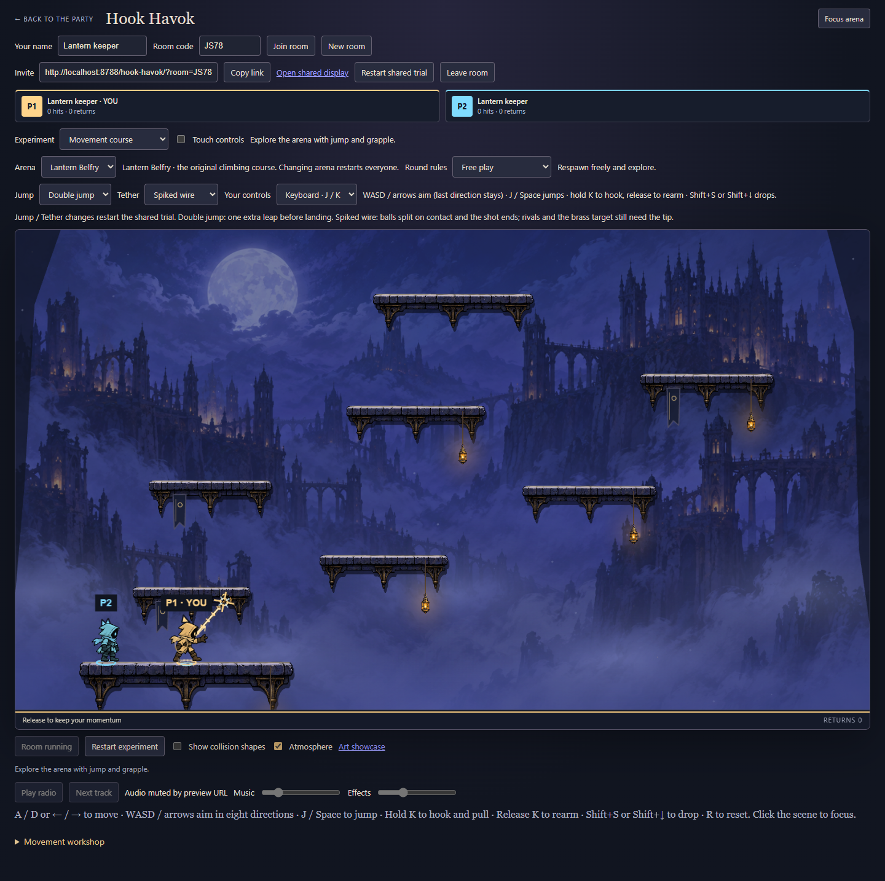
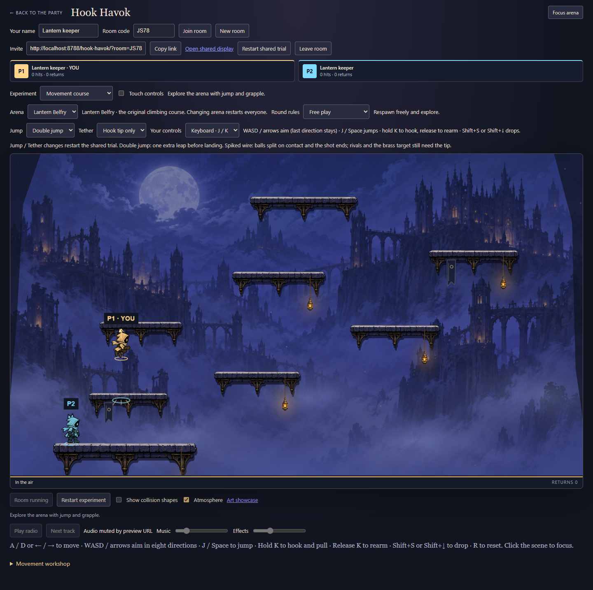

# Spiked wire, air jump and keyboard trials

These selectable experiments let players compare the new mechanics with the original controls. Defaults remain single jump, hook-tip contact and mouse aiming. Refresh every client and create a fresh room: the checkpoint contract is now **`hook-havok-8`**.

## Try it

Create a room, then open **Development workshop** to select **Jump → Double jump** and **Tether → Spiked wire**. In **Room & match**, select **Your controls → Keyboard · J / K** and a ball experiment to try splitting orbs. Jump and Tether are manager-controlled shared settings; changing either restarts the trial. Keyboard mode is local to each device and is also available in the splash Settings dialog.

| Action               | Keyboard mode                                   |
| -------------------- | ----------------------------------------------- |
| Move                 | A / D or left / right arrows                    |
| Aim                  | WASD / arrows; combine directions for diagonals |
| Jump / air jump      | J or Space; release between jumps               |
| Fire and pull        | Hold K; release to let go and rearm             |
| Drop through a ledge | Shift+S or Shift+Down                           |

The last nonzero aim direction remains selected, initially up. A small arrow shows it. Down alone aims downward, so it does not accidentally drop the keeper. Mouse mode retains its existing aiming, Space jump and S/Down drop. This is a keyboard experiment, not a native gamepad integration. Switching modes and losing focus release held input. Touch remains available and can also use the shared double-jump and wire settings.

## Mechanics and presentation

Double jump gives one extra airborne launch per landing, including after a deliberate drop or walking off a ledge. Ground/coyote jumps take priority without consuming the reserve. Holding jump does not trigger it; a fresh press does. A blue ring marks the available reserve and a brief airborne burst marks its use. Landing, respawn and round reset restore it; hook attachment, cancellation and checkpoint recovery do not grant another jump.

Spiked wire adds a luminous spine and alternating metal barbs. A ball touching the active flying or attached wire splits/pops, then that shot retracts. One shot consumes one ball; retracting or released wire is harmless. Rival knockback and the brass target retain tip-only contact. The wire clips at the first solid platform, and a source inside stone is inactive, so the visible lethal segment does not pass through a ledge.

The engine sweeps each ball motion segment against a capsule around the current wire spine (three logical units of thickness plus ball radius). This traces fast ball crossings, not just endpoint overlap. Wire geometry uses the keeper's post-movement position for the tick; it does not sweep the wire's previous shape across time. Terrain wins equal-time ball contacts, stable keeper slots break competing-wire ties, and ascending ball IDs order processing. New wire-split children wait until the next tick. Population and family-conservation guards remain unchanged. Input aim bounds now support all eight directional endpoints even when the keeper is above the arena. Presentation consumes the engine's clipped segment and never decides contact.

## Verification

**73/73 Hook Havok tests pass**, including eight new control-trial tests: fresh/held/third jump, drop and walk-off recovery, landing/reset/cancel/checkpoint behavior, strict tuning and token validation, keyboard directions above the arena, midpoint and fast wire crossings, inactive/blocked wire, stable competing wires, and a 1,200-tick replay with periodic restore. The shared runtime impairment fixture now combines double jump, spiked wire and surge balls through loss, duplication, reordering and member refresh.

Typecheck, build and source ESLint pass. The full repository run is **1679/1687**, with the same eight Windows backend-paths, CI-manifest and new-game failures recorded in [the clean-main baseline](art-production.md#verification-record). No assertions were removed or weakened.

The real Chrome smoke creates its own two-player room. It checks J/Space-mode air recovery, up/diagonal K shots, down aim versus deliberate drop, wire presentation, blur cancellation, shared options, peer refresh, return to the mouse/single/tip baseline and phone-width layout. The existing five-player/shared-display arena smoke also passes. Evidence is from actual browser flows; phone-width emulation does not establish physical-phone usability.

```sh
pnpm typecheck
pnpm build
node --import tsx --test games/hook-havok/tests/*.test.ts
node games/hook-havok/preview/control-trials-check.mjs http://localhost:PORT/
node games/hook-havok/preview/arena-check.mjs http://localhost:PORT/ artifacts/controls-arena
```

Independent review checked the implementation and independently passed the eight new tests. Its counter-overflow suggestion was addressed with the same saturating increment used by tip hits. The suggested maximum-counter ball checkpoint is already rejected by family conservation (at most seven hits), so this is defensive consistency, not a claim that such a valid checkpoint existed. The available inherited model was used because Sonnet is unavailable.




User assessment of feel remains open. These experiments are not merged or deployed. The next planned presentation phase remains 8B: lobby, match HUD and results.
