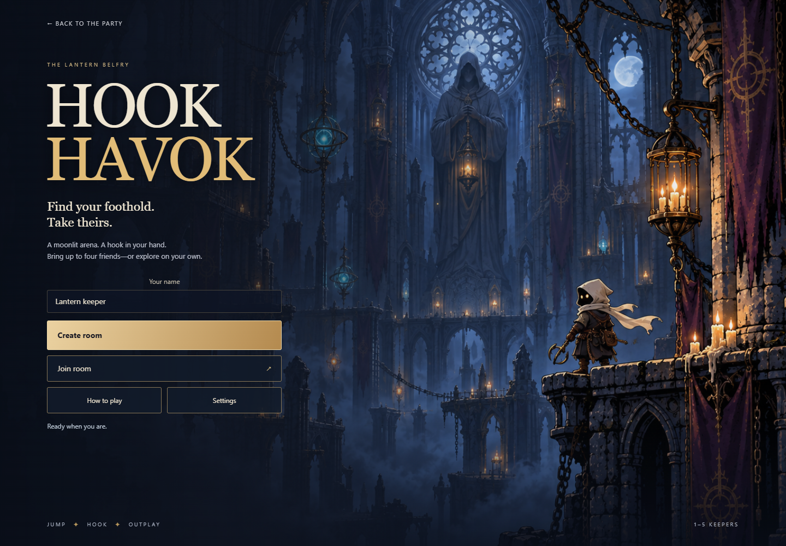
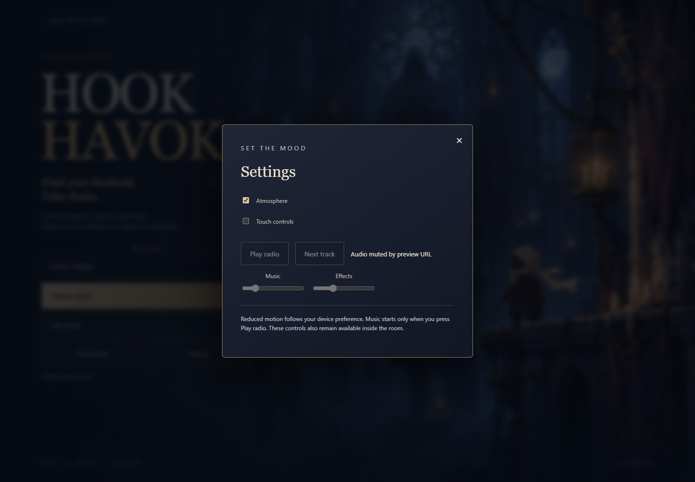
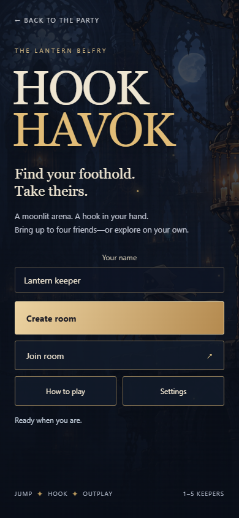
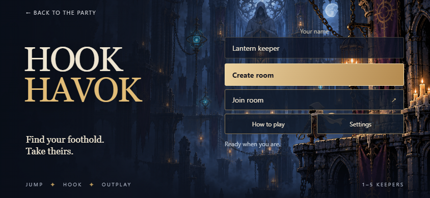
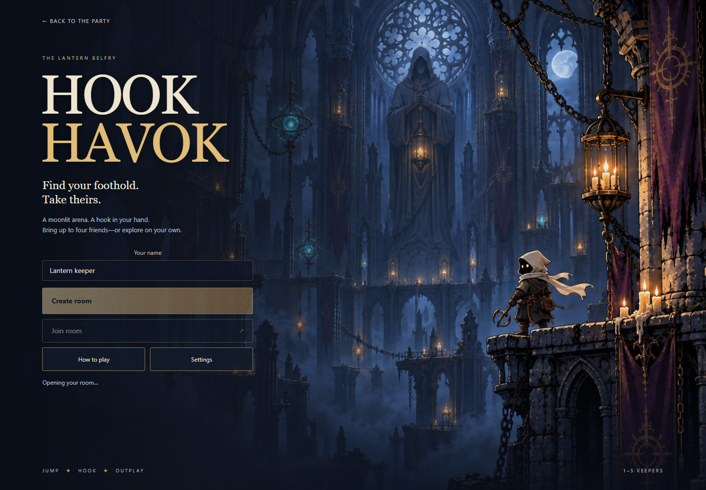
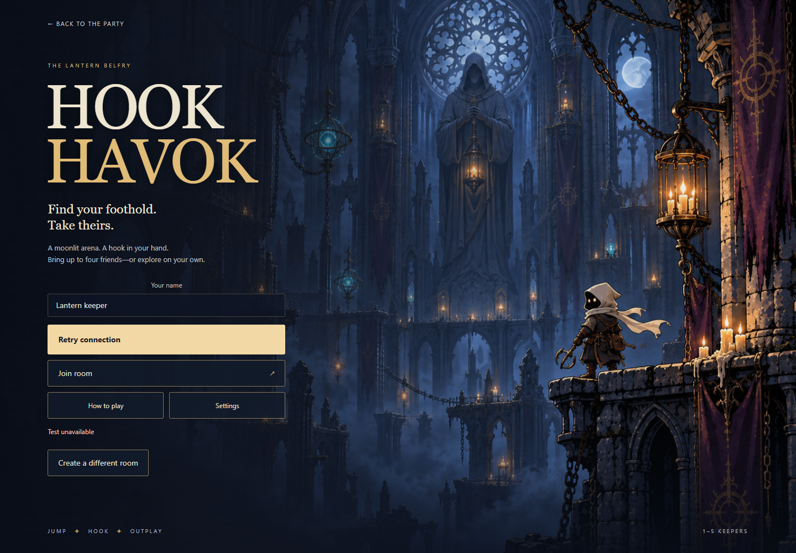

# Phase 8A — The entrance to the belfry

A fresh visit now opens the Hook Havok splash and main menu. An original painted cathedral, keeper and lanterns frame a live ivory/gold title and large Create room, Join room, How to play and Settings controls. Five small CSS embers drift over the painting; reduced motion or disabling Atmosphere stops them. The painting itself is static.

Create room uses the existing online room architecture, including solo exploration. Join room accepts a friend's code. Valid invite, refresh and shared-display links still connect directly. Leaving removes room/display parameters and returns to the menu. Invalid room parameters fall back to normal creation rather than creating a seatless display room. The existing workshop, Focus arena, roster and controls remain after entry; their redesign belongs to 8B.

## State and accessibility

The menu temporarily moves the existing name, join, start, status, graphics retry, audio, atmosphere and touch controls into slots, restoring them at their original DOM positions on entry. Their IDs, handlers and current settings stay intact. The covered arena is inert and hidden from accessibility APIs. Its layout is preserved for Phaser initialization; it becomes visible and resizes when a running room arrives. Native modal dialogs provide focus containment, Escape dismissal and focus restoration. The help describes current keyboard/mouse/touch controls and experimental balls honestly.

Room attempts are serialized before the asynchronous create request. Loading disables entry actions; failure exposes Retry connection and Create a different room. Graphics failure prevents room entry. A failed decorative painting has a separate retry and does not block play. Failed application-module loading has a reload retry; initial showcase markup stays invisible while the application loads. No retry runs automatically in a loop.

Settings reuse the existing opt-in radio, music/effects volume, Atmosphere and Touch controls. `?mute` remains authoritative, audio unlock stays gesture-driven, and music starts only on Play radio. Graphics retry preserves the Atmosphere setting. Device reduced-motion preferences apply live. Settings are page-local; this phase adds no persistent preferences.

## Source and art limits

- [Original painting](../art-source/backgrounds/entrance-source.png): 1672 × 941, 2,129,126 bytes, copied unchanged from built-in ImageGen.
- [Exact prompt and reference](../art-source/backgrounds/entrance-prompt.md). It uses our Crossroads cathedral painting as its source reference.
- Title, text and controls are live HTML/CSS. No lettering or buttons are baked into the painting.
- Portrait crops the illustration to preserve the right-hand scene behind the readable menu. Short landscape uses two columns to keep entry actions visible.

## Verification

Typecheck/build, changed-source ESLint, formatting and diff checks pass. The full repository suite is **1671/1679**, including **65/65 Hook Havok tests**; the same eight Windows backend-paths, CI-manifest and new-game baseline failures remain as recorded in [7B](art-production.md#verification-record). Gameplay and rules remain `hook-havok-7`.

The new real Chrome smoke starts from the party landing link and covers menu/help/settings, keyboard dismissal/focus, invalid-code feedback, blocked create/loading state and retry, ordinary Create/Join, invite auto-entry, refresh, shared display, leave-to-menu, independent illustration/graphics failures and retries, application-chunk failure/reload, mute behavior, reduced motion, native touch input in portrait/landscape emulation, and malformed invite fallback. The existing five-player arena smoke also passes: map switching, manager controls, held-input cancellation, jump/drop, phone layouts, refresh and round restart. Screenshots are actual browser flows, not staged fixtures. Chrome emulation is not physical-phone qualification.

```sh
pnpm build
node games/hook-havok/preview/entrance-check.mjs http://localhost:PORT/
node games/hook-havok/preview/arena-check.mjs http://localhost:PORT/ artifacts/entrance-arena
```

Independent source/test review found no actionable issues, including a follow-up check of bootstrap failure and invalid-invite handling. Review used the available inherited model because Sonnet is unavailable. The reviewer did not independently rerun the browser harness. User assessment of appearance and feel, physical phones, merging and deployment remain outside this phase.

The authored showcase smoke also passes navigation, stable idle, reduced motion, timeline/replay/pause, resize, asset retry and context-loss retry. Its navigation now creates a room before clicking the workshop's Art showcase link, matching the intentional new entry flow; no assertion was removed.







