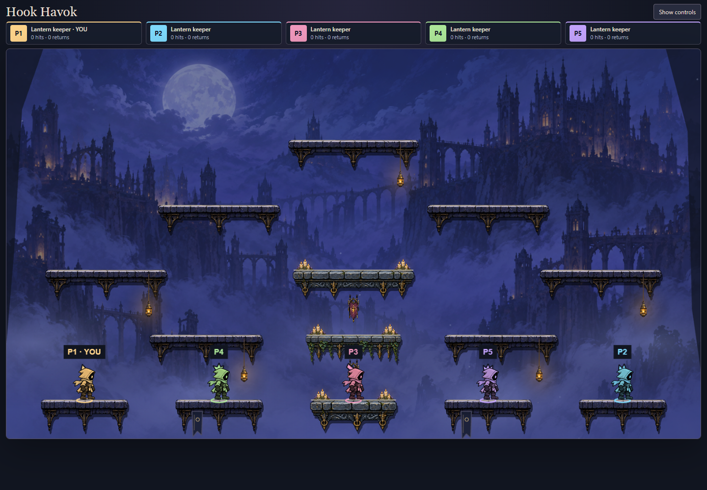
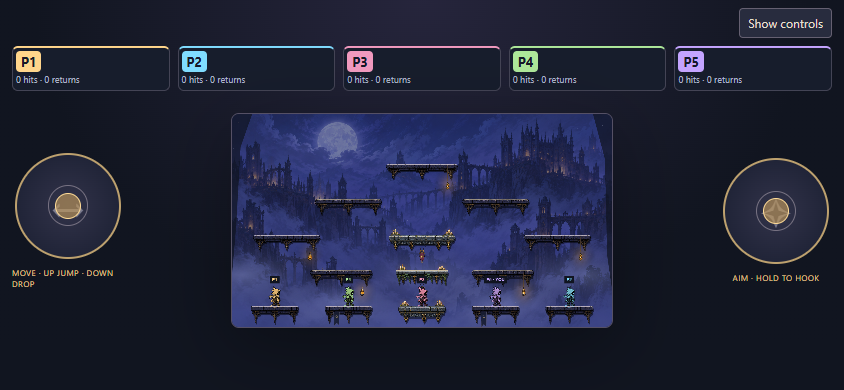
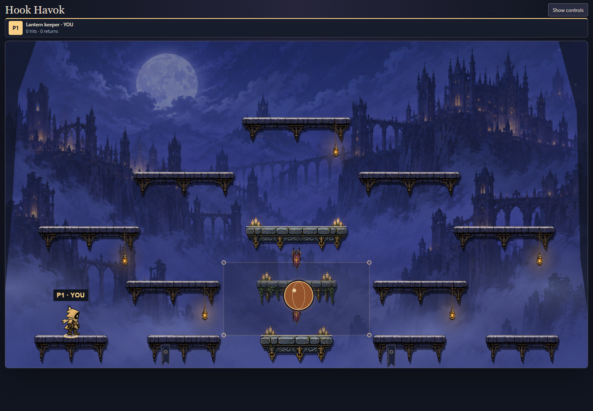

# Phase 7D — lantern shrine art section

## Intent and visual direction

Build one finished section of Crossroads before extending the treatment across the arena. The user's first reference supplies the hierarchy: cool architectural shadows, richly worked stone and iron, warm practical lights, muted cloth, and brilliant readable action. The references' text, characters and power-up mechanics are not requirements. Hook Havok retains its original lantern keepers and identity.

The trial occupies the central three ledges at heights 510, 660 and 810. The remaining ledges retain the earlier art for comparison. Belfry, map geometry, rules and player identity remain unchanged. Stone is blue slate with light top edges; metal is aged brass and near-black iron; cloth is dusty plum; small organic accents are violet and moss green. Warm light concentrates around candles and lanterns. Decoration stays below actors and behind their effects.

## Asset and rendering contract

Generate an original transparent four-cell source atlas: two distinct flat-topped stone ledges, a hanging shrine banner, and candles/mushrooms. Preserve the source and exact generation prompt. Inspect real alpha and cell bounds. Use runtime texture frames rather than editing source pixels. Platform end caps retain their scale; a cropped middle fills the width. This establishes a reusable modular rendering path without stretching complete paintings to unrelated proportions.

Keep the continuous bright platform top aligned with engine geometry. Hanging ornaments and supports are visibly decorative, not grapple targets. Limit their depth to keep the route below legible. Existing actors, ball exercise and their animation demonstrate the section in motion. This phase does not expand ball physics or replace character animation.

All objects belong to the existing terrain container and are released when maps switch. Phaser's existing presentation loop owns any lighting variation. No new simulation, timers or persisted setting is introduced. Actual browser evidence, including phone scale and loading/retry, is required; a generated asset sheet is not gameplay evidence.

## Source and current result

The built-in ImageGen source is [lantern-shrine-source.png](../art-source/platforms/lantern-shrine-source.png), **1254 × 1254**, **1,146,268 bytes**. Browser decoding verifies **71.8% fully transparent pixels** and **23.9% opaque pixels**. [Exact generation and correction prompts](../art-source/platforms/lantern-shrine-prompts.md) retain the production record. The initial sheet's painted backdrop was rejected. The corrected sheet has actual alpha but unequal packing, so the loader uses observed fractional divisions (x 0/0.484375/1, y 0/0.35/1) and validates that painted bounds do not touch cell edges. Source pixels are preserved unchanged.

Three central ledges use the new stone kit; six small candle clusters and two hanging banners supply the finished section's dressing. The 65-unit hanging decorations leave space above the next platform. Original gameplay, background and character animation remain visible, so this establishes an asset-quality direction rather than completing the reference image's architectural density or movement polish. At portrait phone scale the silhouette and warm accents matter more than tiny carved details. Source loading adds about 1.15 MB of PNG data before transfer encoding; no performance improvement is claimed.

## Playtest and evidence

Open `/hook-havok/?mute`, enter a room, select **Arena → Crossroads**, then **Focus arena**. The central three ledges carry the new art. Compare them with the surrounding platforms; select **Splitting ball** before focusing to inspect action against the section. Ordinary jumping, dropping and grappling still use the original map geometry. Belfry remains available for comparison.





```sh
pnpm build
node --import tsx --test games/hook-havok/tests/*.test.ts
node games/hook-havok/preview/shrine-check.mjs http://localhost:PORT/
node games/hook-havok/preview/arena-check.mjs http://localhost:PORT/ games/hook-havok/docs/evidence/shrine
```

The shrine smoke verifies alpha, repeated map cleanup, the ball exercise, reduced-motion refresh and new-source failure/retry. The arena smoke covers five actual members plus shared display, manager selection, matching terrain, ordinary jump/drop, held-input cancellation, refresh, competitive restart and desktop/phone layouts. Evidence comes from Windows Chrome with emulated phones, not physical-phone qualification. No gameplay state is injected for screenshots.

Final local checks: **55/55 Hook Havok tests**, typecheck/build, changed-source ESLint and both browser checks pass. The full repository suite is **1661/1669**, with the same eight Windows backend-paths, CI-manifest and new-game baseline failures previously reproduced on clean main (see [7B verification](art-production.md#verification-record)). No tests were removed or weakened. Independent review found a missing correction prompt in the generation record; it was restored before delivery. Rendering, cleanup and collision alignment had no actionable review findings. Review used the available inherited model because the repository's requested Sonnet model is unavailable in this session. No merge or deployment is included.

## Following increments

- **7E:** extend the approved treatment, depth layers and restrained ambient animation across the arena.
- **7F:** improve registered movement/action animation and combat feedback.
- **7G:** compare arena-wide ball motion, bounce rules, luminous colour/effects and bounded splitting; validate shared deterministic results.
- **8A:** illustrated splash screen and Create room, Join room, How to play and Settings flow.
- **8B:** cohesive lobby, match HUD, results and device-specific layouts.
- **8C:** combined visual/audio polish, loading and measured performance checks, including physical phones.

Each remains a separate playtestable increment; only 7D is authorized in this change.
