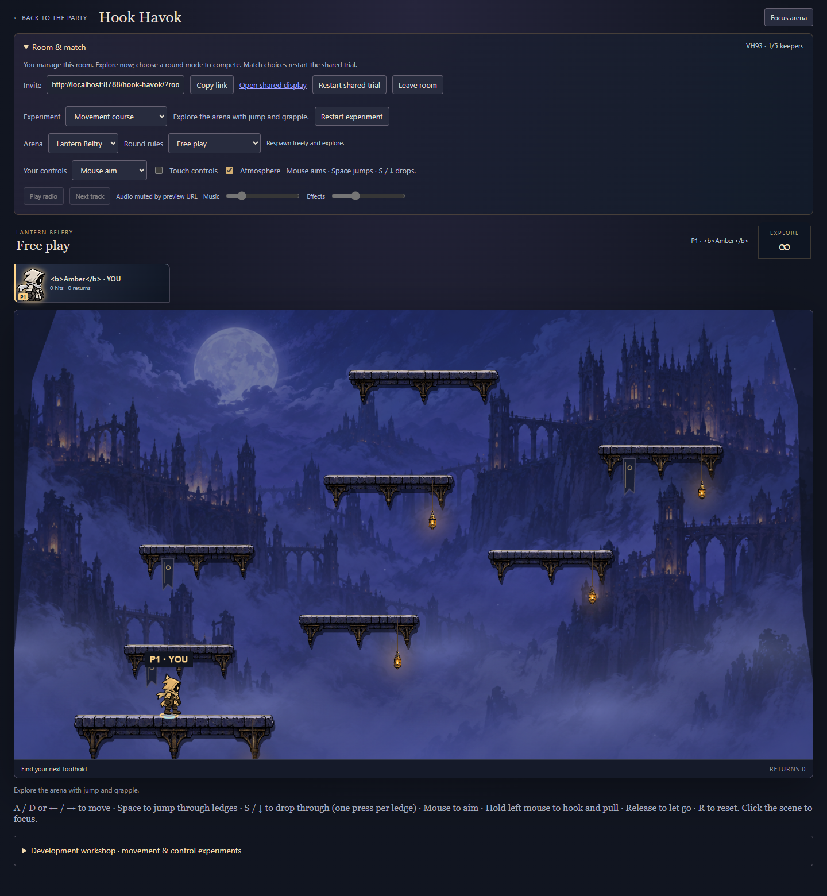
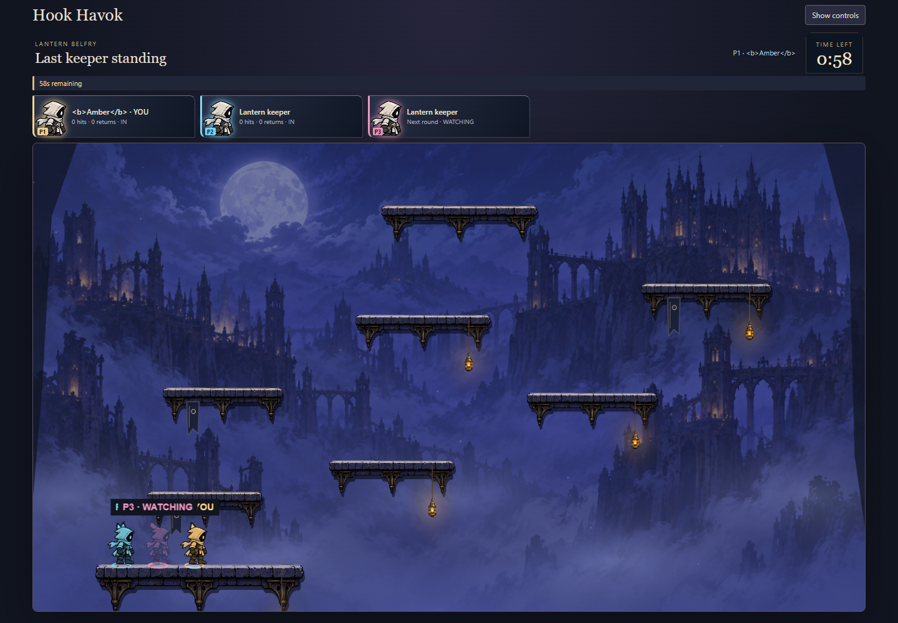
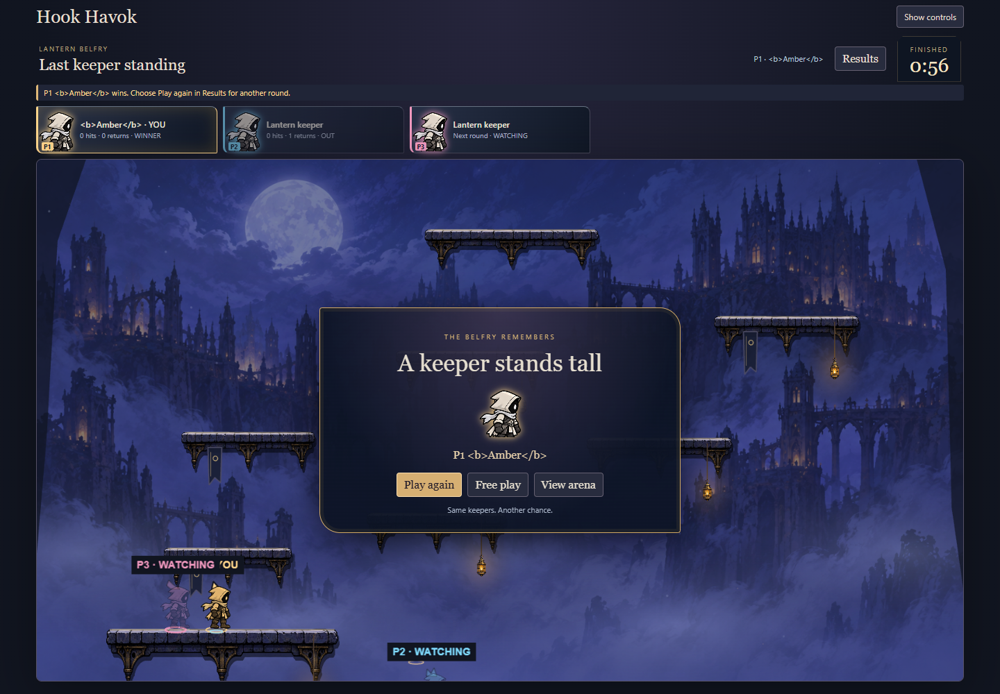
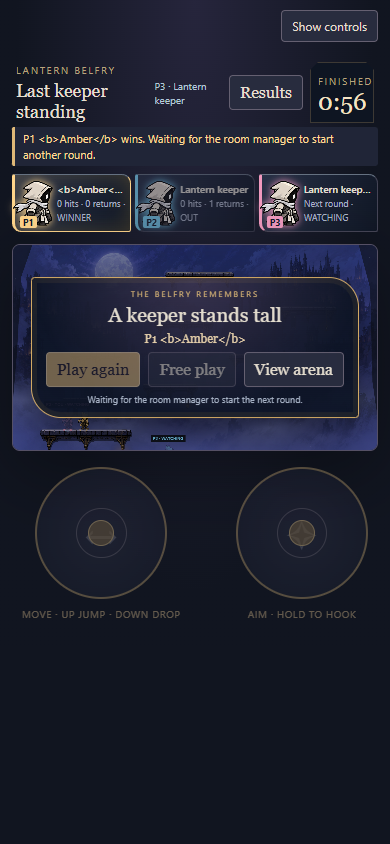

# Phase 8B: room lounge, HUD and results

The game now has a room lounge above the arena, illustrated keeper cards, a compact mode/map/timer header, an in-arena countdown and a winner panel. The slate, ivory and lantern-gold treatment reuses the existing keeper atlas; no additional raster asset is generated.

## Room flow

The room continues to open directly into free play. **Room & match** contains invitations, Copy link, shared display, leave/restart, arena and round choices, experiment selection, personal controls and audio. Its summary carries the room code and connected keeper count. Manager status explains who can change the shared trial. Choosing a competitive rule starts the existing wait-for-two/countdown flow; this phase does not introduce ready votes or a separate authoritative lobby stage.

Choose your keeper name before entering from the splash. The assigned P1–P5 seat/color stays consistent in the cards and arena; there is no cosmetic character or color picker. Changing identity/protocol is outside this presentation phase. The existing name/new-room controls remain available in the workshop for the next room.

**Development workshop** is collapsed by default. It contains numeric tuning, double-jump/spiked-wire experiments, collision debug and the art showcase. Normal experiment reset remains beside experiment selection in the lounge. Control IDs, handlers and form ownership remain intact. Splash Settings temporarily moves the same personal controls and restores them to the lounge on entry.

**Focus arena** hides the lounge and workshop while keeping cards, round status and the timer visible. Phone layouts retain the touch pads. Shared display shows the scoreboard and result but no manager actions. Connection loading/error/retry remains in the established splash flow.

## Match presentation

Cards show the keeper illustration, P number, name, score or hits/returns, and OUT/AWAY/WATCHING/WINNER status. A late joiner's status explicitly says they return next round. Free play shows an infinity clock; competitive rounds use replicated whole seconds, including the frozen remaining time when a round finishes. The presentation does not create a new timer or simulation loop.

Countdown and result panels read the existing contest state. The result supports one winner, shared winners and a draw, reuses winner portraits, and offers **Play again**, **Free play**, and **View arena**. Results can be reopened from the HUD. Manager-only actions reuse the existing commands. Rematch returns keyboard focus to the scene so movement works immediately after countdown. The winner message is a live status; names are always text, never interpreted as HTML. Reduced motion disables the short result entrance animation.

The shell only updates when displayed facts change. Countdown seconds, scores, keeper names/status and authority can update it; simulation elapsed ticks alone cannot. Engine rules remain `hook-havok-8` and this phase changes no simulation geometry, timing or protocol.

## Verification

Typecheck, build, changed-source ESLint, formatting and diff checks pass. **73/73 Hook Havok tests pass.** Full repository result: **1679/1687**, with the same eight Windows baseline failures in backend-paths, CI-manifest and new-game documented in [phase 7B](art-production.md#verification-record). No assertions were removed or weakened.

The new real Chrome smoke creates an isolated room and covers name escaping, manager status, collapsed/reachable workshop, shared experiments, visible rule explanations, waiting/countdown, late watchers, illustrated cards, spectator display, winner reveal, result dismissal/reopening, rematch, keyboard movement immediately after rematch, return to free play and peer refresh. It also checks phone-width overflow and landscape touch-pad fit. The existing five-player presentation smoke and full entrance smoke pass, including native touch emulation, failure/retry, reduced motion and shared displays. Physical phones remain unqualified.

The existing rules smoke also passes the complete 60-second scoring round, including agreement between peers, elimination, rematch and return to free play.

Independent review found two issues: rematch did not restore scene focus, and compact layout hid scoring rules. Both were fixed. The browser smoke now checks the visible rule summary and movement after rematch without a test-side scene focus. Review used the available inherited model because Sonnet is unavailable.

```sh
pnpm build
node games/hook-havok/preview/match-shell-check.mjs http://localhost:PORT/
node games/hook-havok/preview/presentation-check.mjs http://localhost:PORT/
node games/hook-havok/preview/entrance-check.mjs http://localhost:PORT/
node games/hook-havok/preview/rules-check.mjs http://localhost:PORT/
```

Screenshots below are actual gameplay, without injected world state. The test name `<b>Amber</b>` intentionally verifies literal text display. Earlier phase evidence remains unchanged.






User assessment is still needed for visual density, legibility and feel. No merge or deployment is included. The next planned phase is 8C: cohesion, busy-scene checks and performance qualification.
