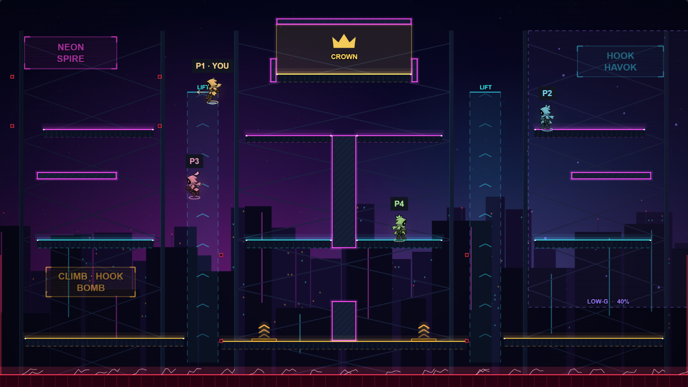
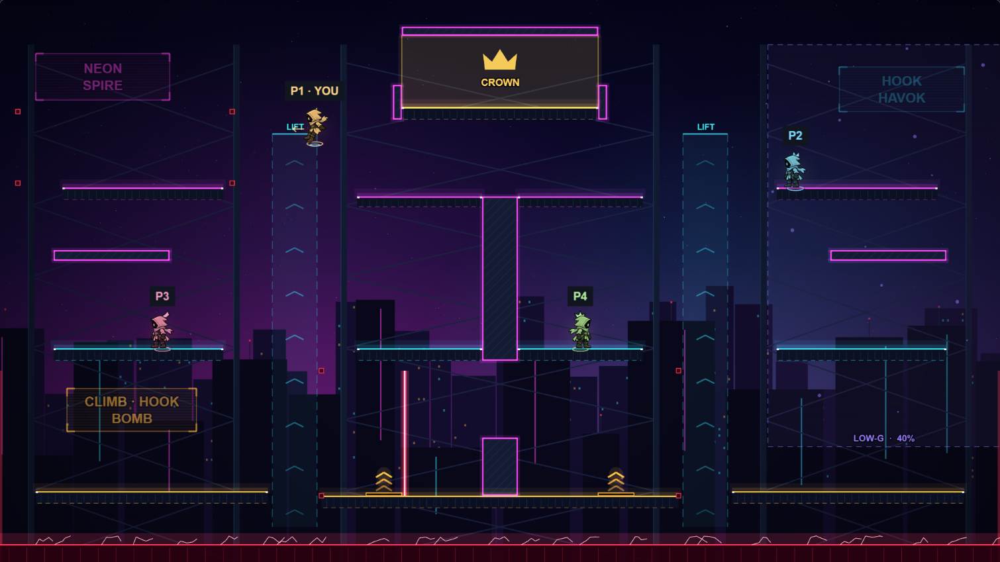
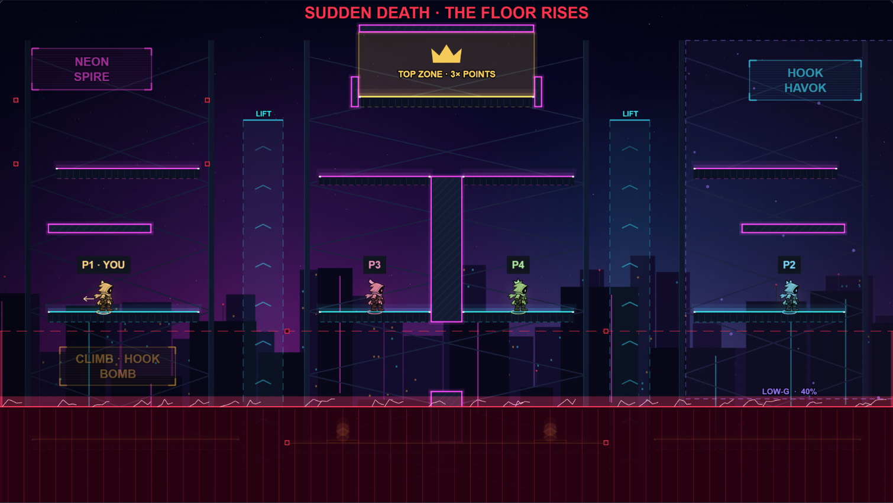
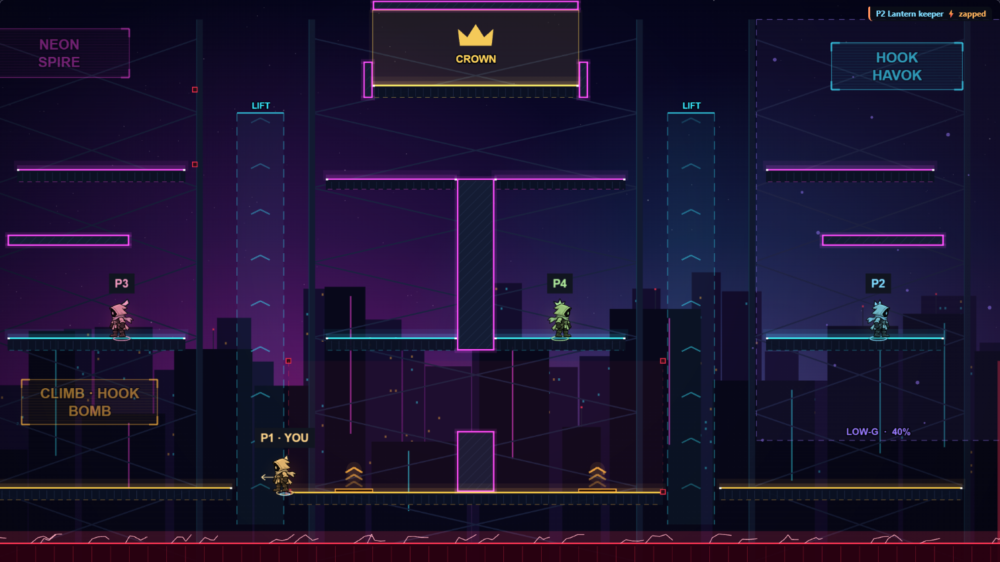
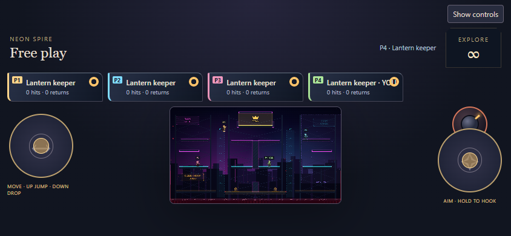
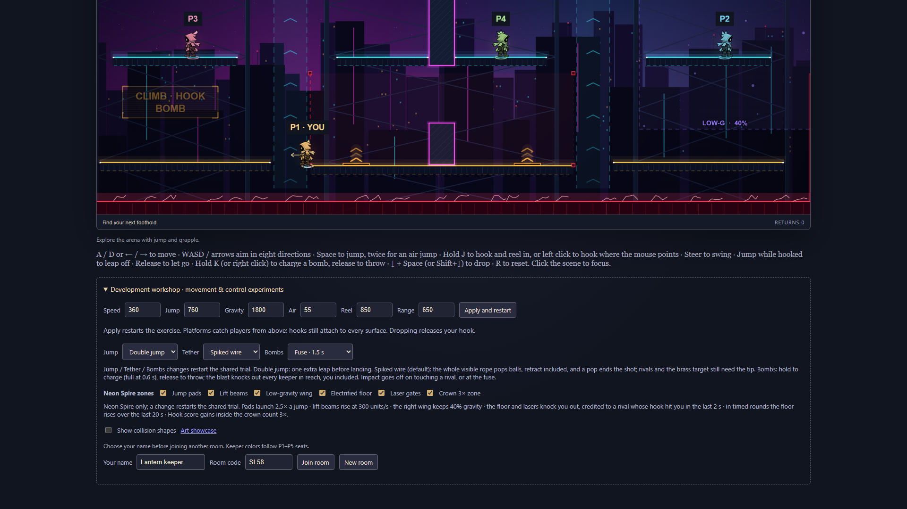

# Neon Spire: arena foundation, zones and hazards (12A–12B)

Rules are now **`hook-havok-15`** (11B was `hook-havok-12`; 11C bots claim 13 and 11D power-ups 14, and whichever of the three merges later takes the next free number). Refresh every client and create a fresh room: older clients cannot read the new settings or checkpoints.

**Playtest:** refresh, create a fresh room, then **Room & match → Arena → Neon Spire**. The zone switches are in **Development workshop → Neon Spire zones**; **Follow keepers** is with your own controls under Room & match. Lantern Belfry and Crossroads play exactly as before.

## 12A. Foundation

### Per-map world size

Every map now carries its `width` and `height` ([engine/maps.ts](../src/engine/maps.ts)). The side walls, the out-of-bounds line (feet 52 units below the bottom), the arena ricochet field (`height − 30`), bomb bounds (walls, and the fizzle line 40 below the bottom), the knockout body's parking spot, touch and mouse aim clamps, the camera, and every checkpoint bound (keeper, hook, target, orb, bomb, hit and knockout positions) read the selected map's size. Lantern Belfry and Crossroads are 1600 × 900 with the same numbers as before; `WIDTH` and `HEIGHT` in `engine/world.ts` remain as the belfry's size for old fixtures.

### Solid platforms

A map lists its surfaces in one stable order (the checkpoint's `hook.platform` indexes it) and names the solid ones in `solid`. Solid blocks (walls, pillars, ceilings) stop keepers on every face; the rest stay one-way ledges that only catch a keeper falling onto their top. `movePlayer` in [engine/collision.ts](../src/engine/collision.ts) is one swept solver for both: up to four contacts per tick, earliest first, a block winning a tie with a ledge, and each contact leaving the body one subunit clear, so no speed tunnels through a block (a 20-unit pylon stops a body moving 400 units per tick) and a corner resolves to its top or bottom face. With no blocks it is exactly the 10A ledge solver, which a test compares directly. A block never drops a keeper (Down + Space on a block does nothing). Hooks, orbs and bombs already treated every surface as solid, so they attach to and bounce off walls and ceilings. A checkpoint with a keeper in play inside a block is rejected.

### The map

Neon Spire is **2240 × 1260** (1.4×, still 16:9) and is shown whole on a TV. Three tiers of catwalks around a split tower:

| Part        | Surfaces (x, top y, width, height)                                                                                                                                                                        |
| ----------- | --------------------------------------------------------------------------------------------------------------------------------------------------------------------------------------------------------- |
| Bottom tier | decks at 80–600 (y 1100), 720–1520 (y 1110), 1640–2160 (y 1100)                                                                                                                                           |
| Middle tier | 120–500 and 1740–2120 (y 780); catwalks 800–1080 and 1160–1440 (y 780)                                                                                                                                    |
| Top tier    | 140–500 and 1740–2100 (y 420); bridges 800–1080 and 1160–1440 (y 440)                                                                                                                                     |
| Crown deck  | 900–1340 (y 240)                                                                                                                                                                                          |
| Solid       | the core pillar [1080, 440, 80, 368] that splits the tower, a hurdle [1080, 980, 80, 130], two overhangs [120 / 1860, 560, 260, 24], crown pylons [880 / 1340, 190, 20, 78] and a roof [900, 60, 440, 20] |

The core's top is flush with the top bridges, so the top tier connects across while the middle tier is split. Five spawns sit on the middle tier (x 260, 1980, 940, 1300, 440): supported, clear of every block, lift, pad, laser band and the crown, and above the floor's sudden-death cap. Power-up pads (the existing format until 11D replaces it) are Lift on the right top tier and Ward on the left bottom deck. `target`, `ballField`, `ballSpawn` and the ricochet orb's start (`arenaBall`) are map data as before. The arena is selectable in the picker and is not the default.

### Grey-box render and camera

[render/neon.ts](../src/render/neon.ts) draws the art direction procedurally, no bitmaps: a night-city gradient with stars, magenta and cyan haze, two layers of procedural skyline with lit windows, neon strips and antenna lights, and the tower's dark steel scaffold, painted once into a canvas; dark steel panels whose top edge glows by tier (amber bottom, cyan middle, magenta top, gold crown) with a dashed underside for "passable from below", while solid blocks are hatched and boxed in magenta on every side; and three holographic billboards that flicker. The backdrop, panels and billboards are built once per map; beams, the wing, the crown and pad plates once per zone setting; animated parts (rising lift chevrons, wing motes, pad pulses, floor arcs, billboard flicker, crown glow) redraw at about 30 fps only while Atmosphere is on and reduced motion is off. Otherwise they freeze and only redraw when what they show changes (the floor's height, a laser's phase and sweep). The belfry's painting, fog, light shafts, grain and inked frame are hidden on the spire; the keepers' halos stay.

The camera ([render/camera.ts](../src/render/camera.ts)) fits the whole arena by default (zoom 1600 / 2240 ≈ 0.714 of the old scale). **Follow keepers** is a local display option: it frames the living keepers with a margin, zoomed between the whole arena and 1.0 (1600 × 900 units), eased with a quarter-second time constant, kept inside the arena. It never reaches the simulation; mouse aim maps through the current camera, and keeper and power-up labels keep their screen size when the arena is fitted. On the 1600 × 900 maps both modes are the old fixed view.

## 12B. Zones and hazards

Zones are map data (`zones` in [engine/maps.ts](../src/engine/maps.ts)); the rules and numbers are in [engine/zones.ts](../src/engine/zones.ts), [engine/zone-rules.ts](../src/engine/zone-rules.ts) and [engine/hazards.ts](../src/engine/hazards.ts). Each is a validated shared setting (`jumpPads`, `lifts`, `lowGravity`, `electricFloor`, `lasers`, `bonusZone`: `"on"` or `"off"`, all on by default, ignored on maps without the zone). A change restarts the shared trial like any other setting. None of them keeps state of its own: each is a function of positions, the settings and the arena tick or the contest clock, so every peer agrees from the log.

| Zone              | Where                                                                                                                                                         | Rule                                                                                                                                                                                                                                                                                                                                                                                 |
| ----------------- | ------------------------------------------------------------------------------------------------------------------------------------------------------------- | ------------------------------------------------------------------------------------------------------------------------------------------------------------------------------------------------------------------------------------------------------------------------------------------------------------------------------------------------------------------------------------ |
| Jump pads         | 820–900 and 1340–1420 on the centre deck (y 1110)                                                                                                             | Touching a pad's top launches at 1240 units/s, **416 units against a normal jump's 167 (2.5×)**, and refills the air jump; an attached hook lets go. The launch is the one speed past the 1000 units/s cap: the cap follows it down under gravity, and a checkpoint allows it only where pads are on. From the pads you land on the catwalks above.                                  |
| Lift beams        | x 610–710 and 1530–1630, y 300–1180 (the two shafts)                                                                                                          | Where a body's centre is inside, gravity is replaced by 3000 units/s² towards a **300 units/s rise**; a faster rise eases down to it. Steering works as in the air. Bombs and orbs rise too (an orb keeps its speed across). A keeper who falls into a shaft is caught and carried to the top tier.                                                                                  |
| Low-gravity wing  | x 1720–2240, y 100–1000 (the right wing)                                                                                                                      | **40% gravity** for keepers, bombs and orbs: a jump rises about 2.4× (407 against 167 units).                                                                                                                                                                                                                                                                                        |
| Electrified floor | a strip from y 1220 to the bottom                                                                                                                             | A keeper whose feet pass its top is knocked out (cause "hazard"). In timed rules (Last keeper standing and Hook score) it rises linearly over the round's **last 20 s to y 830**, just below the middle tier: sudden death. It is warned 3 s ahead ("SUDDEN DEATH IN 3"), the cap is a dashed red line during the rise, and red gauges on both walls mark it. Free play never rises. |
| Laser gates       | A: a horizontal beam over x 40–520 sweeping y 250→410 (the left top tier); B: a vertical beam over y 830–1110 sweeping x 720→1520 (under the centre catwalks) | Every **8 s** (480 ticks) each gate shows a **1 s** telegraph (a thin dashed line where the beam starts, and its sweep area), then a **0.5 s** live beam sweeping its section. B runs 4 s after A. Contact is tested against the whole band a beam swept that tick, so a fast sweep cannot pass over a body. Contact knocks out (cause "hazard").                                    |
| Crown zone        | x 900–1340, y 80–240 (the chamber on the crown deck)                                                                                                          | In Hook score, gains by a keeper whose body centre is inside count **3×**: hook hits, bomb knockouts and hazard credits. Penalties are unchanged. A crown and glow mark it, labelled "TOP ZONE · 3× POINTS" in Hook score and "CROWN" otherwise.                                                                                                                                     |

### Hazard knockouts and attribution

Hazards use the bomb knockout path ([engine/knockout.ts](../src/engine/knockout.ts)): the knockout event (now with a `cause`, "bomb" or "hazard"), the body leaving below the arena, a 1 s return with 1 s of spawn protection, tallies (a new `zapped` count and fate "hazard"), the feed and the score (the victim's usual −2, elimination puts them out). Spawn protection applies, as for bombs; Ward does not protect. Hazards are checked after keepers move, hooks hit and bombs blast, in slot order, and a keeper already down that tick is skipped.

A hazard gives no thrower credit. **If a rival's hook tip hit the victim within the last 2 s (120 ticks), that rival is credited: "pushed into the lasers".** Each keeper carries `pushedBy` and `pushed` (ticks left); a hook hit that lands sets them, they count down every tick, and any death or knockout clears them. The credited rival gets +1 (3 from the crown) and a knockout in their tally; the feed shows "P1 Amber ⚡ P2 Blue", an uncredited one "P2 Blue ⚡ zapped", and the results "pushed into a hazard by …" or "zapped". Falling out of the bottom with the floor off stays an ordinary fall with no credit.

### Checkpoints

Settings gain six exact keys; knockout events a seventh field, `cause`; each keeper `pushedBy` and `pushed`; the kit `zapped`. Decoding rejects: an unknown or missing zone switch; a position outside the selected map (x beyond its walls, feet more than 100 below its bottom); a keeper in play inside a solid block; a rise faster than a pad launch, or any launch speed where pads are off; a push without a pusher, a pusher without a push, a push longer than 2 s, a push by oneself or while returning; hazard fates, tallies or events where no hazard is on; hazard, bomb and self knockouts together exceeding the deaths; a bomb event naming nobody; and an event with an unknown cause. With the crown on in Hook score a score may reach three points per active tick. A rejected checkpoint leaves the healthy room untouched and it plays on identically to an untouched twin.

## Verification

- `tests/spire.test.ts` (20 tests): map sizes with the old maps unchanged (fields, orb start, no blocks or zones); walls, the fall line and checkpoint bounds per map; solid blocks from all four faces, standing on a block and not dropping through it, a ceiling bump; a corner, a 400-units-per-tick body against a 20-unit pylon and the roof, and a 2,800-sample fuzz that never ends inside a block; one-way ledges beside blocks and the ledge-only solver compared with the old one; hooks on a wall and a ceiling through checkpoints; bombs off a wall and a ceiling, an orb off the core; the pad launch (2.5×, air jump, off, codec); the lift cap and steering for keepers, bombs and orbs; low gravity for all three; the floor knockout, spawn protection and return, the off setting; the rising schedule (rest, 50 s halfway, cap, over, countdown, free play, warning) and a live catch on the bottom deck at the predicted tick; laser telegraph versus live timing, a live knockout, beside the band and off, and contiguous bands; the crown's 3× in and out and off; push credit within 2 s and none after; strict zone settings; safe spawns and a 20 s idle with five keepers; a full five-keeper Hook score round (countdown, 60 s with the rising floor, bombs, hooks, orbs) replayed deterministically with a checkpoint round trip every tick and a restore every 17, asserting lift, low-gravity, launch and hazard ticks were all covered; and 20 corrupt or out-of-bounds cases on a live room (plus four valid controls) with the healthy hash unchanged and the room continuing identically to its twin.
- `tests/camera.test.ts` (3 tests): the whole-arena fit, the old maps' fixed view, Follow keepers' clamps (never past 1, never out past the whole arena, inside the arena) and canvas-to-world mapping.
- All earlier Hook Havok tests pass unchanged apart from the tally's new field in a feedback fixture.
- `preview/spire-check.mjs` plays real rooms in headless Chrome with ordinary keys, no injected state: a host at 1920 × 1080 picks Neon Spire (19 surfaces, the whole arena fitted at zoom 0.714); Follow keepers zooms to 1.0 alone; three guests join, one a phone in landscape; slot 0 walks into the left lift and rides it to its top (feet 300), slot 1 jumps 407 units in the low-gravity wing, slot 2 drops to the bottom deck and a pad launches it to feet 666, a laser sweeps on screen, slot 1 drops through two tiers into the floor and the feed shows "⚡ zapped"; Follow keepers frames everyone on the host while a guest keeps the fit; a zone switch reaches the guests, where it is disabled; with `sudden`, a Hook score round warns and the floor rises. It found one bug, fixed here: the local view took zones from the keeper's own body view, so the rising floor never showed.
- `arena-check`, `bombs-check` and `effects-check` pass unchanged (the camera's zoom punch moved from the juice to the scene).
- Frame sanity (same run, host page alone, 3 s of rAF in headless Chrome on the development machine): Crossroads p50 / p95 / p99 7.0 / 7.1 / 7.1 ms, Neon Spire 7.0 / 7.0 / 7.1 ms. rAF cadence is not GPU or paint time and this is not the 8C five-client workload.

## Limits and what comes next

- Feel and balance (pad height, lift speed, the wing's 40%, laser cadence, the floor's cap and rise, the crown's 3×, spawn fairness) need playtesting; bots from 11C will help fill a five-keeper test. The layout is a first grey box.
- A pad launch past the speed cap is clipped back to the cap by a rival's hook knockback, like any other impulse.
- On a phone in landscape the whole spire is small between the touch pads; Follow keepers helps there. It is off by default everywhere, as asked.
- Zones do not act on the brass target, and lasers do not pop orbs or detonate bombs.
- 11D replaces the power-up pads with a random pool; the spire's two pads are placeholders in the old format.
- The render is procedural vector neon. **12C** would add moving lifts carrying keepers, bombs and hook anchors, only if the grey box is fun. **12E** replaces the grey box with generated night-city art and a neon keeper rim once the geometry settles.
- Browser checks run in headless Chrome on Windows; this is not physical-phone or TV evidence.
