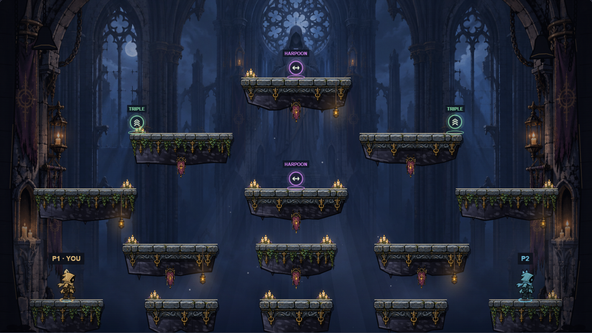
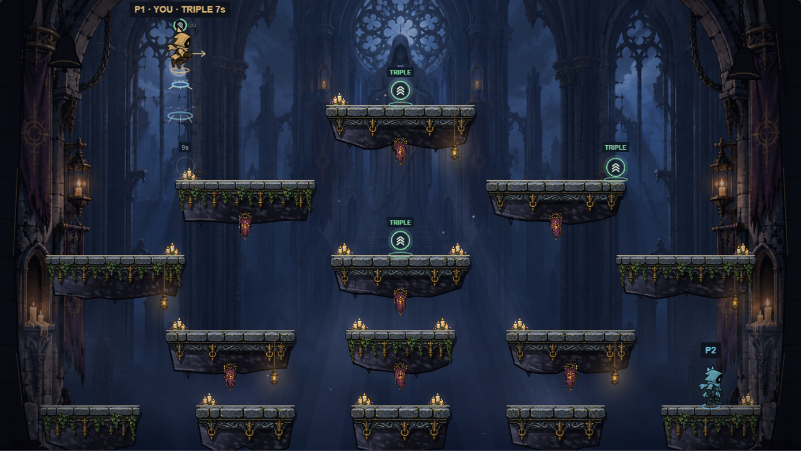
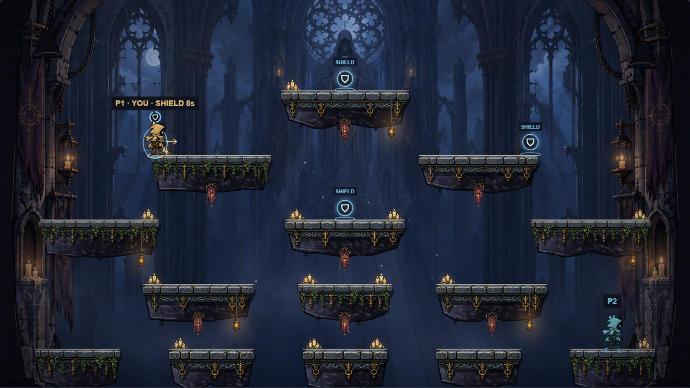
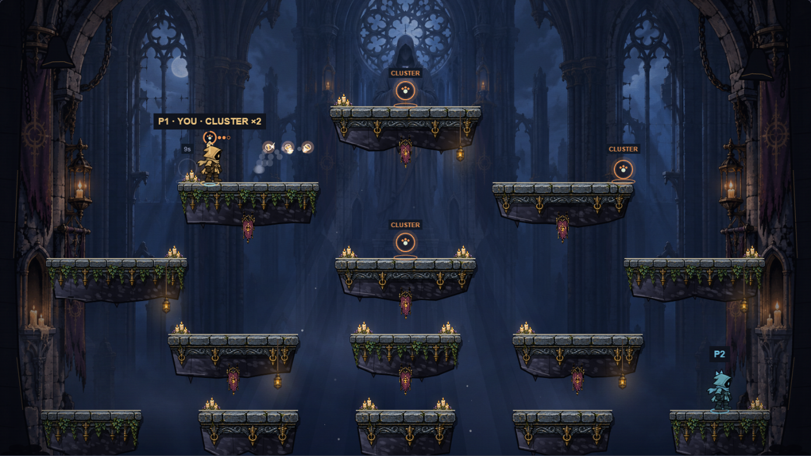
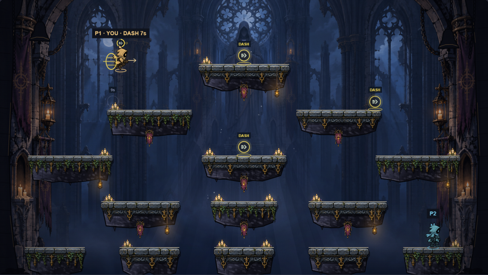
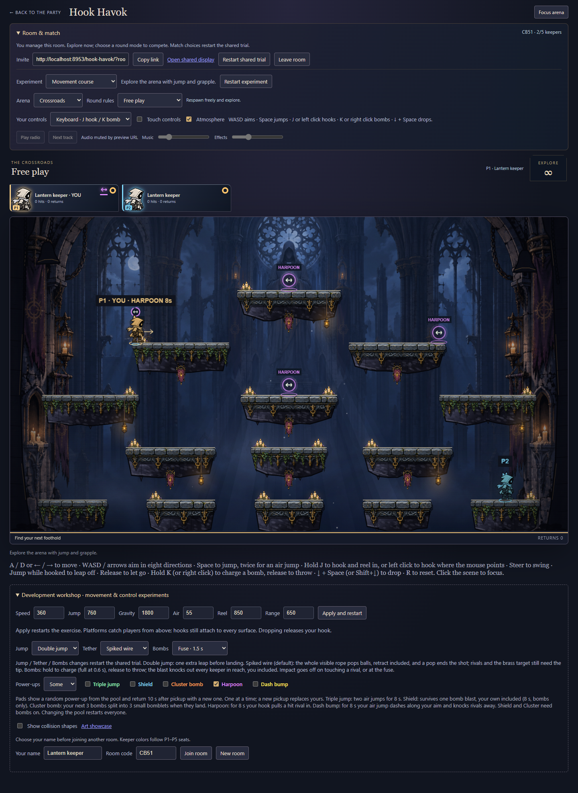
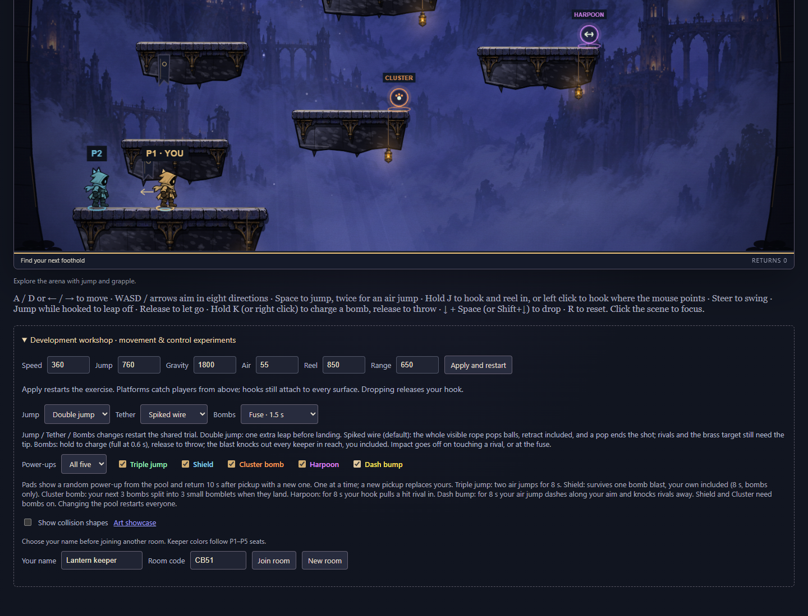
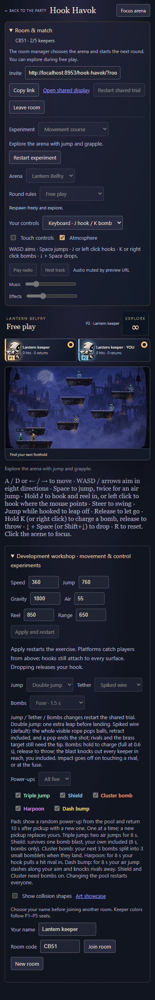

# Power-ups v2 (11D)

Rules are **`hook-havok-14`** (11B was `hook-havok-12`; 13 is left for the 11C bots, and whichever of the two merges second takes the next free number). Refresh every client and create a fresh room: older clients cannot read the new settings, keeper state or checkpoints.

Phase 9A's two fixed pads, Lift and Ward, are gone. Each map now has four pads at spots worth the risk, and each pad shows a random power-up from a pool the room manager picks. The first batch is five power-ups: Triple jump replaces Lift, Shield replaces Ward, and Cluster bomb, Harpoon and Dash bump are new.

## Setting

**Development workshop → Power-ups**: **All five** (the default for new rooms), **Off**, or any mix with the five boxes. The setting is one validated bit mask in the tuning (`powerUps`, 0–31: triple 1, shield 2, cluster 4, harpoon 8, dash 16). Changing it restarts the shared trial, like the other workshop settings. Shield and Cluster bomb only matter with bombs, so with **Bombs → Off** they leave the pool. An empty pool shows no pads.

## Rules

All of it is engine-owned (`engine/power-ups.ts`, numbers in `engine/power-rules.ts`) and runs inside the deterministic fold.

- **Pads.** Four per map, 28 units above a ledge: on Crossroads the summit (800, 182), the tips of the two upper side ledges (370, 332) and (1230, 332), and the centre ledge (800, 482); on the Belfry the lip of the middle ledge (790, 582), the right end of the right ledge (1180, 452), the far upper-right corner (1395, 242) and the summit (820, 92). `padList(arena)` is the one read of them (position, kind, ready) for bots and presentation.
- **The draw.** A ready pad shows the kind drawn by a stateless integer hash of the arena seed, the pad index and the pad's cycle count, over the room's pool. The seed is fixed when an arena is made (from the match id and tick), so every peer sees the same pads and each restart deals new ones. Collecting a pad increments its cycle; each round start increments every cycle and makes every pad ready.
- **Pickup.** As in 9A: body contact after everyone has moved, pads in index order, the first eligible keeper in slot order. Eliminated keepers, late watchers and returning, disconnected or respawning keepers cannot collect. A collected pad shows its next draw 10 s (600 ticks) of active play later; waiting, countdown and results freeze the timer.
- **One at a time.** A keeper holds one power-up; a new pickup replaces the old one. It works from the next tick. Every power-up ends on a fall or knockout, a personal reset, a disconnect or a new connection generation, at the end of a round, and when its time runs out. The count of pickups per round stays for the results.
- **Triple jump.** For 8 s (480 ticks) the keeper has two air jumps, in either jump mode, refilled on landing and by a rope jump like the ordinary air jump. Collected in the air it works at once. Pips over the keeper show the air jumps left.
- **Shield.** For up to 8 s a bubble survives one bomb blast, the keeper's own included, and pops with a burst (a `shieldPops` event). It shelters the keeper from the rest of that tick's blasts, so a cluster's bomblets going off together count as one blast; any later blast knocks them out. **It blocks bombs only.** Ward's immunity to rival hooks is gone: hooks and dashes still knock a shielded keeper around, and falls still count.
- **Cluster bomb.** The keeper's next three bombs (within 15 s, 900 ticks) are cluster bombs. On its first contact with stone a cluster bomb splits into three bomblets that leave the bounce 3 units/tick to either side and straight, popping up 5 units/tick. Bomblets have a 0.6 s (36 tick) fuse, a 48-unit blast (0.6× a bomb's 80) and a bomb's body; they knock out anyone in reach, the thrower included, pop orbs and chain other bombs like any bomb. A cluster bomb that meets a rival in impact mode, or whose fuse ends first, blasts as a normal bomb. **Cap:** live bombs are capped at 15 (five keepers, three bomblets each). A keeper's bomblets always burn out before their 2.5 s cooldown lets them throw again, so the rules never reach it; a split beyond it keeps only the bomblets that fit.
- **Harpoon.** For 8 s a hook-tip hit on a rival pulls them toward the hooking keeper at 13 units/tick (780 units/s) plus a 3-unit/tick lift off the ledge, instead of the usual push. Like any hit it adds to the rival's velocity within the 1000 units/s cap, scores in Hook score and gives the victim half a second of protection there. Spawn protection stops it; Shield does not.
- **Dash bump.** For 8 s an air jump becomes a dash: 0.2 s (12 ticks) at 900 units/s along the aim (eight-way keys, the mouse point or the aim pad), with no gravity or steering, then half that speed is kept. It uses the ordinary air jump, so it refills on landing or a rope jump; a single-jump room gets one dash per landing from the power. A rope that catches, landing, or the power ending stops the dash. A dash that touches rivals after everyone has moved knocks each one away from the dasher at 15 units/tick with a 5-unit/tick lift (a hook pushes at 9) and ends; it counts as a hit. Spawn protection stops it.

### Checkpoints

The arena gains `seed`, `pads` (cooldown and cycle per pad, replacing `powerCooldowns`) and `shieldPops`; pickup events carry their kind; each keeper has `power` (kind, ticks, charges, pickups taken) in place of `ward`, and `spawnGuard` in place of the old spawn-protection field `shield`; the world has `bonusJumps` and `dash`; bombs and blasts have a `kind` (`plain`, `cluster`, `bomblet`) and bomb ids become tick × 32 + slot × 4 (+ 1–3 for bomblets). Decoding checks exact keys and integer bounds, and rejects a power outside the pool, a duration or charge count its kind cannot have, a power held while away or returning, more air jumps than the power grants, a dash without Dash bump or on the ground, a pad list of the wrong length, a recharging pad while power-ups are off, pickups of an unknown kind or pad, a Shield pop with no Shield in the pool, stale events, a bad seed, a bomblet with a throw's id or a bomb's fuse, and more than three bomblets or one bomb per owner. A rejected checkpoint leaves the healthy state untouched. The hash covers all of it through `encode`.

## Presentation

Cosmetic only; it never changes geometry, timing or identity.

- **Pads** show their kind's icon in its colour (Triple jump green chevrons, Shield blue shield, Cluster bomb orange bomb and bomblets, Harpoon violet barbed line, Dash bump yellow arrow and speed lines) with a label; a recharging pad dims and counts down.
- **Keepers** with a power carry its icon over the hat with a ring of time left, pips for the air jumps or throws left, and the kind in their label. Shield draws a bubble, Dash bump streaks, and a cluster bomb wears three bomblets on its rim; bomblets are smaller and orange-rimmed with a shorter red warning ring.
- **Keeper cards** show the active power's icon and a bar of the time left, updated in place.
- **Feedback.** A burst in the power's colour on pickup, a shrinking ring when it runs out or is spent, shards when a Shield pops, a ring on a dash. Synthesized sounds: the pickup chime, a falling blip on expiry, a glassy noise pop for a Shield, a whoosh for a dash, and a clink when a cluster splits. The six-voice limit and per-cue rate limits bound them, `?mute` creates no audio context.
- **Reduced motion** keeps every icon, pip, bubble and ring, and drops pad bobbing, bubble shimmer, the end-of-power blink, dash streaks and particles.
- **Results** list power-ups taken per entrant whenever the pool is not empty.

## Playtesting

Build and start the local service from the repository root (`pnpm build`, then `pnpm exec tsx service/dev.ts --port 8951`; it moves to a free port if needed). Open `/hook-havok/?mute` in two windows, **Create room** in one and join with the invite in the other. Pads are on by default on Crossroads. To try one power-up alone, open **Development workshop**, set **Power-ups → Off**, then tick one box; every pad then shows it.

## Verification

- `tests/power-ups.test.ts` (18 tests): the mask's validation and bomb filtering, stateless draws (every kind turns up, one seed gives the same pads, seeds vary them, every pad stands on a ledge); a contested pickup, the ten-second recharge with a new draw and the lobby freeze; watchers, eliminated, returning and disconnected keepers not collecting and round starts refreshing pads; Triple jump's two air jumps in both jump modes, refill and expiry; Shield absorbing exactly one blast, a self-blast, two same-tick blasts as one, and not blocking hooks; three cluster throws then a plain bomb, the split into three bomblets (ids, spread, fuse) and their blasts; the bomblet radius, friendly fire and the cap; a cluster bomb meeting a rival in impact mode or running out of fuse blasting as a bomb; a pickup replacing the power held; Harpoon's pull versus the ordinary push, its score and the victim's protection, and spawn protection; Dash bump's speed, duration, kept speed, one dash per landing, a vertical dash and single-jump mode; a dash ending on landing, on a rope that catches and when the power runs out; a dash bump's knockback, once, and spawn protection; every power ending on time, with the round, on a fall, reset, knockout, disconnect and new generation; a 2,400-tick three-keeper replay on each map with pickups, active powers and a cluster split, checkpointing every tick and restoring every 23 ticks mid-effect; and 41 corrupt or out-of-bounds cases, each isolated, with the healthy hash unchanged.
- `tests/feedback.test.ts` covers the new cues: expiry once, a Shield pop at its place (and a rival's staying theirs), a dash and a bonus air jump.
- `preview/power-ups-check.mjs` plays a real two-player room in Chrome: the default pool and manager-only controls, then on Crossroads and on the Belfry it narrows the pool to each power-up in turn and climbs to a pad with ordinary keyboard input. It checks the pickup on both clients, the card chip and the pad's recharge, two triple jumps and their refill, a Shield popping on a bomb thrown at the keeper's own feet, a cluster bomb splitting into three bomblets, and a dash; then a guest refreshing into a mixed pool, off, and a 390 px viewport. Run it with `node games/hook-havok/preview/power-ups-check.mjs http://localhost:PORT/` against the local service above; it overwrites `docs/evidence/powers-*.png`.
- `bombs-check.mjs` and `character-check.mjs` follow the `spawnGuard` rename.

## Limits

- Feel and balance (pad spots, 8 s durations, the dash and harpoon strengths, bomblet spread) need a playtest with several keepers. Bots (11C) will take pads through `padList`.
- Sticky bomb, Rapid throw, Big blast, Low gravity and Jackpot remain for later.
- Physical-phone use is untested; the aim pad drives the dash direction on touch.
